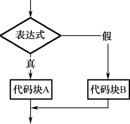
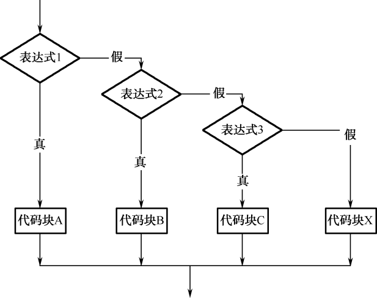
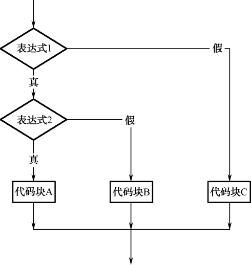
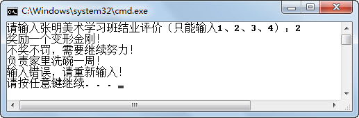
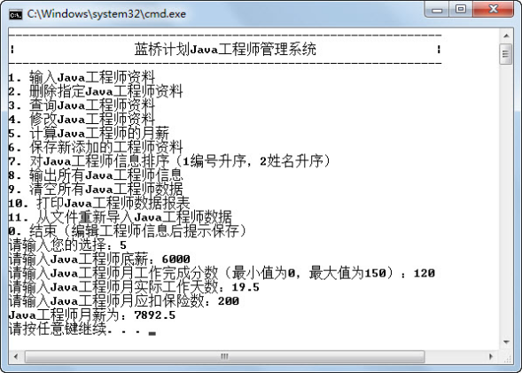
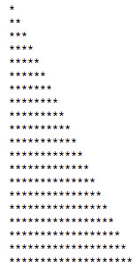
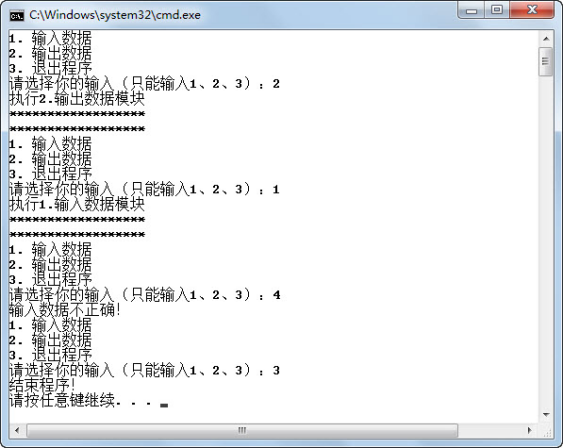
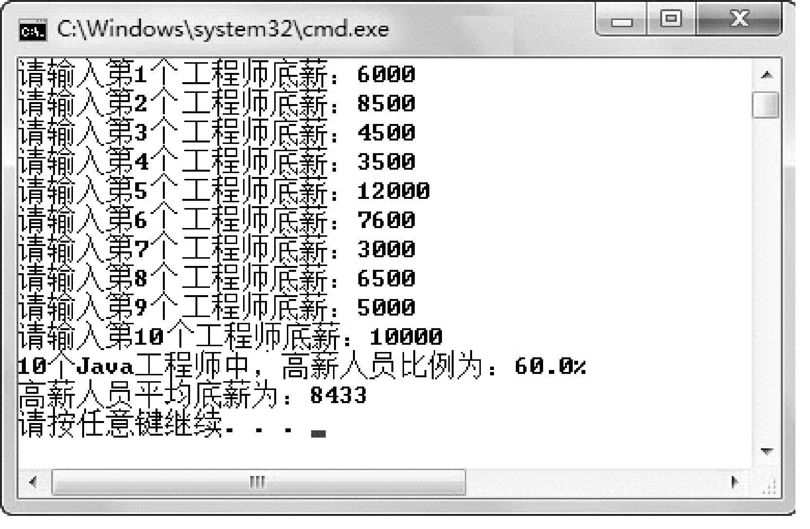
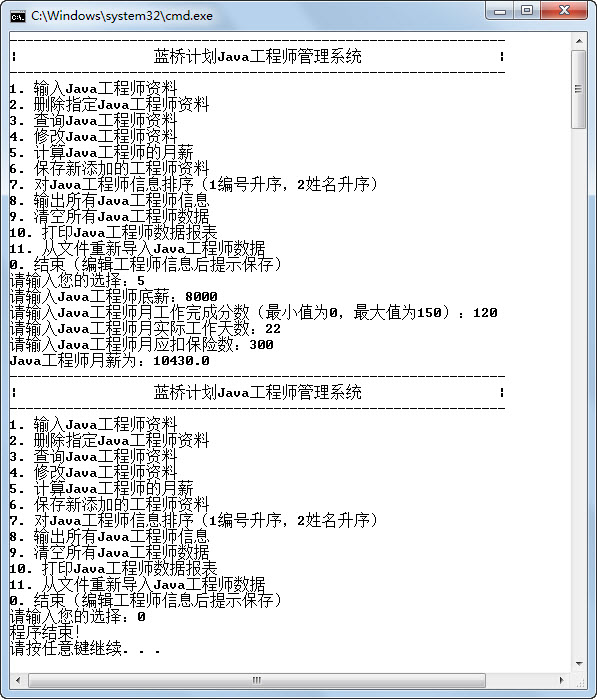

## 本章简介

 

&emsp;&emsp;通过前两章的学习，大家所学的知识已经能够编写简单的Java程序了。不过这些代码只能按照顺序执行的方式依次执行，即进入方法体内，依次执行完所有的语句，这样的语句结构称为顺序结构。

&emsp;&emsp;但是在某些情况下，需要当满足某一条件时才执行一些操作，而不满足条件则执行其他操作。例如，从控制台输入王云Java考试的成绩，如果成绩大于等于60分，则输出“恭喜你，考试合格！”的信息，否则输出“很难过地通知你，考试不及格，需要补考！”。遇到这样的问题，如何编写Java程序呢？下面从if语句开始，通过本章的内容全面学习Java流程控制语句。

 


## 3.1  if语句

 

&emsp;&emsp;本章简介中提到的问题，其实利用现有的知识，在不使用if语句的情况下也能解决，代码如下。


```
import java.util.Scanner;

class TestIf1{

    public static void main(String[] args) {

        int JavaScore = -1;                //Java考试成绩

        Scanner input = new Scanner(System.in);

        System.out.print("请输入王云同学Java考试成绩：");

        JavaScore = input.nextInt();  //从控制台获取Java考试成绩

        //使用(表达式1)?(表达式2):(表达式3)这个三目运算符进行判断输出

        System.out.println(JavaScore>=60?("恭喜你，考试合格！"):("很难过地通知你，考试不及格，需要补考！"));

    }

}
```


&emsp;&emsp;这样的写法可以解决这个问题，但不够灵活。通过if语句，可以更加灵活地编写条件判断程序。

### 3.1.1  if语句的语法  

&emsp;&emsp;if语句有以下3种语法形式。

&emsp;&emsp;第一种形式为基本形式，其语法形式如下。


```
If(表达式){

	代码块

 }
```
&emsp;&emsp;其语义是：如果表达式的值为true，则执行其后的代码块，否则不执行该代码块。其执行过程如图3.1所示。

&emsp;&emsp;需要强调的是，在if语句中，表达式的类型必须是布尔类型，例如可以写成a == 3，但不要误写成a = 3（赋值语句）。

&emsp;&emsp;if语句的第二种语法形式如下。


```
If(表达式){

	代码块A

 }else{

	代码块B

}
```


&emsp;&emsp;其语义是：如果表达式的值为true，则执行其后的代码块A，否则执行代码块B。其执行过程如图3.2所示。  

<p align="center"></p>
<p align="center"> 图3.1  if语句语法形式一   </p>  
<p align="center"></p>
<p align="center">  图3.2  if语句语法形式二  </p>  
&emsp;&emsp;将前面使用三目运算符完成的程序换成使用if语句，代码如下所示。


```
import java.util.Scanner;

class TestIf2{

    public static void main(String[] args) {

        int JavaScore = -1;                //Java考试成绩

        Scanner input = new Scanner(System.in);

        System.out.print("请输入王云同学Java考试成绩：");

        JavaScore = input.nextInt();  //从控制台获取Java考试成绩

        //使用if...else...实现

        if(JavaScore >= 60){

        	System.out.println("恭喜你，考试合格！");

        }else{

        	System.out.println("很难过地通知你，考试不及格，需要补考！");

        }

    }

}
```


&emsp;&emsp;假设上面的程序需求发生了变化，更改为：如果王云同学的Java考试成绩和Web考试成绩都大于等于60分，则输出“恭喜你，获得Java初级工程师认证！”，否则输出“你有考试不及格，需要补考！”，具体的代码如下所示。


```
import java.util.Scanner;

class TestIf3{

	public static void main(String[] args) {

        int JavaScore = -1;                          //Java考试成绩

        int WebScore = -1;                         //Web考试成绩

        Scanner input = new Scanner(System.in);

        System.out.print("请输入王云同学Java考试成绩：");

        JavaScore = input.nextInt();            //从控制台获取Java考试成绩

        System.out.print("请输入王云同学Web考试成绩：");

        WebScore = input.nextInt();           //从控制台获取Web考试成绩

        //使用if...else...实现

        if(JavaScore >= 60 && WebScore >= 60)

        {

        	System.out.println("恭喜你，获得Java初级工程师认证！");

        }else{

        	System.out.println("你有考试不及格，需要补考！");

        }

    }

}
```


&emsp;&emsp;if语句的第三种语法形式如下。


```
if(表达式1){

	代码块A

}else if(表达式2){

	代码块B

}else if(表达式3){

	代码块C

…

}else{

	代码块X

}
```


&emsp;&emsp;其语义是：依次判断表达式的值，当出现某个表达式的值为true时，则执行其对应的代码块，然后跳到整个if语句之后继续执行程序。如果所有的表达式均为flase，则执行代码块X，然后继续执行后续程序，其执行过程如图3.3所示。

&emsp;&emsp;还是前面的例子，需求更改为：王云同学的Java考试成绩为x，则按以下要求输出结果。

- x **≥** 85，则输出“恭喜你，成绩优秀！”。

- 70 **≤** x < 85，则输出“恭喜你，成绩良好！”。

- 60 **≤** x < 70，则输出“恭喜你，成绩合格！”。

- x < 60，则输出“很抱歉，成绩不合格！”。

<p align="center"></p>
<p align="center"> 图3.3  if语句语法形式三 </p>  
&emsp;&emsp;具体代码如下所示。


```
import java.util.Scanner;

class TestIf4

{

	public static void main(String[] args) {

        int JavaScore = -1;                //Java考试成绩

        Scanner input = new Scanner(System.in);

        System.out.print("请输入王云同学Java考试成绩：");

        JavaScore = input.nextInt();  //从控制台获取Java考试成绩

        //使用if...else if...实现

        if(JavaScore >= 85)

        {

        	System.out.println("恭喜你，成绩优秀！");

        }else if(JavaScore >=70){

        	System.out.println("恭喜你，成绩良好！");

        }else if(JavaScore >=60){

        	System.out.println("恭喜你，成绩合格！");

        }else{

        	System.out.println("很抱歉，成绩不合格！");

        }

	}
}
```


&emsp;&emsp;注意，程序中判断表达式的前后顺序务必要有一定的规则，要么从大到小，要么从小到大，否则会出现错误。还是刚才的案例，如果把JavaScore >=70表达式及其之后的语句和JavaScore >=60表达式及其之后的语句换个位置，编译运行，当用户输入75的时候，就会输出“恭喜你，成绩合格！”，软件出现缺陷。


### 3.1.2  嵌套if语句  


&emsp;&emsp;有这样的需求：某小学需要从该校五、六年级学生中挑选一部分学生参加市数学竞赛，现对该校所有五、六年级学生进行了一次摸底考试，根据考试成绩，大于等于80分的可以参加数学竞赛，之后再根据年级分别进入五年级组和六年级组。

&emsp;&emsp;首先要判断学生考试成绩是否大于等于80分，在大于等于80分的基础上再判断是进入五年级组还是进入六年级组。所以使用嵌套的if语句，语法形式如下，具体的流程图如图3.4所示。


```
If(表达式1){

	If(表达式2){

    	代码块A

    }else{

    	代码块B

    }
    
}else{

    代码块C

} 

```

<p align="center"></p>
<p align="center"> 图3.4  嵌套的if语句 </p>  
&emsp;&emsp;具体程序代码如下所示。

```

import java.util.Scanner;

class TestIf5

{

    public static void main(String[] args) 

    {

        int score = -1;                                 //数学摸底考试成绩

        int grade = 5;                                  //学生年级数

        Scanner input = new Scanner(System.in);

        System.out.print("请输入数学摸底考试成绩：");

        score = input.nextInt();                             //从控制台获取数学摸底考试成绩

        //使用嵌套的if语句实现

        if(score >= 80)

        {

            System.out.print("请输入所属年级（只能输入“5”或“6”）：");

            grade = input.nextInt();                   //从控制台获取所属年级

            if (grade == 5)

            {

            	System.out.println("你将参加市五年级组数学竞赛！");

            }else{

            	System.out.println("你将参加市六年级组数学竞赛！");

            }

        }else{

            System.out.println("抱歉，不能参加市数学竞赛！");

        }

    }

}

```


## 3.2  上机任务


#### 目标：

 

&emsp;&emsp;新建一个程序，完成如下功能。

&emsp;&emsp;一个商城在国庆节期间根据用户积分数决定给用户送何种礼物，在控制台允许用户输入积分数x，根据用户的输入在控制台输出所送礼物。

- x < 5000，则输出“国庆节快乐，送您一张贺卡！”。

- 5000 **≤** x < 10000，则输出“国庆节快乐，送您一个杯子！”。

- 10000 **≤** x < 30000，则输出“国庆节快乐，送您一套餐具！”。

- x **≥** 30000，则输出“国庆节快乐，送您一套精美骨质瓷器！”。


&emsp;&emsp;时间：10分钟。

 


&emsp;&emsp;形式：每个学员独立完成，小组组长检查。

 


&emsp;&emsp;工具：EditPlus。

 


## 3.3  上机任务

 

 

#### 目标：完成本章3.1节的所有程序。

 

时间：20分钟。

 


形式：每个学员独立完成，小组组长检查。

 


工具：EditPlus。

 

 


## 3.4  switch语句

 


&emsp;&emsp;编写程序，完成如下需求。

&emsp;&emsp;学生张明参加了少年宫组织的美术学习班，到了学习班结束的时候，张明的父亲告诉张明：

&emsp;&emsp;如果学习班结业评价是1等，则会“暑假带张明去九寨沟旅游！”；

&emsp;&emsp;如果学习班结业评价是2等，则会“奖励一个变形金刚！”；

&emsp;&emsp;如果学习班结业评价是3等，则会“不奖不罚，需要继续努力！”；

&emsp;&emsp;如果学习班结业评价是4等，则会“负责家里洗碗一周！”。

&emsp;&emsp;这样的需求，通过前面介绍的if语句完全可以解决，但是作为程序员，总会觉得有些麻烦，有些不舒服。接下来，通过switch语句解决这个问题。

### 3.4.1  switch语句概述  

&emsp;&emsp;switch语句的语法形式如下。


```
switch(表达式){

	case  常量1:

		代码块A;

		break;

	case  常量2:

		代码块B;

		break;

	…

	default:

		代码块X;

		break;

}
```


&emsp;&emsp;switch关键字表示“开关”，其针对的是后面表达式的值。尤其需要注意的是，这个表达式的值只允许是byte、short、int和char类型（在JDK 7.0中表达式的值可以是String）类型。

&emsp;&emsp;case后必须要跟一个与表达式类型对应的常量，case可以有多个，且顺序可以改变，但是每个case后面的常量值必须不同。当表达式的实际值与case后的常量相等时，其后的代码块就会执行。

&emsp;&emsp;default表示当表达式的实际值没有匹配到前面对应的任何case常量，default后面的默认代码块会被执行，default通常放在末尾。

&emsp;&emsp;break表示跳出当前结构，必须注意不要忘记。

### 3.4.2  switch语句的使用  

&emsp;&emsp;根据前面的需求，使用switch语句编写代码如下。


```
import java.util.Scanner;

class TestSwitch1{

    public static void main(String[] args) {

        int score = -1;               //美术学习班结业评价

        Scanner input = new Scanner(System.in);

        System.out.print("请输入张明美术学习班结业评价（只能输入1、2、3、4）：");

        score = input.nextInt();          //从控制台获取张明美术学习班结业评价


        switch(score){

        	case 1:

       			System.out.println("暑假带张明去九寨沟旅游！");

        		break;

        	case 2:

        		System.out.println("奖励一个变形金刚！");           

        		break;

        	case 3:

        		System.out.println("不奖不罚，需要继续努力！");

        		break;

        	case 4:

        		System.out.println("负责家里洗碗一周！");

        		break;

        	default:

        		System.out.println("输入错误，请重新输入！");

        		break;

        }

    }

}
```


&emsp;&emsp;通过观察可以看出，switch语句的判断条件只能是等值判断，而且对表达式的类型有要求。

&emsp;&emsp;前面提到过，语句块后面需要跟上break，不能忘记，如果忘了会出现什么情况呢？把上面代码中的break语句全部去掉，编译运行程序，程序运行结果如图3.5所示。

<p align="center"></p>
<p align="center"> 图3.5  去除break的switch语句 </p>  
&emsp;&emsp;从运行结果可以看出，当用户输入“2”后，执行case 2后面的代码块，而且将不再判断case 2之后的所有case语句，直接执行后面所有的代码块。利用这个特点，可以完成针对几个不同的值，执行一类代码的操作。例如上面的例子，需求进行了如下调整：

&emsp;&emsp;如果学习班结业评价是1等或2等，则会“暑假带张明去九寨沟旅游！”；

&emsp;&emsp;如果学习班结业评价是3等或4等，则会“不奖不罚，需要继续努力！”。

&emsp;&emsp;则对应的代码可以修改为以下形式（仅显示部分代码）。


```
switch(score){

    case 1:

    case 2:

    	System.out.println("暑假带张明去九寨沟旅游！");                  

   		break;

    case 3:

    case 4:

    	System.out.println("不奖不罚，需要继续努力！");

    	break;

    default:

    	System.out.println("输入错误，请重新输入！");

    	break;

}

```


## 3.5  上机任务


#### 目标：

 

&emsp;&emsp;完成“蓝桥系统”主菜单向子功能的跳转，即当用户输入一个数字以后，跳转到该子功能模块。例如，如果用户输入5，则跳转到计算Java工程师的月薪模块。

&emsp;&emsp;程序运行结果如图3.6所示。

<p align="center"></p>
<p align="center"> 图3.6  “蓝桥系统”主菜单向子功能的跳转 </p>  
实现思路： 

 

&emsp;&emsp;（1）使用switch语句实现，没有实现的模块直接打印“本模块功能未实现”，已实现的模块（例如模块5），执行相关功能。

&emsp;&emsp;（2）在main函数开始处，需要定义在相关模块中使用到的变量。


时间：15分钟。

 


形式：每个学员独立完成，小组组长检查。

 


工具：EditPlus。


 


##  3.6  循环语句

 


&emsp;&emsp;为什么要使用循环语句呢？

&emsp;&emsp;如果需要在控制台输出如图3.7和图3.8所示的两组图形，如何输出呢？

<p align="center"></p>
<p align="center">图3.7  输出图形1 </p>  
<p align="center"></p>
<p align="center">图3.8  输出图形2</p>  
​                                          

用之前学过的知识，可以输出这些图形，逐行输出每行的内容即可。但是，如果要输出100、1000行，怎么办？接下来，使用循环语句解决这个问题。

### 3.6.1  while循环  


&emsp;&emsp;while循环的语法形式如下。


```
while(循环条件){

	循环代码块

 }
```


&emsp;&emsp;其语义是：如果循环条件的值为true，则执行循环代码块，否则跳出循环，其执行过程如图3.9所示。

<p align="center"></p>
<p align="center">图3.9  while循环执行过程</p>  
&emsp;&emsp;使用while循环，输出图3.7中的图形，代码如下。


```
class TestWhile1

{

	public static void main(String[] args) 

    {

        int i=0;                                   //声明循环参数

        //循环20次，每次输出20个*

        while(i < 20){                       //循环条件为i<20

        	System.out.println("********************");

        	i++;                              //循环参数+1

        }

    }

}

```

&emsp;&emsp;在使用while循环以及下面介绍的do…while循环时，必须要注意，在循环体中要改变循环条件中的参数（例如本例中的i++）或者有其他跳出循环的语句，这样才能跳出循环，否则就会出现死循环。

&emsp;&emsp;下面使用while循环再完成一个案例，这个案例的需求如下。

&emsp;&emsp;程序的主界面：

&emsp;&emsp;1．输入数据

&emsp;&emsp;2．输出数据

&emsp;&emsp;3．退出程序

&emsp;&emsp;请选择你的输入（只能输入1、2、3）：

&emsp;&emsp;当用户输入1时，执行模块1的功能，执行完毕之后，继续输出主界面；当用户输入2时，执行模块2的功能，执行完毕之后，继续输出主界面；当用户输入3时，则退出程序。具体代码如下所示，在“蓝桥系统”中也会使用类似的代码结构，需要注意。


```
import java.util.Scanner;

class TestWhile2 

{

    public static void main(String[] args) 

    {

        int userSel = -1;                             //用户选择输入的参数

        while(true){//使用while(true)，在单个模块功能执行结束后，重新输出主界面，继续循环

            System.out.println("1. 输入数据");

            System.out.println("2. 输出数据");

            System.out.println("3. 退出程序");

            System.out.print("请选择你的输入（只能输入1、2、3）：");

            Scanner input = new Scanner(System.in); 

            userSel = input.nextInt();       //从控制台获取用户输入的选择

            switch(userSel){

                case 1:

                    System.out.println("执行1.输入数据模块");

                    System.out.println("******************");

                    System.out.println("******************");

                    break;

                case 2:

                    System.out.println("执行2.输出数据模块");

                    System.out.println("******************");

                    System.out.println("******************");

                    break;

                case 3:

                    System.out.println("结束程序！");

                    break;

                default:

                    System.out.println("输入数据不正确！");

                    break;

            }

            if (userSel == 3)                    //当用户输入3时，退出while循环，结束程序

            {

            	break;

            }

        }

    }

}
```


&emsp;&emsp;程序运行结果如图3.10所示。

<p align="center"></p>
<p align="center"> 图3.10  使用while循环输出主界面 </p>  
&emsp;&emsp;如图3.10所示，当用户输入2时，执行case 2后面的代码并跳出switch语句，之后再通过if语句判断用户输入的是否是3，如果是3，则跳出while循环，结束程序，如果不是3，则继续执行while循环，输出主界面。

### 3.6.2  do…while循环  

&emsp;&emsp;do…while循环的语法形式如下。
```
do{

	循环代码块

 }while(循环条件)；
```


&emsp;&emsp;do…while循环和while循环类似，不同点在于do…while循环以do开头，先执行循环代码块，然后再判断循环条件，如果循环条件满足，则继续循环。由此可见，do…while循环中的循环代码块至少会被执行一次。

&emsp;&emsp;下面完成一个案例，这个案例的需求是让用户输入正确的程序密码之后，才可以执行下面的代码，否则继续让用户输入，直到输入正确为止，具体代码实现如下。

 ```

import java.util.Scanner;

class TestWhile3 

{

    public static void main(String[] args) 

    {

        //使用字符串String存储密码，后面课程会详细介绍String类

        String userPass = "";                                //用户输入的密码

        final String PASSWORD = "123456";    //正确密码为123456

        Scanner input = new Scanner(System.in);

        do{

            System.out.print("请输入程序密码：");

            userPass = input.nextLine();           //从控制台获取用户输入的密码

            System.out.println();

            //字符串的equals()方法用于判断两个字符串的值是否相同

        }while(!userPass.equals(PASSWORD));         //密码输入不正确，继续循环，重新输入

        System.out.println("程序密码正确，继续执行！");

    }

}
 ```


&emsp;&emsp;程序运行结果如图3.11所示。

<p align="center"></p>
<p align="center"> 图3.11  do...while循环 </p>  
### 3.6.3  for循环  

&emsp;&emsp;上面介绍了while循环和do…while循环，其实程序员在编程过程中，使用最多的循环结构是for循环。for循环主要的特点是结构清晰，易于理解，在解决能确定循环次数的问题时，首选for循环。for循环的语法形式如下。


```
for(表达式1;表达式2;表达式3){

	循环代码块

 }
```
&emsp;&emsp;前面通过while循环完成了图3.7中图形的输出，下面使用for循环完成同样的功能，具体代码如下。


```
class TestFor1 

{

    public static void main(String[] args) 

    {

        int i;//声明循环参数

        //循环20次，每次输出20个*号

        for(i = 0; i < 20; i++ ){

        	System.out.println("********************");

        }

    }

}
```


&emsp;&emsp;for循环的重点在于其3个表达式，其中：

- 表达式1通常是赋值语句，一般是循环语句的初始部分，为循环参数赋初值。表达式1可以省略，但需要在for语句前给循环参数先赋值。

- 表达式 2 通常是条件语句，即为循环条件，当该条件满足时，进入循环，不满足则跳出循环。表达式2也可以省略，即不判断循环条件，也就形成了死循环。

- 表达式 3 通常也是赋值语句，属于循环结构的迭代部分，当一次循环代码块执行完毕以后，程序执行表达式3，然后再去判断表达式2的循环条件是否满足。表达式3通常用来更改循环参数的值。表达式3也可以省略，如果省略，通常需要在循环代码块中添加修改循环参数的语句。

&emsp;&emsp;综上，可以发现for循环的执行顺序如图3.12所示。

<p align="center"></p>
<p align="center">图3.12  for循环的执行顺序</p>  
&emsp;&emsp;如果需要求出1～1000之间所有奇数的和，实现代码如下。


```
class TestFor3 

{

    public static void main(String[] args) 

    {

        int sum = 0;//存放和

        //循环参数从1开始，步长为2（奇数和），循环条件为i<=1000

        for(int i = 1;i <= 1000;i = i + 2 ){

        	sum = sum + i;

        }

        System.out.println("1～1000之间所有奇数的和为：" + sum);

    }

} 
```

&emsp;&emsp;假设“蓝桥系统”中可以存放10个Java工程师信息，现在需要分别输入这10个Java工程师的底薪，并计算出底薪大于等于6000的高薪人员比例以及这些高薪人员的底薪平均值，程序运行结果如图3.13所示。  

<p align="center"></p>
<p align="center"> 图3.13  计算高薪人员比例及平均底薪 </p>  
&emsp;&emsp;具体代码如下。


```
import java.util.Scanner;

class TestFor4 

{

    public static void main(String[] args) 

    {

        int highNum = 0;                                                                          //底薪大于等于6000的Java工程师人数

        int sumBasSalary = 0;                       //高薪人员底薪总和

        Scanner input = new Scanner(System.in);

        for(int i = 1;i <= 10 ; i++ )

        {

            System.out.print("请输入第" + i + "个工程师底薪：");

            int basSalary = input.nextInt();

            if(basSalary >= 6000)

            {

                highNum = highNum + 1;                                //高薪人员计数

                sumBasSalary = sumBasSalary + basSalary;   //高薪人员底薪求和

            }

        }

        System.out.println("10个Java工程师中，高薪人员比例为：" + highNum/10.0*100 + "%");

        System.out.println("高薪人员平均底薪为：" + sumBasSalary/highNum);

    }

}
```


&emsp;&emsp;细心的读者会发现，该程序在计算过程中有一个缺陷。sumBasSalary是一个int型的整数，存放的是高薪人员底薪之和，highNum也是一个int型的整数，存放的是高薪人员人数，两个int型的数相除，结果还是int型的数，会丢失小数点后面的精度。

### 3.6.4  双重for循环  

&emsp;&emsp;前面的课程在介绍if语句的时候，提到了嵌套的if语句。同样，在for循环里，也可以嵌套for循环，如果只嵌套一次，就构成双重for循环。

&emsp;&emsp;图3.7需要在控制台输出20行，每行输出20个*，采用for循环20次，每次输出20个*，即输出图3.7中的图形。图3.8也是需要在控制台输出20行，不过每行输出的*的个数不同，第i行输出i个*，所以采用单次循环无法解决这个问题。接下来，通过双重for循环，输出图3.8中的图形，具体代码如下。


```
class TestFor2 

{

    public static void main(String[] args) 

    {

        int i,j;                                     //声明循环参数

        for(i = 1;i <= 20;i++){          //循环20次

        for(j = 1;j <= i;j++){    //每次输出当次个*

        System.out.print("*");

        }

        	System.out.println();

        }

    }

}
```


&emsp;&emsp;双重for循环的重点在于，内循环的循环条件往往和外循环的循环参数有关，例如本例中内循环的循环条件为j <= i，其中i是外循环的循环参数。

&emsp;&emsp;下面使用双重for循环再完成一个案例，这个案例的需求很简单，输出1至100之间的质数，具体实现代码如下，程序逻辑参考代码中的注释，其中continue语句后面会详细介绍。


```
class TestFor5 

{

//输出1～100间质数

    public static void main(String[] args) 

    {

        int i,j;                                                        //声明循环参数  

        outer:for(i = 2;i < 100;i++){                    //从2开始，逐个递增进行判断

            //Math.sqrt(i)方法是求i的平方根

            for(j = 2;j <= Math.sqrt(i);j++){     //从2开始，逐个递增到外循环的平方根

                if(i%j == 0)               //外循环数除以内循环数，余0则非质数，跳出内循环

                continue outer;             //跳出内循环，跳到outer标识的位置继续循环

            }

                System.out.println(i);                      //否则显示质数

        }

    }

}
```
### 3.6.5  跳转语句  

&emsp;&emsp;在介绍switch语句的时候，首次接触了break语句，其作用是跳出switch代码块，执行switch语句后面的代码。在介绍双重for循环时，用到了continue语句，continue语句的主要作用为跳出当次循环，继续执行下一次循环。其中break、continue以及后面要学到的return语句，都是让程序从一部分跳转到另一部分，习惯上都称为跳转语句。

&emsp;&emsp;在循环体内，break语句和continue语句的区别在于：使用break语句是跳出循环执行循环之后的语句，而continue语句是中止本次循环继续执行下一次循环。在企业面试的时候，这个问题经常被问到，务必掌握。大家通过前面的案例以及后面的上机任务，能体会到两者的区别，掌握其具体使用方法，这里不再详细举例。


## 3.7  上机任务


#### 目标：完成本章3.6节的所有程序。

 


时间：40分钟。

 


形式：每个学员独立完成，小组组长检查。

 


工具：EditPlus。

 


## 3.8  上机任务

 


#### 目标： 

 

输入任意一个整数，根据这个值输出乘法表。例如输入值为8，程序运行结果如图3.14所示。

<p align="center"></p>
<p align="center"> 图3.14  使用for循环输出乘法表 </p>  
时间：15分钟。

 


形式：每个学员独立完成，小组组长检查。

 


工具：EditPlus。

 


参考答案： 


```
import java.util.Scanner;

class TestFor6 

{

    public static void main(String[] args) 

    {

        int firNum;                            //第一个数

        int secNum;                           //第二个数

        int maxNum;                         //最大数

        Scanner input = new Scanner(System.in);

        System.out.print("请输入一个整数：");

        maxNum = input.nextInt();

        System.out.println("数" + maxNum + "的乘法表为：");

        for(firNum = 0,secNum = maxNum;firNum <= maxNum;firNum++,secNum--)

        {

        	System.out.println(firNum + " * " + secNum + " = " + firNum*secNum);

        }

    }

}

```


## 3.9  上机任务


#### 目标： 

 

&emsp;&emsp;修改“蓝桥系统”，当用户输入某个数（非0）时，执行该模块的功能，执行完毕之后，继续输出主界面。当用户输入0，则退出程序。程序运行结果如图3.15所示。

<p align="center"></p>
<p align="center">图3.15  使用while循环输出“蓝桥系统”主界面 </p>  
时间：20分钟。

 


形式：每个学员独立完成，小组组长检查。

 


工具：EditPlus。

 


#### 实现思路：参考图3.10对应程序的实现思路。

 


参考答案： 


```
import java.util.Scanner;

class JavaEngineer 

{

    public static void main(String[] args) 

    {

        double engSalary = 0.0;                     //Java工程师月薪

        int basSalary = 3000;        	      //底薪

        int comResult = 100;                   //月工作完成分数（最小值为0，最大值为150）

        double workDay = 22;                                      //月实际工作天数

        double insurance = 3000 * 0.105;                     //月应扣保险数

        Scanner input = new Scanner(System.in);        //从控制台获取输入的对象

        int userSel = -1;                                                 //用户选择的数

        while(true) //使用while(true)，在单个模块功能执行结束后，重新输出主界面，继续循环

        {

            //显示主界面

            System.out.println("-------------------------------------------------");

            System.out.println("|             蓝桥计划Java工程师管理系统                 |");

            System.out.println("-------------------------------------------------");

            System.out.println("1. 输入Java工程师资料");

            System.out.println("2. 删除指定Java工程师资料");

            System.out.println("3. 查询Java工程师资料");

            System.out.println("4. 修改Java工程师资料");

            System.out.println("5. 计算Java工程师的月薪");

            System.out.println("6. 保存新添加的工程师资料");

            System.out.println("7. 对Java工程师信息排序（1编号升序，2姓名升序）");

            System.out.println("8. 输出所有Java工程师信息");

            System.out.println("9. 清空所有Java工程师数据");

            System.out.println("10. 打印Java工程师数据报表");

            System.out.println("11. 从文件重新导入Java工程师数据");

            System.out.println("0. 结束（编辑工程师信息后提示保存）");

            System.out.print("请输入您的选择：");

            userSel = input.nextInt();

            switch(userSel)

            {

                case 1:

                System.out.println("本模块功能未实现");

                break;

                case 2:

                System.out.println("本模块功能未实现");               

                break;

                case 3:

                System.out.println("本模块功能未实现");

                break;

                case 4:

                System.out.println("本模块功能未实现");

                break;                           

                case 5:

                    System.out.print("请输入Java工程师底薪：" );

                    basSalary = input.nextInt();//从控制台获取输入的底薪，将其赋值给basSalary

                    System.out.print("请输入Java工程师月工作完成分数（最小值为0，最大值为150）：");

                    comResult = input.nextInt();          //从控制台获取输入的月工作完成分数，

                    ​                                     //赋值给comResult      

                    System.out.print("请输入Java工程师月实际工作天数：" );

                    workDay = input.nextDouble();     //从控制台获取输入的月实际工作天数，

                    ​                                 //赋值给workDay

                    System.out.print("请输入Java工程师月应扣保险数：" );

                    insurance = input.nextDouble();     //从控制台获取输入的月应扣保险数，

                    ​                                   //赋值给insurance

                    /*Java工程师月薪= 底薪 + 底薪×25%×月工作完成分数/100\+ 15×月实际工作天数 - 月应扣保险数；*/

                    engSalary = basSalary + basSalary*0.25*comResult/100 + 15*workDay – 
						insurance;

                    System.out.println("Java工程师月薪为：" + engSalary );

                    break;

                case 6:

                    System.out.println("本模块功能未实现");               

                    break;

                case 7:

                    System.out.println("本模块功能未实现");

                    break;

                case 8:

                    System.out.println("本模块功能未实现");

                    break;

                case 9:

                    System.out.println("本模块功能未实现");               

                    break;

                case 10:

                    System.out.println("本模块功能未实现");

                    break;

                case 11:

                    System.out.println("本模块功能未实现");

                    break;

                case 0:

                    System.out.println("程序结束！");

                    break;

                default:

                    System.out.println("数据输入错误！");

                    break;

            }

            if (userSel == 0)//当用户输入0时，退出while循环，结束程序

            {

            	break;

            }

        }

    }

}


```


## 3.10  本章练习

 

1  以下表达式中，（    ）不可以作为循环条件。（选择两项） 

&emsp;&emsp;A．x = 10

&emsp;&emsp;B．y >=80

&emsp;&emsp;C．inputPass == truePass

&emsp;&emsp;D．x|y

2  请介绍“==”和“=”的区别。

 

 

3  switch语句对应的表达式可以是哪些类型？

 

 

4  请描述break和continue的区别。

 

 

5  在使用switch语句时，如果在case语句后忘了加上break，会出现什么样的结果？

 

 

 