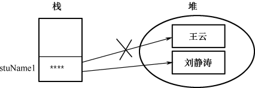
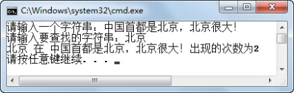
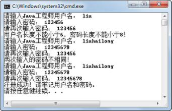
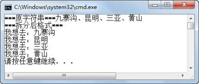
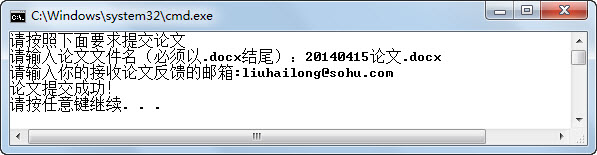
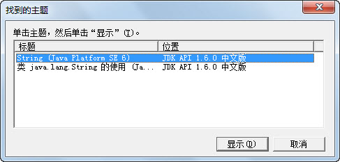
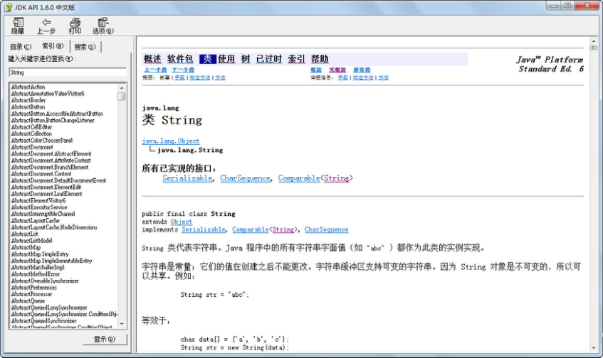
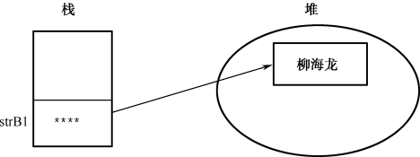

## 本章简介

&emsp;&emsp;通过第4章的学习，通过采用方法的形式重新组织了《蓝桥系统》的代码结构。在本章中，会学习到在之前Java编程中已经使用，在之后的编程过程中也会用到的内容——String字符串。  

&emsp;&emsp;在《蓝桥系统》的编写过程中，已经使用了String类来存放Java工程师姓名这个字符串变量，但是并没有具体介绍String类。接下来，将系统地学习String类及其常用方法。  

## 5.1  String类 

 

&emsp;&emsp;String类表示字符串，Java 程序中的所有字符串（例如“雷静”）都作为此类的对象。String类不是基本数据类型，它是一个类。因为对象的初始化默认值是null，所以String类对象的初始化默认值也是null。String是一种特殊的对象，具有其他对象没有的一些特性。  

&emsp;&emsp;String字符串是常量，字符串的值在创建之后不能更改。  

&emsp;&emsp;String类是最终类，不能被继承。  

### 5.1.1  String类的概念  

&emsp;&emsp;如何使用String类操作字符串呢？首先要定义并初始化字符串。String类包括以下常用的构造方法。  

- String(String s)：初始化一个新创建的String对象，使其表示一个与参数相同的字符序列。

- String(char[] value)：创建一个新的String对象，使其表示字符数组参数中当前包含的字符序列。

- String(char[] value, int offset, int count)：创建一个新的String对象，它包含取自字符数组参数的一个子数组的字符序列。offset参数是子数组第一个字符的索引（从0开始建立索引），count 参数指定子数组的长度。

&emsp;&emsp;例如：


```
String stuName1 = new String("王云");

char[] charArray = {'刘','静','涛'};

String stuName2 = new String(charArray);

String stuName3 = new String(charArray,1,2);//从'静'字开始，截取2个字符，结果是“静涛”

```

&emsp;&emsp;实际上，最常使用的创建String类字符串的方法如下。  


```
String stuName1 = "王云";
```


&emsp;&emsp;在实际编程过程中，常常有这样的需求，需要在一个字符串后面增加一些内容，例如需要在stuName1后面增加字符串“同学”。查询相关资料，知道String类提供了一个concat(String str)的方法，可以在String类字符串后面增加字符串。有如下代码：


```
class TestString2 

{

    public static void main(String[] args) 

    {

        String stuName1 = new String("王云");

        stuName1.concat("同学");

        System.out.println(stuName1);

    }

}
```


&emsp;&emsp;其输出结果是“王云”，而不是“王云同学”。为什么呢？

&emsp;&emsp;在本章开始就介绍过String字符串是常量，字符串的值在创建之后不能更改。concat(String str)方法的输出是，创建了一个新String字符串，用来存stuName1字符串加上“同学”的结果，而不是在原来stuName1字符串的后面增加内容，对于stuName1而言，它是常量，内容并没有变化。所以，如果想输出“王云同学”，可以将stuName1.concat("同学")表达式的结果赋给一个新的字符串，然后再输出该字符串即可。

&emsp;&emsp;再看下面的案例。

```
class TestString3 

{

    public static void main(String[] args) 

    {

        String stuName1 = new String("王云");

        System.out.println(stuName1);

        stuName1 = "刘静涛";

        System.out.println(stuName1);

    }

}
```


&emsp;&emsp;代码的输出结果如下。


```
王云

刘静涛
```

&emsp;&emsp;不是说String字符串是不可变的常量吗？怎么两次输出stuName1，却发生变化了呢？究其原因，主要是这里说的不可变是指在堆内存中创建出来的String字符串不可变。事实上，stuName1 = "刘静涛";语句已经新创建了一个String字符串，并让stuName1指向了这个新的String字符串，原来存放“王云”的这个String字符串没有发生变化，如图5.1所示。

<p align="center"></p>
<p align="center">图5.1  引用类型变量重赋值</p>  


### 5.1.2  String类的使用  

#### 1．连接字符串

&emsp;&emsp;前面介绍了采用public String concat(String str)方法连接字符串。事实上，采用最多的方法是使用“+”进行String字符串连接。之前的代码，在控制台输出程序运行结果的时候，都是使用“+”进行String字符串的连接。

&emsp;&emsp;执行下面的程序，其运行结果如图5.2所示。


```
public class TestStringConcat {

    public static void main(String[] args) {

        //使用"+"进行字符串连接

        System.out.println("使用'+'进行字符串连接");

        String s1 = "您好";

        s1 = s1 + ",蒋老师!";//创建一个新字符串用来连接两个字符串，并让s1指向这个新字符串

        System.out.println(s1);

        //使用public String concat(String str)方法连接

        System.out.println("使用public String concat(String str)方法连接");

        String s2 = "您好";

        //创建一个新字符串用来连接两个字符串，但没有变量指向这个新字符串

        s2.concat(",田老师!");

        //创建一个新字符串用来连接两个字符串，并让s3指向这个新字符串

        String s3 = s2.concat(",田老师!");

        System.out.println(s2);

        System.out.println(s3);

    }

}
```

<p align="center"></p>
<p align="center">图5.2  连接String字符串 </p>  

#### 2．比较字符串

&emsp;&emsp;比较字符串常用的两个方法是运算符“==”和String类的equals方法。

&emsp;&emsp;使用“==”比较两个字符串，是比较两个对象的地址是否一致，本质上就是判断两个变量是否指向同一个对象，如果是则返回true，否则返回false。而String类的equals方法则是比较两个String字符串的内容是否一致，返回值也是一个布尔类型。

&emsp;&emsp;先看下面的例子。


```
public class TestStringEquals {

    public static void main(String[] args) {

        String s1 = "Java基础";

        String s2 = "Java基础";

        System.out.println(s1 == s2);                           //返回true

        System.out.println(s1.equals(s2));           //返回true

        String s3 = new String("前端技术");

        String s4 = new String("前端技术");

        System.out.println(s3 == s4);                           //返回false

        System.out.println(s3.equals(s4));           //返回true

    }

}
```


&emsp;&emsp;程序的运行结果如图5.3所示。

 <p align="center"></p>
<p align="center"> 图5.3  比较String字符串 </p>  

## 5.2  String类的常用方法

 

&emsp;&emsp;以下是String类的常用方法。

- public char charAt(int index)

&emsp;&emsp;从字符串中返回指定索引处的字符值。

- public int length()

&emsp;&emsp;返回此字符串的长度。这里需要和获取数组长度区别开，获取数组长度是通过“数组名.length”获取的。

- public int indexOf(String str)

&emsp;&emsp;返回指定子字符串在此字符串中第一次出现处的索引。

- public int indexOf(String str,int fromIndex)

&emsp;&emsp;返回指定子字符串在此字符串中第一次出现处的索引，从指定的索引开始搜索。

- public boolean equalsIgnoreCase(String another)

&emsp;&emsp;将此String与另一个String比较，不区分大小写。

- public String replace(char oldChar,char newChar)

&emsp;&emsp;返回一个新的字符串，它是通过用newChar替换此字符串中出现的所有oldChar得到的。

&emsp;&emsp;这里再重申一下，String类方法中的索引都是从0开始编号的。执行下面的程序，请注意程序注释，程序运行结果如图5.4所示。


```
public class TestArrayMethod {

    public static void main(String[] args) {

        String s1 = "blue bridge";

        String s2 = "Blue Bridge";

        System.out.println(s1.charAt(1));                      //查找第2个字符，结果为l

        System.out.println(s1.length());                         //求s1的长度，结果为11

        System.out.println(s1.indexOf("bridge"));   //查找bridge字符串在s1中的位置，结果为5

        System.out.println(s1.indexOf("Bridge")); //查找Bridge字符串在s1中的位置，没找到返回-1

        System.out.println(s1.equals(s2));                     //区分大小写比较，返回false

        System.out.println(s1.equalsIgnoreCase(s2));   //不区分大小写比较，返回true


        String s = "我是学生，我在学java!";

        String str = s.replace('我','你');                          //把"我"替换成"你"

        System.out.println(str);

    }

}
```

<p align="center"></p>
<p align="center"> 图5.4  String类常用方法综合实例一</p>  

- public boolean startsWith(String prefix)

&emsp;&emsp;判断此字符串是否以指定的前缀开始。

- public boolean endsWith(String suffix)

&emsp;&emsp;判断此字符串是否以指定的后缀结束。

- public String toUpperCase()

&emsp;&emsp;将此String中的所有字符都转换为大写。

- public String toLowerCase()

&emsp;&emsp;将此String中的所有字符都转换为小写。

- public String substring(int beginIndex)

&emsp;&emsp;返回一个从beginIndex开始到结尾的新的子字符串。

- public String substring(int beginIndex,int endIndex)

&emsp;&emsp;返回一个从beginIndex开始到endIndex结尾（不含endIndex所指字符）的新的子字符串。

- public String trim()

&emsp;&emsp;返回字符串的副本，忽略原字符串前后的空格。

&emsp;&emsp;下面继续通过一个案例，说明上述String类方法的使用。执行下面的程序，运行结果如图5.5所示。


```
public class TestStringMethod2 {

    public static void main(String[] args) {

        String fileName = "20140801柳海龙Resume.docx";

        System.out.println(fileName.startsWith("2014"));      //判断字符串是否以"2014"开头

        System.out.println(fileName.endsWith("docx"));       //判断字符串是否以"docx"结尾

        System.out.println(fileName.endsWith("doc"));         //判断字符串是否以"doc"结尾

        System.out.println(fileName.toLowerCase());              //将大写变为小写

        System.out.println(fileName.toUpperCase());            //将小写变为大写

        System.out.println(fileName.substring(8));    //从第9个位置开始到结尾截取字符串

        System.out.println(fileName.substring(8,11));   //从第9个位置开始到第11个位置结尾截取
        												//字符串

        String fileName2 = "  20150801柳海龙Resume  .docx "; 

        System.out.println(fileName2.trim());    //忽略原字符串前后的空格

    }

}
```

<p align="center"></p>
<p align="center">图5.5  String类常用方法综合实例二 </p>  

- public static String valueOf(基本数据类型参数)

&emsp;&emsp;返回基本数据类型参数的字符串表示形式，例如：


```
public static String valueOf(int i)

public static String valueOf(double d)
```


&emsp;&emsp;这两个方法是String类的静态方法，关于静态方法后面的课程会详细介绍，这里需要大家注意的是静态方法是通过“类名.方法名”直接调用的，例如：


```
String result = String.valueOf(100);//将int型100转换为字符串"100"
```


- public String[] split(String regex)

&emsp;&emsp;通过指定的分隔符分隔字符串，返回分隔后的字符串数组。

&emsp;&emsp;通过下面这个案例，说明上述两个方法的使用。执行下面的程序，运行结果如图5.6所示。


```
import java.util.Scanner;

public class TestStringMethod3{

    public static void main(String[] args){

        String result = String.valueOf(100);

        Scanner input = new Scanner(System.in);

        System.out.print("请输入您去年一年的薪水总和：");

        int lastSalary = input.nextInt();

        //通过String类的静态方法将lastSalary从int型转化成String字符串

        String strSalary = String.valueOf(lastSalary);

        System.out.println("您去年一年的薪水总和是：" + strSalary.length() + "位数！");

        String date = "Mary,F,1976";

        String[] splitStr = date.split(",");//用","将字符串分隔成一个新的字符串数组

        System.out.println("Mary,F,1976使用,分隔后的结果：");

        for(int i = 0;i < splitStr.length; i++)

        {

       		System.out.println(splitStr[i]);

        }       

    }

}
```

<p align="center"></p>
<p align="center"> 图5.6  String类常用方法综合实例三 </p>  

&emsp;&emsp;在上面的例子中，用“,”将字符串“Mary,F,1976”分隔成一个新的字符串数组，这个字符串数组的长度为3，每个元素存的内容分别是“Mary”、“F”和“1976”。假设原来的字符串是“,Mary,F,1976”（第一个字符就是‘,’）、“,Mary,F,1976”（第一个字符是空格，第二个字符是‘,’），其结果又是如何呢？请大家自行练习获得结果。


## 5.3  上机任务


#### 目标：完成本章5.1节和5.2节的所有程序。


时间：30分钟。


形式：每个学员独立完成，小组组长检查。


工具：EditPlus。

 

## 5.4  上机任务


#### 目标：计算字符串中子字符串出现的次数：让用户分别输入字符串和子字符串，输出子字符串出现的次数，程序运行结果如图5.7所示。

<p align="center"></p>
<p align="center"> 图5.7  统计子字符串出现的次数 </p>  


时间：10分钟。

 


形式：每个学员独立完成，小组组长检查。


工具：EditPlus。

参考答案：


```
import java.util.Scanner;

public class StrCount{

    public static void main(String[] args) {   

        int count = 0;      //用于计数的变量

        int start = 0;        //标识从哪个位置开始查找

        Scanner input = new Scanner(System.in);

        System.out.print("请输入一个字符串：");

        String str = input.next();

        System.out.print("请输入要查找的字符串：");

        String str1 = input.next();

        while (str.indexOf(str1, start) >= 0 && start < str.length()) {

            count++;

            //找到子字符串后，查找位置移动到找到的这个字符串之后开始

            start = str.indexOf(str1, start) + str1.length();

        }

        System.out.println(str1 + " 在 " + str + "出现的次数为" + count);

    }

}
```


## 5.5  上机任务

#### 目标：完成Java工程师注册的功能，具体需求如下，程序运行结果如图5.8所示。

 

&emsp;&emsp;（1）用户名长度不能小于6。

&emsp;&emsp;（2）密码长度不能小于8。

&emsp;&emsp;（3）两次输入的密码必须一致。

<p align="center"></p>
<p align="center"> 图5.8  Java工程师注册功能的实现</p>  


时间：15分钟。


形式：每个学员独立完成，小组组长检查。

 

工具：EditPlus。

 

参考答案：


```
import java.util.Scanner;

public class EngRegister{

    //使用verify方法对用户名、密码进行验证，返回是否成功

    public static boolean verify(String name,String pwd1,String pwd2){

        boolean flag = false;//标识是否成功

        if(name.length() < 6 || pwd1.length() < 8){

       	 	System.out.println("用户名长度不能小于6，密码长度不能小于8！");

        }else if(!pwd1.equals(pwd2)){

        	System.out.println("两次输入的密码不相同！");

        }else{

        	System.out.println("注册成功！请牢记用户名和密码。");

        	flag=true;

        }

        return flag;

    }

    public static void main(String[] args) {

        Scanner input = new Scanner(System.in);

        String engName,p1,p2;

        boolean resp = false;//标识是否成功

        do{                      

            System.out.print("请输入Java工程师用户名： ");

            engName = input.next();

            System.out.print("请输入密码： ");

            p1 = input.next();

            System.out.print("请再次输入密码： ");

            p2 = input.next();

            //调用verify方法对用户名、密码进行验证，返回是否成功

            resp = verify(engName, p1, p2);              

        }while(!resp);

    }

}
```


## 5.6  上机任务

#### 目标：定义字符串“九寨沟、昆明、三亚、黄山”，使用split方法分别输出“我想去：九寨沟”，“我想去：昆明”……如图5.9所示。

<p align="center"></p>
<p align="center"> 图5.9  使用split方法拆分字符串 </p>  


时间：10分钟。


形式：每个学员独立完成，小组组长检查。


工具：EditPlus。


## 5.7  上机任务

#### 目标：完成提交论文的功能，具体需求如下，程序运行结果如图5.10、图5.11和图5.12所示。

&emsp;&emsp;（1）需要检查论文文件名，文件名必须以.docx结尾。

&emsp;&emsp;（2）需要检查接收论文反馈的邮箱，邮箱必须含“@”和“.”，且“.”在“@”之后。

<p align="center"></p>
<p align="center"> 图5.10  检查文件名和邮箱一 </p>  

<p align="center"></p>
<p align="center"> 图5.11  检查文件名和邮箱二</p>  

<p align="center"></p>
<p align="center">图5.12  检查文件名和邮箱三</p>  


时间：15分钟。

 

形式：每个学员独立完成，小组组长检查。


工具：EditPlus。


参考答案：


```
import java.util.Scanner;

public class FileUpload{

    public static void main(String[] args) {

        boolean fileCorrect = false;                     //标识论文文件名是否正确

        boolean emailCorrect = false;                           //标识邮箱是否正确

        System.out.println("请按照下面要求提交论文");

        Scanner input = new Scanner(System.in);

        System.out.print("请输入论文文件名（必须以.docx结尾）：");

        String fileName = input.next();

        System.out.print("请输入接收论文反馈的邮箱:");

        String email = input.next();

        //检查论文文件名

        if(fileName.endsWith(".docx")){

        	fileCorrect = true;                           //标识论文文件名正确

        }else{

        	System.out.println("文件名无效！");

        }

        //检查邮箱格式

        if(email.indexOf('@') != -1 && email.indexOf('.') > email.indexOf('@')){

        	emailCorrect = true;                        //标识邮箱正确

        }else{

        	System.out.println("邮箱无效！");

        }

        //输出结果

        if(fileCorrect&&emailCorrect){

        	System.out.println("论文提交成功！");

        }else{

        	System.out.println("论文提交失败！");

        }

    }

}
```
## 5.8  Java API文档的使用


&emsp;&emsp;前面在介绍String字符串类的方法时，只是介绍了其中一小部分常用的方法。String字符串类有很多方法，如何记住它们呢？答案是：记不住，也不用记！

&emsp;&emsp;Java给程序员提供了Java API文档，供Java程序员随时查阅。API（Application Programming Interface）指应用程序编程接口。

&emsp;&emsp;Java语言提供了一些核心类库供Java程序员直接调用，程序员无须关注类库中方法的实现细节，只需关注其输入、输出和功能等，这些类库统称为API。在一个文档中统一定义类库中方法的输入、输出和功能描述，这个文档就是API文档。

&emsp;&emsp;在使用Java API文档时，需要注意API文档的版本号要和JDK的版本号一致，否则可能会出现随着JDK版本的更新导致的API文档与实际类库之间存在差异。

&emsp;&emsp;接下来介绍Java API文档的文档结构和如何使用Java API文档，这里以.chm格式的Java API文档为例进行介绍。

&emsp;&emsp;Java API文档的文档结构如图5.13所示。

<p align="center"></p>
<p align="center"> 图5.13  Java API文档的文档结构 </p>  

&emsp;&emsp;如果要查找String字符串类的其他方法，可以在“索引”处输入String，在弹出的对话框（见图5.14）中选择相关主题，单击“显示”按钮，就会显示String类的相关内容，如图5.15所示。

&emsp;&emsp;在String类的文档中，主要包括以下内容：类的继承和被继承关系、类的声明、类的功能说明、属性列表、构造方法列表和方法列表等。其中每个属性、构造方法和方法都包含一个超链接，通过单击该链接可以查看更详细的说明。

<p align="center"></p>
<p align="center"> 图5.14  在Java API文档中选择主题</p>  

<p align="center"></p>
<p align="center"> 图5.15  Java API文档查询结果 </p>  
## 5.9  上机任务

#### 目标：使用Java API文档查找String字符串类的方法，并使用找到的方法。

 

&emsp;&emsp;（1）判断一个字符串是否为空的方法。

&emsp;&emsp;（2）将字符串转换为一个新的字符数组。

&emsp;&emsp;（3）按字典顺序比较两个字符串。


时间：15分钟。

形式：每个学员独立完成。

工具：Java API文档、EditPlus。


## 5.10  StringBuffer类

### 5.10.1  StringBuffer类的概念  

&emsp;&emsp;StringBuffer类也可以存放字符串。与String类不同的是，StringBuffer字符串代表的是可变的字符序列，可以对字符串对象的内容进行修改。 

&emsp;&emsp;以下是StringBuffer类最常用的构造方法。

- StringBuffer()：构造一个其中不带字符的字符串缓冲区，其初始容量为16个字符。

- StringBuffer(String str)：构造一个字符串缓冲区，并将其内容初始化为指定的字符串内容。

&emsp;&emsp;StringBuffer字符串使用场合为经常需要对字符串内容进行修改操作的场合。

### 5.10.2  StringBuffer类的使用  

&emsp;&emsp;以下是通过StringBuffer类的构造方法创建StringBuffer字符串的代码。
```
StringBuffer strB1 = new StringBuffer();
```


&emsp;&emsp;通过strB1.length()返回长度是0，但在底层创建了一个长度为16的字符数组。


```
StringBuffer strB2 = new StringBuffer("柳海龙");
```


&emsp;&emsp;通过strB2.length()返回长度是3，在底层创建了一个长度为3+16的字符数组。

&emsp;&emsp;StringBuffer上的主要操作是append和insert方法，将字符追加或插入到字符串缓冲区中。append方法始终将字符添加到缓冲区的末端，而insert方法则在指定的位置添加字符。

&emsp;&emsp;以下是StringBuffer类的常用方法。

- public StringBuffer append(String str)

&emsp;&emsp;将指定的字符串追加到此字符序列中。

- public StringBuffer append(StringBuffer str)

&emsp;&emsp;将指定的StringBuffer字符串追加到此序列中。

- public StringBuffer append(char[] str)

&emsp;&emsp;将字符数组参数的字符串表示形式追加到此序列中。

- public StringBuffer append(char[] str,int offset,int len)

&emsp;&emsp;将字符数组参数的子数组的字符串表示形式追加到此序列中，从索引offset开始，此字符序列的长度将增加len。

- public StringBuffer append(double d)

&emsp;&emsp;将double类型参数的字符串表示形式追加到此序列中。

- public StringBuffer append(Object obj)

&emsp;&emsp;将Object参数的字符串表示形式追加到此序列中。

- public StringBuffer insert(int offset,String str)

&emsp;&emsp;将字符串插入到此字符序列中，offset表示插入位置。

&emsp;&emsp;下面通过一个案例说明上述StringBuffer类方法的使用，执行下面的程序，运行结果如图5.16所示。


```
public class TestStringBuffer {

    public static void main(String[] args) {            

        System.out.println("创建StringBuffer对象");

        //使用StringBuffer()构造器创建对象

        StringBuffer strB1 = new StringBuffer();

        System.out.println("new StringBuffer()创建对象的长度为：" + strB1.length());

        //使用StringBuffer(String str)构造器创建对象

        StringBuffer strB2 = new StringBuffer("柳海龙");            

        System.out.println("new StringBuffer(\"柳海龙\")创建对象的长度为：" + strB2.length());

        System.out.println("strB2里的内容为：" + strB2);

        //使用append、insert方法追加、插入字符串

        System.out.println("使用append方法追加字符串");

        strB2.append("，您好！");            //在最后增加"，您好"！

        System.out.println(strB2);

        strB2.insert(3,"工程师");               //从第4个位置开始，插入"工程师"

        System.out.println(strB2);

    }

}
```

<p align="center"></p>
<p align="center"> 图5.16  StringBuffer常用方法</p>  

### 5.10.3  StringBuffer内存模型  

&emsp;&emsp;StringBuffer是一个内容可变的字符序列，或者说它是一个内容可变的字符串类型。当使用StringBuffer strB1 = new StringBuffer("柳海龙");语句创建StringBuffer对象时，内存结构示意图如图5.17所示。

<p align="center"></p>
<p align="center">图5.17  StringBuffer内存结构示意图一</p>  

&emsp;&emsp;当使用strB1.append("工程师")方法时，将之前创建的StringBuffer对象的内容“柳海龙”修改成“柳海龙工程师”，内存结构示意图如图5.18所示。

<p align="center"></p>
<p align="center"> 图5.18  StringBuffer内存结构示意图二 </p>  


## 5.11  本章练习  

1  下列String字符串类的（    ）方法实现了“将一个字符串按照指定的分隔符分隔，返回分隔后的字符串数组”的功能。（选择一项）

&emsp;&emsp;A．substring(...)

&emsp;&emsp;B．split(...)

&emsp;&emsp;C．valueOf(...)

&emsp;&emsp;D．replace(...)

2  使用String类的split方法，用“,”对字符串“,Mary,F,1976”（第一个字符是‘,’）和“ ,Mary,F,1976”（第一个字符是空格，第二个字符是‘,’）进行分隔，得到的字符串数组的结果分别是什么？


3  String是基本数据类型吗？String类可以继承吗？


4  请描述“==”和“equals”的区别。


5  请描述String和StringBuffer的区别。


 