## 本章简介

&emsp;&emsp;在第1章介绍Java语言的特点时，提到过Java是一种面向对象的程序设计语言。为什么要用面向对象的思想设计程序呢？什么是面向对象？面向对象有哪些特征？如何使用面向对象程序设计语言开发程序？这些问题是本章要给读者介绍的核心内容。

&emsp;&emsp;面向对象是二十世纪九十年代开始兴起的软件设计开发方法，现在主流的应用软件大部分都采用面向对象方法设计开发，所以对程序员而言，面向对象程序设计是必须要掌握的技能之一。

&emsp;&emsp;如今，面向对象的概念和应用已超越了程序设计和软件开发领域，扩展到很宽的范围，例如数据库系统、交互式界面、应用结构、应用平台、分布式系统、网络管理结构、CAD技术、人工智能等领域。

 

 

 

## 6.1  类和对象概述

 

&emsp;&emsp;面向对象是一种对现实世界理解和抽象的方法，是计算机编程技术发展到一定阶段后的产物。早期的计算机编程是面向过程的，解决的都是一些相对简单的问题。随着IT行业不断发展，计算机被用于解决越来越复杂的问题。通过面向对象的方式，将现实世界的事物抽象成对象，现实世界中的关系抽象成关联、继承、实现、依赖等关系，从而帮助人们实现对现实世界的抽象与建模。通过面向对象的方法，更利于用人容易理解的方式，对复杂系统进行分析、设计与开发。同时，面向对象也能有效提高编程的效率，通过封装技术和消息机制可以像搭积木一样快速开发出一个全新的系统。

### 6.1.1  面向过程与面向对象  


&emsp;&emsp;什么是面向过程？面向过程与面向对象的区别是什么？通过下面这个广泛使用的案例的介绍，比较容易理解面向过程和面向对象的区别。

&emsp;&emsp;例如，要编写一个五子棋的游戏，用面向过程的设计思路，其分析步骤如下。

&emsp;&emsp;（1）开始游戏，绘制基本画面。

&emsp;&emsp;（2）黑棋先走，绘制走完画面。

&emsp;&emsp;（3）判断黑棋是否赢棋。

&emsp;&emsp;（4）白棋走棋，绘制走完画面。

&emsp;&emsp;（5）判断白棋是否赢棋。

&emsp;&emsp;（6）返回步骤（2），继续执行。

&emsp;&emsp;（7）输出五子棋输赢结果。

&emsp;&emsp;通过之前学过的流程控制和Java API方法，这个问题可以采用面向过程的方法解决。而面向对象则完全采用了另外一套设计思路，整个五子棋系统可以分为以下3个部分。

&emsp;&emsp;（1）棋盘部分：负责绘制基本画面以及黑棋、白棋走完后的画面。

&emsp;&emsp;（2）黑棋、白棋：除了颜色不一样外，其行为是一样的。

&emsp;&emsp;（3）规则部分：负责判定输赢和犯规。

&emsp;&emsp;有了这3个部分，整个五子棋系统运作方式如下。

&emsp;&emsp;（1）首先棋盘部分先绘制基本画面。

&emsp;&emsp;（2）然后黑棋、白棋部分接受用户输入，执行黑棋、白棋部分的行为，并告知棋盘部分。

&emsp;&emsp;（3）棋盘部分接收黑棋、白棋部分的行为，绘制黑棋、白棋走完后的画面。

&emsp;&emsp;（4）棋盘部分发生变化后，规则部分对棋局进行判定。

&emsp;&emsp;可以明显地看出，面向对象是根据各个部分（对象）来划分系统，而不是根据步骤，每个对象拥有自己的属性（例如棋的颜色）和行为（例如绘制画面）。编写程序就是调用不同对象来执行相应的行为，影响其他对象的属性或调用其他对象的行为，最终完成程序的功能。

&emsp;&emsp;采用面向对象有这样的好处，例如同样是绘制棋盘画面，这样的行为在面向过程的设计中分散在了很多步骤中，很可能出现不同的绘制棋盘画面的代码版本。而面向对象的设计中，绘制棋盘画面只可能在棋盘部分出现，从而保证了绘制棋盘画面代码的统一。 

&emsp;&emsp;功能上的统一保证了面向对象程序设计的可扩展性。例如程序员要加入悔棋的功能，如果采用的是面向过程的设计，需要改面向过程代码中所有行棋、棋盘画面绘制部分。如果是面向对象，只用改动棋盘部分就行了，棋盘部分保存了黑棋、白棋双方的棋谱，简单回溯就可以了，不用调整其他部分，同时整个调用的对象功能顺序都没有变化，改动只是局部的。 

### 6.1.2  类和对象的概念  

&emsp;&emsp;Java是一种面向对象的语言，因此Java开发人员要学会用面向对象的思想考虑问题和编写程序。从现实世界中客观存在的事物出发来构造软件系统，并在系统的构造中尽可能运用人类的自然思维方式，这是面向对象设计思想的核心。面向对象更加强调运用人类在日常的思维逻辑中经常采用的思想方法与原则，如封装、抽象、继承和多态等。

&emsp;&emsp;什么是对象呢？现实世界中，万物皆对象，例如“蓝桥系统”中Java工程师是对象，一辆汽车、一间房子、一张支票、一个桌子也是对象，甚至一项计划、一个思想都是对象。

&emsp;&emsp;下面以现实生活中的两个对象为例简要介绍一下对象。例如讲授Java基础课的蒋老师是一个对象，蒋老师具有的属性包括姓名、性别、年龄、学历等，具有的行为包括讲课、批改作业等。蒋老师开的小轿车也是一个对象，小轿车这个对象具有的属性包括品牌、颜色、价格等，具有的行为包括行驶、停止、喇叭响等。

&emsp;&emsp;在Java面向对象编程中，将这些对象的属性仍然称为属性，将对象具有的行为称为方法。例如，老师具有姓名、性别、年龄、学历这些属性，小轿车具有品牌、颜色、价格等属性，这些属性具体的值称为属性值。老师具有讲课、批改作业等行为，小轿车具有行驶、停止、喇叭响等行为，这些行为称为方法。

&emsp;&emsp;什么是类？类是对具有相同属性和相同行为的对象的抽象。例如，班级中有学生王云、刘静涛、南天华、雷静，他们4个都是现实世界的学生对象，而学生这个角色是我们大脑中的抽象概念，是对这些类似对象进行的抽象。在计算机世界里，学生就是类。通过学生这个类，可以创建出一个一个的对象，通常也称为实例化出一个一个对象，如图6.1所示。

&emsp;&emsp;通过对王云、刘静涛、南天华、雷静这些现实世界学生对象的抽象，可以分析出学生这个类具有的属性包括姓名、年龄、性别、年级等，方法包括听课、写作业等，如图6.2所示。

<p align="center">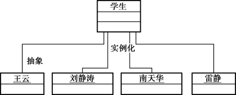</p>
<p align="center">图6.1  对象和类的关系   </p>  
<p align="center">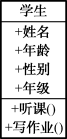</p>
<p align="center">  图6.2 学生类</p>  

## 6.2  Java类


&emsp;&emsp;Java API提供了一些现有的类，程序员可以使用这些类来创建对象，例如第5章学习的String类。除了使用现有的Java类，程序员还可以自定义Java类，接下来会详细地介绍如何定义和使用Java类。

### 6.2.1  Java类的定义  

&emsp;&emsp;在编写第一个Java程序时就已经知道，类是Java程序的基本单元。Java是面向对象的程序设计语言，所有程序都是由类组织起来的。下面是类定义的语法形式。


```
public class 类名｛

    //定义类属性

    属性1类型:属性1名;

    属性2类型:属性2名;

    …

    //定义方法

    方法1定义

    方法2定义

    …

｝
```


&emsp;&emsp;在Java中，class是用来定义类的关键字，class关键字后面是要定义的类的名称，然后有一对大括号，大括号里写的是类的主要内容。

&emsp;&emsp;类的主要内容也分两部分，第一部分是类的属性定义，在前面的课程中学习过，在类内部、方法外部定义的变量称为成员变量，这里类的属性就是类的成员变量，这两个概念是相同的。第二部分是类的方法定义，通过方法的定义，描述类具有的行为，这些方法也可以称为成员方法。

&emsp;&emsp;接下来通过定义学生类，熟悉Java类定义的写法，具体代码如下所示。


```
public class Student 

{

    String stuName;  //学生姓名

    int stuAge;      //学生年龄

    int stuSex;      //学生性别

    int stuGrade;    //学生年级

    //定义听课的方法，在控制台直接输出

    public void learn()

    {

    	System.out.println(stuName + "正在认真听课！");

    }

    //定义写作业的方法，输入时间，返回字符串

    public String doHomework(int hour)

    {

    	return "现在是北京时间:" + hour + "点，" + stuName + " 正在写作业！";

    }

}
```


&emsp;&emsp;需要注意的是，这个类里面没有main方法，所以只能编译，不能运行。

### 6.2.2  Java类的创建和使用  


&emsp;&emsp;定义好Student类后，就可以根据这个类创建（实例化）对象了。类就相当于一个模板，可以创建多个对象。创建对象的语法形式如下。


```
类名 对象名 = new 类名();
```


&emsp;&emsp;在学习使用String类创建String字符串时，其实已经创建了类的对象，所以大家对这样的语法形式并不陌生。创建对象时，要使用new关键字，后面要跟着类名。

&emsp;&emsp;根据上面创建对象的语法，创建王云这个学生对象的代码如下。


```
Student wangYun = new Student();
```


&emsp;&emsp;这里，只创建了wangYun这个对象，并没有对这个对象的属性赋值，考虑到每个对象的属性值不一样，所以通常在创建对象后给对象的属性赋值。在Java语言中，通过“.”操作符来引用对象的属性和方法，具体的语法形式如下。


```
对象名.属性;

对象名.方法;
```


&emsp;&emsp;通过上面的语法形式，可以给对象的属性赋值，也可以更改对象属性的值或者调用对象的方法，具体的代码如下。


```
wangYun.stuName ="王云";

wangYun.stuAge = 22;

wangYun.stuSex = 1;                      //1代表男，2代表女

wangYun.stuGrade = 4;                  //4代表大学四年级

wangYun.learn();                            //调用学生听课的方法

wangYun.doHomework(22);          //调用学生写作业的方法，输入值22代表现在是22点

​                                              //该方法返回一个String类型的字符串
```


&emsp;&emsp;接下来通过创建一个测试类TestStudent（这个测试类需要和之前编译过的Student类在同一个目录），来测试Student类的创建和使用，具体代码如下所示。


```
public class TestStudent

{

	public static void main(String[] args) 

	{

        Student wangYun = new Student();                  //创建wangYun学生类对象

        wangYun.stuName = "王云";

        wangYun.stuAge = 22;

        wangYun.stuSex = 1;                                        //1代表男，2代表女

        wangYun.stuGrade = 4;                                    //4代表大学四年级

        wangYun.learn();                                              //调用学生听课的方法

        String rstString = wangYun.doHomework(22);  //调用学生写作业的方法，输入值22代表现在是22点

        System.out.println(rstString);

    }

}

```

&emsp;&emsp;编译并运行该程序，运行结果如图6.3所示。

<p align="center"></p>
<p align="center">图6.3  创建和使用Student类</p>  

&emsp;&emsp;这个程序虽然非常简单，但却是我们第一次使用两个类完成的一个程序。其中TestStudent类是测试类，测试类中包含main方法，提供程序运行的入口。在main方法内，创建Student类的对象并给对象属性赋值，然后调用对象的方法。

&emsp;&emsp;这个程序有两个Java文件，每个Java文件中编写了一个Java类，编译完成后形成2个class文件。也可以将两个Java类写在一个Java文件里，但其中只能有一个类用public修饰，并且这个Java文件的名称必须用这个public类的类名命名，具体代码如下。

``` 

public class TestStudent

{

    public static void main(String[] args) 

    {

        Student wangYun = new Student();                  //创建wangYun学生类对象

        wangYun.stuName = "王云";

        wangYun.stuAge = 22;

        wangYun.stuSex = 1;                                        //1代表男，2代表女

        wangYun.stuGrade = 4;                                    //4代表大学四年级

        wangYun.learn();                                              //调用学生听课的方法

        String rstString = wangYun.doHomework(22);  //调用学生写作业的方法，输入值22代表现在是22点

        System.out.println(rstString);

    }

}

class Student                                                                       //不能使用public修饰

{

    String stuName;                                                        //学生姓名

    int stuAge;                                                            //学生年龄

    int stuSex;                                                             //学生性别

    int stuGrade;                                                           //学生年级

    //定义听课的方法，在控制台直接输出

    public void learn()

    {

        System.out.println(stuName + "正在认真听课！");

    }

    //定义写作业的方法，输入时间，返回字符串

    public String doHomework(int hour)

    {

        return "现在是北京时间:" + hour + "点，" + stuName + " 正在写作业！";

    }

}

```

&emsp;&emsp;在上面的一些例子中，对对象的属性都是先赋值后再使用，如果没有赋值就直接使用对象的属性，会有什么样的结果呢？

&emsp;&emsp;下面将TestStudent测试类的代码修改成如下的形式。


```
public class TestStudent

{

    public static void main(String[] args) 

    {

        Student wangYun = new Student();                           //创建wangYun学生类对象

        System.out.println("未赋值前的学生姓名为：" + wangYun.stuName);

        System.out.println("未赋值前的学生年龄为：" + wangYun.stuAge);

        System.out.println("未赋值前的学生性别数值为：" + wangYun.stuSex);

        System.out.println("未赋值前的学生年级为：" + wangYun.stuGrade);

        //给对象的属性赋值

        wangYun.stuName = "王云";

        wangYun.stuAge = 22;

        wangYun.stuSex = 1;                                                 //1代表男，2代表女

        wangYun.stuGrade = 4;                                             //4代表大学四年级

        System.out.println("赋值后的学生姓名为：" + wangYun.stuName);

        System.out.println("赋值后的学生年龄为：" + wangYun.stuAge);

        System.out.println("赋值后的学生性别数值为：" + wangYun.stuSex);

        System.out.println("赋值后的学生年级为：" + wangYun.stuGrade);

    }

}
```


&emsp;&emsp;程序运行结果如图6.4所示。

<p align="center">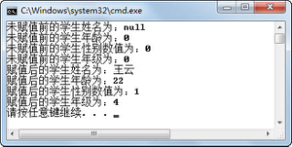</p>
<p align="center">图6.4  未赋值对象属性的值</p>  

&emsp;&emsp;从图6.4所示的程序运行结果可以看出，在未给对象属性赋值前使用属性时，如果该属性为引用数据类型，其初始默认值为null，如果该属性是int型，其初始默认值为0。

### 6.2.3  Java类的简单运用  


&emsp;&emsp;在上一小节中，定义了Student类后，使用TestStudent测试类创建了一个Student类的对象wangYun，然后给wangYun对象的属性赋值并调用对象的方法。接下来再定义一个老师类Teacher，Teacher类具有的属性和方法如图6.5所示。

<p align="center">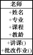</p>
<p align="center">图6.5  老师类</p>  
&emsp;&emsp;下面将新定义一个TestStuTea类，用于组织这个新程序的程序结构。该程序中包含2个老师对象（基本信息如表6.1所示）和4个学生对象（基本信息如表6.2所示）。

<p align="center">表6.1  老师基本信息表</p>  


| 姓名 | 专业       | 课程     | 教龄 |
| ---- | ---------- | -------- | ---- |
| 蒋涵 | 计算机应用 | Java基础 | 5    |
| 田斌 | 软件工程   | 前端技术 | 10   |


<p align="center">表6.2  学生基本信息表</p>  

| 姓名   | 年龄 | 性别 | 年级 |
| ------ | ---- | ---- | ---- |
| 王云   | 22   | 男   | 4    |
| 刘静涛 | 21   | 女   | 3    |
| 南天华 | 20   | 男   | 3    |
| 雷静   | 22   | 女   | 4    |

 

&emsp;&emsp;程序要完成的功能描述如下。

&emsp;&emsp;（1）在程序开始运行时，需要在控制台依次输入所有老师和学生的基本信息。

&emsp;&emsp;（2）在控制台输入完毕这些老师和学生的基本信息后，调用第一个老师讲课的方法，在控制台输出“\*\*（该老师的姓名）老师正在辛苦讲\*\*（该老师所授课程）课程”的信息。

&emsp;&emsp;（3）依次调用所有学生听课的方法，在控制台输出“\*\*（该学生姓名）学生正在认真听课！”的信息。

&emsp;&emsp;（4）依次调用所有学生写作业的方法，在控制台“现在是北京时间：20点，\*\*（该学生姓名）正在写作业！”的信息，其中20是作为参数传递给写作业的方法的。

&emsp;&emsp;（5）调用第二个老师批改作业的方法，依次批改所有学生的作业，在控制台输出“讲授\*\*（该老师所授课程）课程的老师\*\*（该老师姓名）已经批改完毕：\*\*（该学生姓名）的作业！”。

&emsp;&emsp;程序运行结果如图6.6所示。

<p align="center">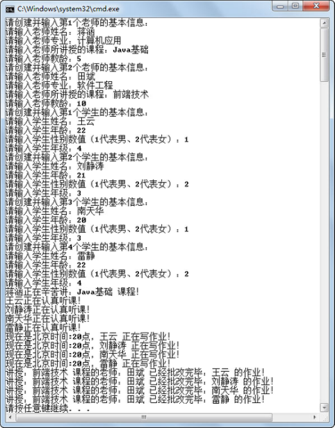</p>
<p align="center">图6.6  Java类的简单运用</p>  	

&emsp;&emsp;程序代码如下所示，其中使用了两个数组，分别存放了2个老师对象和4个学生对象，使用循环和方法createTeacher()、createStudent()创建对象并给对象赋值，之后再使用循环并调用对象方法按要求输出结果。


```
import java.util.Scanner;

public class TestStuTea

{

    static Scanner input = new Scanner(System.in);

    public static void main(String[] args) 

    {

        Teacher[] tea = new Teacher[2];     //创建长度为2的数组tea，用于存放2个老师对象

        Student[] stu = new Student[4];      //创建长度为4的数组stu，用于存放4个学生对象

        for(int i = 0;i < tea.length;i++)

        {

            System.out.println("请创建并输入第" + (i+1) + "个老师的基本信息：");

            tea[i] = createTeacher();         //调用createTeacher方法创建第i+1个老师对象并赋值

        }

        for(int j = 0;j < stu.length;j++)

        {

            System.out.println("请创建并输入第" + (j+1) + "个学生的基本信息：");

            stu[j] = createStudent();         //调用createStudent方法创建第j+1个学生对象并赋值

        }

        //调用第一个老师讲课的方法，在控制台输出

        tea[0].teach();

        //依次调用所有学生听课的方法，在控制台输出

        for(int j = 0;j < stu.length;j++)

        {

            stu[j].learn();

        }

        //依次调用所有学生写作业的方法，在控制台输出

        for(int j = 0;j < stu.length;j++)

        {

            String tempStr = stu[j].doHomework(20);        //其中20是作为参数传递给写作业的方法的

            System.out.println(tempStr);

        }

        for(int j = 0;j < stu.length;j++)

        {

            //调用第二个老师批改作业的方法，依次批改所有学生的作业，在控制台输出

            tea[1].checkHomework(stu[j]);

        }

    }

    //创建老师对象并赋值

    public static Teacher createTeacher() 

    {

        Teacher tea = new Teacher();

        System.out.print("请输入老师姓名：");

        tea.teaName = input.next();

        System.out.print("请输入老师专业：");

        tea.teaSpecialty = input.next();

        System.out.print("请输入老师所讲授的课程：");

        tea.teaCourse = input.next();

        System.out.print("请输入老师教龄：");

        tea.teaYears = input.nextInt();

        return tea;

    }

    //创建学生对象并赋值

    public static Student createStudent() 

    {

        Student stu = new Student();

        System.out.print("请输入学生姓名：");

        stu.stuName = input.next();

        System.out.print("请输入学生年龄：");

        stu.stuAge = input.nextInt();

        System.out.print("请输入学生性别数值（1代表男、2代表女）：");

        stu.stuSex = input.nextInt();

        System.out.print("请输入学生年级：");

        stu.stuGrade = input.nextInt();

        return stu;

    }

}

class Teacher                                 //不能使用public修饰

{

    String teaName;              //老师姓名

    String teaSpecialty;              //老师专业

    String teaCourse;              //老师所讲授的课程

    int teaYears;                  //老师教龄

    //定义讲课的方法，在控制台直接输出

    public void teach()

    {

        System.out.println(teaName + "正在辛苦讲：" + teaCourse + " 课程！");

    }

    //定义批改作业的方法，输入值为一个学生对象，在控制台直接输出结果

    public void checkHomework(Student stu)

    {

        System.out.println("讲授：" + teaCourse + " 课程的老师：" + teaName + " 已经批改完毕：

        " + stu.stuName +" 的作业！");

    }

}

class Student                                  //不能使用public修饰

{

    String stuName;                  //学生姓名

    int stuAge;                       //学生年龄

    int stuSex;                       //学生性别

    int stuGrade;                      //学生年级

    //定义听课的方法，在控制台直接输出

    public void learn()

    {

        System.out.println(stuName + "正在认真听课！");

    }

    //定义写作业的方法，输入时间，返回字符串

    public String doHomework(int hour)

    {

        return "现在是北京时间:" + hour + "点，" + stuName + " 正在写作业！";

    }

}
```
### 6.2.4  封装  

&emsp;&emsp;在企业面试的过程中，经常会被问到，面向对象有哪些基本特性？答案应该是：封装、继承和多态。如果要求4个答案的话，可以增加一个抽象。继承和多态在后面的章节会详细介绍，这里给读者简要介绍一下封装。

&emsp;&emsp;封装就是将抽象得到的属性和行为结合起来，形成一个有机的整体，就是类。类里面的一些属性和方法（尤其是属性），需要隐藏起来，不希望直接对外公开，但同时提供供外部访问的方法来访问这些需要隐藏的属性和方法。

&emsp;&emsp;封装的目的是增强安全性和简化编程，使用者不必了解具体类的内部实现细节，而只是要通过提供给外部访问的方法，来有限制地访问类需要隐藏的属性和方法。

&emsp;&emsp;还是使用学生的案例，例如要求一旦对学生对象的性别赋值之后就不能修改，但在6.2.2节的TestStudent.java程序中，完全可以在赋值以后，通过“学生对象名.stuSex = 2”语句，把学生对象的性别从男变成女。这样的做法就不符合程序的需求，如何解决这个问题呢？

&emsp;&emsp;采用封装的形式，用private（私有的）关键字去修饰stuSex变量，其含义是为把stuSex变量封装到类的内部，只有在类的内部才可以访问stuSex变量，从而保证了这个变量不能被其他类的对象修改。这样的做法只起到了隐藏的作用，要想更好地使用这个变量，则应该提供一个对外的public（公有的）方法，其他对象可以通过这个方法访问这个私有的变量。

&emsp;&emsp;所谓良好的封装，就是使用private对属性进行封装，从而保护信息的安全。使用public修饰方法时，外界可以调用该方法，通常将设置私有属性的值和获取私有属性值的方法称为setter和getter方法。接下来按照良好封装的要求，重新编写Student类，其代码如下。


```
public class Student 

{

    private String stuName;                //学生姓名——私有属性

    private int stuAge;                    //学生年龄——私有属性

    private int stuSex;                     //学生性别——私有属性

    private int stuGrade;                   //学生年级——私有属性

    public String getStuName(){         //公有方法获得学生姓名

    //这里的this表示本对象

        return this.stuName;             //返回这个类的私有属性stuName

    }

    //公有方法设置学生姓名，参数为要设置的学生姓名

    public void setStuName(String name){

        this.stuName = name;

    }

    public int getStuAge(){                 //公有方法获得学生年龄

        return this.stuAge;

    }

    //公有方法设置学生年龄，参数为要设置的学生年龄

    public void setStuAge(int age){

        this.stuAge = age;

    }       

    public int getStuSex(){                  //公有方法获得学生性别

        return this.stuSex;

    }

    //公有方法设置学生性别，参数为要设置的学生性别

    public void setStuSex(int sex){

        this.stuSex = sex;

    }       

    public int getStuGrade(){              //公有方法获得学生年级

        return this.stuGrade;

    }

    //公有方法设置学生年级，参数为要设置的学生年级

    public void setStuGrade(int grade){

        this.stuGrade = grade;

    }       

    //定义听课的方法，在控制台直接输出

    public void learn()

    {

        System.out.println(stuName + "正在认真听课！");

    }

    //定义写作业的方法，输入时间，返回字符串

    public String doHomework(int hour)

    {

        return "现在是北京时间:" + hour + "点，" + stuName + " 正在写作业！";

    }

} 

```

&emsp;&emsp;如果继续使用下面的代码创建Student对象并给对象属性赋值，将不会编译通过，原因是不能在类外给类的私有属性赋值，具体参见代码注释。


```
public class TestStudent3

{

    public static void main(String[] args) 

    {

        Student wangYun = new Student();                  //创建wangYun学生类对象

        wangYun.stuName = "王云";                           //不能给私有属性stuName赋值

        wangYun.stuAge = 22;                                     //不能给私有属性stuAge赋值

        wangYun.stuSex = 1;                                        //不能给私有属性stuSex赋值

        wangYun.stuGrade = 4;                                    //不能给私有属性stuGrade赋值

        wangYun.learn();                                              //可以调用公有的学生听课的learn()方法

        String rstString = wangYun.doHomework(22);//可以调用公有的学生写作业的

        //doHomework(22)方法

        System.out.println(rstString);

    }

}
```


&emsp;&emsp;正确的代码如下。


```
public class TestStudent4

{

    public static void main(String[] args) 

    {

        Student wangYun = new Student();                  //创建wangYun学生类对象

        wangYun.setStuName("王云");                        //调用公有方法给stuName赋值

        wangYun.setStuAge(22);                                  //调用公有方法给stuAge赋值

        wangYun.setStuSex(1);                                    //调用公有方法给stuSex赋值

        wangYun.setStuGrade(4);                                 //调用公有方法给stuGrade赋值

        wangYun.learn();                                              //调用公有的学生听课的learn()方法

        String rstString = wangYun.doHomework(22);  //调用公有的学生写作业的doHomework(22)方法

        System.out.println(rstString);

    }

} 
```


## 6.3  上机任务


目标：完成本章6.2.3节的程序。

 

时间：20分钟。

 

形式：每个学员独立完成，小组组长检查。

 

工具：EditPlus。


## 6.4  上机任务


目标：按照良好封装的要求，完成本章6.2.3节的程序。


时间：15分钟。


形式：每个学员独立完成，小组组长检查。


工具：EditPlus。

## 6.5  构造方法

 


&emsp;&emsp;在前面介绍封装的时候，一旦给学生对象的性别赋值之后就不能修改的这个需求其实并没有实现，因为通过Student wangYun = new Student();创建对象，然后通过wangYun.setStuSex(1);方法给学生对象wangYun的stuSex属性赋int型“1”这个值，之后仍然可以使用wangYun.setStuSex(2);方法将wangYun的stuSex属性值从“1”改为“2”，所以没有实现一旦赋值之后就不能修改的需求。

### 6.5.1  构造方法解决问题  

&emsp;&emsp;接下来通过构造方法的形式，实现上面的功能，将Student类的代码改造为如下形式。为了节省篇幅，省略了Student类中的其他方法。但务必注意的是，为了实现一旦给学生对象的性别赋值之后就不能修改的功能，所以去掉了setStuSex(int sex)的方法，保证其他对象不能修改学生对象的性别。


```
public class Student 

{

    private String stuName;                

    private int stuAge;                    

    private int stuSex;                     

    private int stuGrade;                   

    //**构造方法，用户初始化对象的成员变量**

    **public Student(String name,int age,int sex,int grade){**

    **this.stuName = name;**

    **this.stuAge = age;**

    **this.stuSex = sex;**        

    **this.stuGrade = grade;**

    **}**

    //省略了Student类中的其他方法

}
```


测试类TestStudent5的代码如下。


```
public class TestStudent5

{

    public static void main(String[] args) 

    {

        //使用带参的构造方法，创建wangYun学生类对象并初始化对象

        Student wangYun = new Student("王云",22,1,4);     

        wangYun.learn();

        String rstString = wangYun.doHomework(22);

        System.out.println(rstString);

    }

}
```

编译运行程序，其结果如图6.7所示。

<p align="center">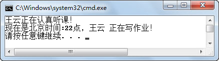</p>
<p align="center">图6.7  使用构造方法创建并初始化对象</p>  


### 6.5.2  构造方法的使用  

&emsp;&emsp;构造方法（也称为构造函数）是一种特殊的方法，它具有以下特点。

- 构造方法的方法名必须与类名相同。

- 构造方法没有返回类型，也不能定义为void，在方法名前不声明返回类型。

&emsp;&emsp;其实构造方法是有返回值的，返回的是刚刚被初始化完成的当前对象的引用。既然构造方法返回被初始化对象的引用，为什么不写返回值类型呢？例如Student类构造方法为什么不写成 public Student Student（参数列表）｛…｝呢？

&emsp;&emsp;因为Java设计人员把这种方法名（类名）和返回类型的类名相同的方法看成一个普通方法，只是名称“碰巧”相同罢了，编译器识别时也会认为它是一个方法。为了和普通方法进行区别，Java设计人员规定构造方法不写返回值，编译器通过这一规定识别构造方法，而不是说构造方法真的没有返回值。

&emsp;&emsp;构造方法的主要作用是完成对象的初始化工作，它能够把定义对象时的参数传给对象。一个类可以定义多个构造方法，根据参数的个数、类型或排列顺序来区分不同的构造方法。


```
public class Student 

{

    private String stuName;       

    private int stuAge;            

    private int stuSex;           

    private int stuGrade;         

    //构造方法，用户初始化对象的属性

    public Student(String name,int age,int sex,int grade){

        this.stuName = name;

        this.stuAge = age;

        this.stuSex = sex;         

        this.stuGrade = grade;

    }

    //构造方法，用户初始化对象的属性（不带年级参数，设置年级默认值为4）

    public Student(String name,int age,int sex){

        this.stuName = name;

        this.stuAge = age;

        this.stuSex = sex;

        this.stuGrade = 4;

    }       

    //构造方法，用户初始化对象的属性

    //不带年龄、年级参数，设置年龄默认值为22，年级默认值为4

    public Student(String name,int sex){

        this.stuName = name;

        this.stuAge = 22;

        this.stuSex = sex;

        this.stuGrade = 4;

    }

    //省略了Student类中的其他方法

}
```


&emsp;&emsp;新建测试类TestStudent6，其代码如下，运行结果如图6.8所示。


```
public class TestStudent6

{

    public static void main(String[] args) 

    {

        //使用不同参数列表的构造方法创建wangYun、liuJT、nanTH三个学生类对象

        Student wangYun = new Student("王云",22,1,4);     

        Student liuJT = new Student("刘静涛",21,2);  

        Student nanTH = new Student("南天华",1);


        wangYun.learn();

        String rstString = wangYun.doHomework(22);

        System.out.println(rstString);


        liuJT.learn();                          //调用liuJT对象的learn()方法

        //调用liuJT对象的getStuName()和getStuGrade()方法获得属性值

        System.out.println(liuJT.getStuName() + " 正在读大学" + liuJT.getStuGrade() + "年级");


        System.out.println(nanTH.doHomework(23));          //调用nanTH对象的doHomework(23)方法

    }

}
```

<p align="center">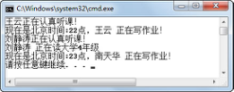</p>
<p align="center">图6.8  使用类的多个构造方法</p>  

&emsp;&emsp;如果在定义类时没有定义构造方法，则编译系统会自动插入一个无参数的默认构造方法，这个构造方法不执行任何代码。如果在定义类时定义了有参的构造方法，没有显式地定义无参的构造方法，那么在使用构造方法创建类对象时，则不能使用默认的无参构造方法。

&emsp;&emsp;例如，在TestStudent6程序的main方法内添加一行语句：Student leiJing = new Student();，编译器会报错，提示没有找到无参的构造方法。


## 6.6  上机任务


目标：完成本章6.5节中的所有程序。

 

时间：20分钟。


形式：每个学员独立完成，小组组长检查。

 

工具：EditPlus。

 


## 6.7  对象初始化过程


&emsp;&emsp;通过前面的学习，知道类中的成员变量初始化有以下几种情况。

- 创建对象时默认初始化成员变量。

- 定义类时，给成员变量赋初值。

- 调用构造方法时，使用构造方法所带的参数初始化成员变量。

&emsp;&emsp;在使用new关键字创建并初始化对象的过程中，具体的初始化分为4步。

&emsp;&emsp;（1）给对象的实例变量分配空间，默认初始化成员变量。

&emsp;&emsp;（2）成员变量声明时的初始化。

&emsp;&emsp;（3）初始化块初始化。

&emsp;&emsp;（4）构造方法初始化。

### 6.7.1  初始化块  

&emsp;&emsp;初始化块就是在类中用一对大括号括起来的代码块，语法形式如下：


```
{

	代码块

｝
```


&emsp;&emsp;初始化块可以用来初始化类的成员变量。但正如前面所说，使用初始化块初始化成员变量的顺序是在默认初始化成员变量以及成员变量声明时赋值之后，在使用构造方法初始化之前，请看下面的代码。


```
public class Student 

{

    private String stuName = "";  

    private int stuAge = -1;      

    private int stuSex = -1;      

    private int stuGrade =-1;    

    //使用初始化块初始化

    {       

        System.out.println("使用初始化块初始化");

        this.stuName = "雷静";

        this.stuAge = 22;

        this.stuSex = 2;   

        this.stuGrade = 4;

    }

    //无参构造方法

    public Student(){                            

        System.out.println("使用无参构造函数初始化");

    }

    //构造方法，用户初始化对象的成员变量

    public Student(String name,int age,int sex,int grade){                                   

        System.out.println("使用有参构造函数初始化");

        this.stuName = name;

        this.stuAge = age;

        this.stuSex = sex;         

        this.stuGrade = grade;

    }       

    //省略了Student类中的其他方法

}
```


&emsp;&emsp;新建测试类TestStudent7，其代码如下，运行结果如图6.9所示。


```
public class TestStudent7

{

    public static void main(String[] args) 

    {

        Student temp = new Student(); 

        System.out.println(temp.getStuName() + " 正在读大学" + temp.getStuGrade() + "年级");

        //构造方法初始化成员变量在初始化块初始化之后

        Student wangYun = new Student("王云",22,1,4);                        

        System.out.println(wangYun.getStuName() + " 正在读大学" + wangYun.getStuGrade() + "年级");

    }

}
```

<p align="center"></p>
<p align="center">图6.9  对象初始化过程</p>  

### 6.7.2  对象初始化内存结构  

&emsp;&emsp;刚才通过案例演示的方式，了解了对象初始化的过程，接下来通过图示内存结构的形式，让大家更加直观地了解对象初始化过程。

&emsp;&emsp;代码Student temp = new Student("王云",22,1,4);      运行后，内存结构如图6.10～图6.13所示。

&emsp;&emsp;（1）给对象的实例变量分配空间，默认初始化成员变量。

<p align="center">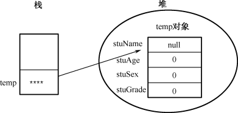</p>
<p align="center">图6.10  对象初始化内存结构一</p>  

&emsp;&emsp;（2）成员变量声明时的初始化。

<p align="center">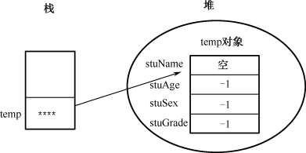</p>
<p align="center">图6.11  对象初始化内存结构二</p>  
&emsp;&emsp;（3）初始化块初始化。

<p align="center">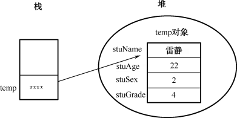</p>
<p align="center">图6.12  对象初始化内存结构三</p>  

&emsp;&emsp;（4）有参构造函数初始化。

<p align="center">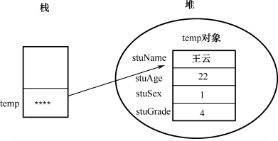</p>
<p align="center">图6.13  对象初始化内存结构四</p>  


## 6.8  重载

###  6.8.1  重载的定义  

&emsp;&emsp;在同一个类中，可以有两个或两个以上的方法具有相同的方法名，但它们的参数列表不同。在这种情况下，该方法就被称为重载（overload）。其中参数列表不同包括以下3种情形。

- 参数的数量不同。

- 参数的类型不同。

- 参数的顺序不同。

&emsp;&emsp;必须要注意的是，仅返回值不同的方法不叫重载方法。

&emsp;&emsp;其实重载的方法之间并没有任何关系，只是“碰巧”名称相同罢了，既然方法名称相同，在使用相同的名称调用方法时，编译器怎么确定调用哪个方法呢？就要靠传入参数的不同确定调用哪个方法。返回值是运行时才决定的，而重载方法的调用是编译时就决定的，所以当编译器碰到只有返回值不同的两个方法时，就“糊涂”了，认为它是同一个方法，不知道调用哪个，所以就会报错。 

&emsp;&emsp;在之前介绍一个类可以定义多个构造方法的时候，已经对构造方法进行了重载，接下来通过案例学习普通方法的重载。

### 6.8.2  重载方法的使用  

&emsp;&emsp;看下面的代码，其中的重点是普通learn方法的重载。


```
public class Student 

{

    private String stuName;               

    private int stuAge;                    

    private int stuSex;                     

    private int stuGrade;                   

    //构造方法，用户初始化对象的属性

    public Student(String name,int age,int sex,int grade){

        this.stuName = name;

        this.stuAge = age;

        this.stuSex = sex;         

        this.stuGrade = grade;

    }

    //构造方法，用户初始化对象的属性（不带年级参数，设置年级默认值为4）

    public Student(String name,int age,int sex){

        this.stuName = name;

        this.stuAge = age;

        this.stuSex = sex;         

        this.stuGrade = 4;

    }       

    //构造方法，用户初始化对象的属性

    //不带年龄、年级参数，设置年龄默认值为22，年级默认值为4

    public Student(String name,int sex){

        this.stuName = name;

        this.stuAge = 22;

        this.stuSex = sex;         

        this.stuGrade = 4;

    }       

    //无参构造方法

    public Student(){

    }

    //省略了Student类中的其他方法

    //传入参数name、age、sex和grade的值，输出结果

    public void learn(String name,int age,int sex,int grade)

    {

        String sexStr = (sex==1)?"男生":"女生";

        System.out.println(age + "岁的大学" + grade + "年级" + sexStr + name + "正在认真听课！");

    }

    //传入参数name、age和sex的值，grade值取4，输出结果

    public void learn(String name,int age,int sex)

    {

        learn(name,age,sex,4);

    }

    //传入参数name和sex的值，age的值取22，grade值取4，输出结果

    public void learn(String name,int sex)

    {

        learn(name,22,sex,4);

    }

    //无参的听课方法，使用成员变量的值作为参数

    public void learn()

    {

        learn(this.stuName,this.stuAge,this.stuSex,this.stuGrade);

    }

}
```


上面的代码重载了learn方法，测试类main方法中的代码如下：


```
Student stu = new Student("王云",22,1,4);

stu.learn("刘静涛",21,2,3);

stu.learn("南天华",20,1);

stu.learn("雷静",2);

stu.learn();
```

&emsp;&emsp;程序运行结果如图6.14所示。

<p align="center">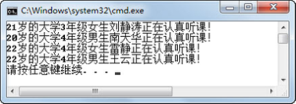</p>
<p align="center">图6.14  重载方法使用</p>  


&emsp;&emsp;有些人可能已经注意到了，在一些重载方法的方法体内，调用了其他重载方法。这种情况在类重载方法的使用上非常普遍，有利于代码的重用和维护。


## 6.9  上机任务


目标：完成本章6.7节和6.8节中的所有程序。


时间：30分钟。


形式：每个学员独立完成，小组组长检查。


工具：EditPlus。


##  6.10  本章练习

1  程序员可以将多个Java类写在一个Java文件中，但其中只有一个类能用      修饰，并且这个Java文件的名称必须与这个类的类名相同。

2  请描述面向过程和面向对象的区别，并用自己的语言总结面向对象的优势和劣势。

 

 

3  面向对象有哪些特性？什么是封装？

 

 

4  请描述构造方法有哪些特点。

 

 

5  在使用new关键字创建并初始化对象的过程中，具体的初始化过程分为哪4步？

 

 

 

 

 

 

 