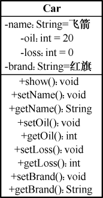
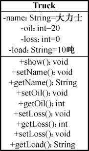
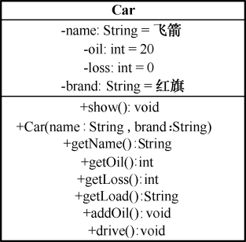
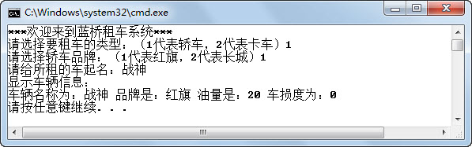
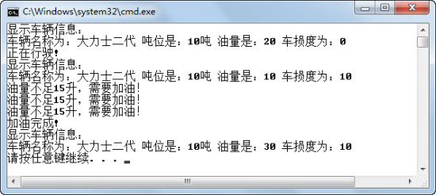
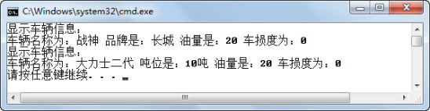
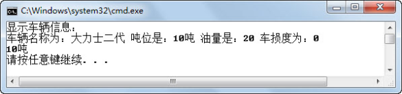

## 本章简介
&emsp;&emsp;前面的章节介绍过，面向对象的主要特性包括抽象、封装、继承和多态，并且详细地介绍了什么是封装，现在来回顾一下。封装就是将抽象得到的属性和方法结合起来，形成一个有机的整体——类。类里面的一些属性，需要隐藏起来，不希望直接对外公开，但同时也提供了供外部访问的方法（setter和getter方法），用于访问这些需要隐藏的属性。

&emsp;&emsp;本章将在已有面向对象概念的基础上，进一步学习采用面向对象进行分析与设计。在接下来的几章中，将通过一个“租车系统”的设计和开发，体会面向对象编程的乐趣。本章将从“租车系统”开始，学习类的抽象、封装、继承和多态，其中抽象和封装是复习前面的内容，而继承和多态是本章的重点。

## 8.1  抽象和封装

&emsp;&emsp;面向对象设计首先要做的就是抽象。根据用户的业务需求抽象出类，并关注这些类的属性和方法，将现实世界中的对象抽象成程序设计中的类。接下来分析一下“租车系统”的部分需求。

&emsp;&emsp;（1）在控制台输出“请选择要租车的类型：（1代表轿车，2代表卡车）”，等待用户输入。

&emsp;&emsp;（2）如果用户选择的是轿车，则在控制台输出“请选择轿车品牌：（1代表红旗，2代表长城）”，等待用户输入。

&emsp;&emsp;（3）如果用户选择的是卡车，则在控制台输出“请选择卡车吨位：（1代表5吨，2代表10吨）”，等待用户输入。

&emsp;&emsp;（4）在控制台输出“请给所租的车起名：”，等待用户输入车名。

&emsp;&emsp;（5）所租的车油量默认值为20升，车辆损耗度为0（表示刚保养完的车，无损耗）。

&emsp;&emsp;（6）具有显示所租车辆信息功能，显示的信息包括：车名、品牌/吨位、油量和车损度。

### 8.1.1  类抽象  

&emsp;&emsp;程序员开发出来的软件是需要满足用户需求的，所以程序员做分析和设计的依据是用户需求，通常是软件开发前期形成的“需求规格说明书”。面向对象设计时，首先要阅读用户需求，找出需求中名词部分用来确定类和属性，找出动词部分确定方法。

&emsp;&emsp;首先要进行类抽象，就是发现类并定义类的属性和方法。具体的步骤如下。

&emsp;&emsp;（1）发现名词。

&emsp;&emsp;通过阅读需求，发现需求中有类型、轿车、卡车、品牌、红旗、长城、吨位、车名、油量、车损度等名词。

&emsp;&emsp;（2）确定类和属性。

&emsp;&emsp;通过分析，车名、油量、车损度、品牌这些名词依附于轿车这个名词，车名、油量、车损度、吨位依附于卡车这个名词，所以可以将轿车、卡车抽象成类，依附于这些类的名词抽象成属性。

&emsp;&emsp;需要补充一点，不是所有依附于类的名词都需要抽象成属性，因为在分析需求的过程中会会发现其中某些名词不需要关注，则在抽象出类的过程中放弃这些名词，不将其抽象成属性。例如红旗、长城，这是两个轿车的品牌，属于属性值，不需要抽象成类或属性。

&emsp;&emsp;（3）确定方法。

&emsp;&emsp;通过分析需求的动词，发现显示车辆信息是轿车和卡车的行为，所以可以将这个行为抽象成类的方法。同样地，不是所有依附于类名词的动词都需要抽象成类的方法，只有需要参与业务处理的动词才能确定成方法。

&emsp;&emsp;根据对轿车和卡车的类抽象，可以得到如图8.1和图8.2所示的结果。

<p align="center"></p>
<p align="center">图8.1  轿车类 </p>  
<p align="center"></p>
<p align="center">图8.2  卡车类 </p>  
### 8.1.2  类封装  

&emsp;&emsp;类抽象的目的在于抽象出类，并确定属性和方法，而接下来的类封装，则要在封装的角度隐藏类的属性，提供公有的方法来访问这些属性。

&emsp;&emsp;最简单的操作方法就是，把所有的属性都设置为私有属性（表示私有属性和方法时，需在类图中的属性和方法前加上“-”号），每个私有属性都提供getter和setter公有的方法（表示公有属性和方法时，需在类图中的属性和方法前加上“+”号），封装后的类图如图8.3和图8.4所示，在类图中设定了类的成员变量的初始值。

<p align="center"></p>
<p align="center"> 图8.3  轿车类  </p>  
<p align="center"></p>
<p align="center">图8.4  卡车类</p>  
&emsp;&emsp;这样的封装过于简单，没有考虑需求，接下来进一步阅读需求，可以发现以下几点。

&emsp;&emsp;（1）租车时可以指定车的类型和品牌（或吨位），之后不允许修改。

&emsp;&emsp;（2）油量和车损度租车时取默认值，只有通过车的加油和行驶的行为改变其油量和车损度值，不允许直接修改。

&emsp;&emsp;根据需求，应对轿车类和卡车类做如下修改。

&emsp;&emsp;（1）去掉所有的setter方法，保留所有的getter方法。

&emsp;&emsp;（2）提供addOil()、drive()这两个公有的方法，实现车的加油和行驶的行为。

&emsp;&emsp;（3）至少需要提供一个构造方法，实现对类型和品牌（或吨位）的初始化。

&emsp;&emsp;调整后的类图如图8.5和图8.6所示。

<p align="center"></p>
<p align="center">图8.5  调整后的轿车类 </p>  
<p align="center"></p>
<p align="center">图8.6  调整后的卡车类 </p>  

&emsp;&emsp;封装后的Car类代码如下所示，具体内容看注释。


```
package com.bd.zuche;

//轿车类

public class Car 

{

    private String name = "飞箭";                 //车名

    private int oil = 20;                                  //油量

    private int loss = 0;                                  //车损度

    private String brand = "红旗";                //品牌

    //构造方法，指定车名和品牌

    public Car(String name,String brand){

        this.name = name;

        this.brand = brand;

	}

        //显示车辆信息

    public void show()

    {

        System.out.println("显示车辆信息：\n车辆名称为：" + this.name + " 品牌是：" + this.brand + "油量是：" + this.oil + " 车损度为：" + this.loss);

    }

    //获取车名

    public String getName()

    {

        return name;

    }

    //获取油量

    public int getOil()

    {

        return oil;

    }

    //获取车损度

    public int getLoss()

    {

        return loss;

    }

    //获取品牌

    public String getBrand()

    {

        return brand;

    }

    //加油

    public void addOil()

    {

    //加油功能未实现

    }

    //行驶

    public void drive()

    {

        //行驶功能未实现

    }

}
```


&emsp;&emsp;封装后的Truck类代码如下所示。


```
package com.bd.zuche;

//卡车类

public class Truck 

{

    private String name = "大力士";             //车名

    private int oil = 20;                                  //油量

    private int loss = 0;                                  //车损度

    private String load = "10吨";                           //吨位

    //构造方法，指定车名和品牌

    public Truck(String name,String load){

        this.name = name;

        this.load = load;

    }

    //显示车辆信息

    public void show()

    {

        System.out.println("显示车辆信息：\n车辆名称为：" + this.name + " 吨位是：" + this.load + "油量是：" + this.oil + " 车损度为：" + this.loss);

    }

    //获取车名

    public String getName()

    {

    return name;

    }

    //获取油量

    public int getOil()

    {

    return oil;

    }

    //获取车损度

    public int getLoss()

    {

    return loss;

    }

    //获取吨位

    public String getLoad()

    {

    return load;

    }

    //加油

    public void addOil()

    {

    //加油功能未实现

    }

    //行驶

    public void drive()

    {

    //行驶功能未实现

    }

}
```


&emsp;&emsp;将之前《租车系统》的需求总结如下。

&emsp;&emsp;（1）在控制台输出“请选择要租车的类型：（1代表轿车，2代表卡车）”，等待用户输入。

&emsp;&emsp;（2）如果用户选择的是轿车，则在控制台输出“请选择轿车品牌：（1代表红旗，2代表长城）”，等待用户输入。

&emsp;&emsp;（3）如果用户选择的是卡车，则在控制台输出“请选择卡车吨位：（1代表5吨，2代表10吨）”，等待用户输入。

&emsp;&emsp;（4）在控制台输出“请给所租的车起名：”，等待用户输入车名。

&emsp;&emsp;（5）所租的车油量默认值为20升，车辆损耗度为0（表示刚保养完的车，无损耗）。

&emsp;&emsp;（6）具有显示所租车辆信息的功能，显示的信息包括车名、品牌/吨位、油量和车损度。

&emsp;&emsp;（7）租车时指定车的类型和品牌（或吨位），之后不允许修改。

&emsp;&emsp;（8）油量和车损度租车时取默认值，只有通过车的加油和行驶的行为改变其油量和车损度值，不允许直接修改。

&emsp;&emsp;按需求完成代码如下，程序运行结果如图8.7所示。


```
import java.util.Scanner;

import com.bd.zuche.*;

class TestZuChe 

{

    public static void main(String[] args) 

    {

        String name = null;                //车名

        int oil = 20;                                  //油量

        int loss = 0;                                    //车损度

        String brand = null;                      //品牌

        String load = null;                               //吨位

        Scanner input = new Scanner(System.in);

        System.out.println("***欢迎来到蓝桥租车系统***");

        System.out.print("请选择要租车的类型：（1代表轿车，2代表卡车）");

        int select = input.nextInt();

        switch(select)

        {

            case 1:                                                      //选择租轿车

                System.out.print("请选择轿车品牌：（1代表红旗，2代表长城）");

                select = input.nextInt();

                if(select == 1)                                 //选择红旗品牌

                {

                    brand = "红旗";

                }else                                               //选择长城品牌

                {

                    brand = "长城";

                }

                System.out.print("请给所租的车起名：");

                name = input.next();                       //输入车名

                Car car = new Car(name,brand);    //使用构造方法初始化车名和品牌

                car.show();                                               //输出车辆信息

                break;

            case 2:                                                      //选择租卡车

                System.out.print("请选择卡车吨位：（1代表5吨，2代表10吨）");

                select = input.nextInt();

                if(select == 1)                                 //选择5吨卡车

                {

                    load = "5吨";

                }else                                               //选择10吨卡车

                {

                    load = "10吨";

                }

                System.out.print("请给所租的车起名：");

                name = input.next();                                //输入车名

                Truck truck = new Truck(name,load);     //使用构造方法初始化车名和吨位

                truck.show();                                           //输出车辆信息

                break;

        }

    }

}
```

<p align="center"></p>
<p align="center">图8.7 《租车系统》运行结果</p>  
### 8.1.3  方法的实现  

&emsp;&emsp;在Car类和Truck类的代码中，addOil()方法和drive()方法的功能还没有实现，接下来结合需求，分别完成Car类和Truck类中的这两个方法。

&emsp;&emsp;《租车系统》增加了如下需求。

&emsp;&emsp;（1）不论是轿车还是卡车，油箱最多可以装60升汽油，每次给车加油，增加油量20升。如果加油20升超过油箱容量时，则加到60升即可，并在控制台输出“油箱已加满！”。

&emsp;&emsp;（2）汽车行驶1次，耗油5升，车损度增加10，如果油量低于10升，则不允许行驶，直接在控制台输出“油量不足10升，需要加油！”。

&emsp;&emsp;具体实现代码如下所示。


```
//加油

public void addOil()

{

    if(oil > 40)                    //如果加油20升则超过油箱容量，则加到60升即可

    {

        oil = 60;

        System.out.println("邮箱已加满!");

    }else{                           //加油20升

        oil = oil + 20;

    }

    System.out.println("加油完成!");

}

    //行驶

public void drive()

{

    if(oil < 10)

    {       

        System.out.println("油量不足10升，需要加油！");

    }else{

        System.out.println("正在行驶!");

        oil = oil - 5;

        loss = loss + 10;

    }

}
```


&emsp;&emsp;执行下面的代码，注意观察油量和车损度的变化，程序运行结果如图8.8所示。


```
import java.util.Scanner;

import com.bd.zuche.*;

class TestZuChe2 

{

    public static void main(String[] args) 

    {

        Car car = new Car("战神","长城");        //初始化轿车对象car

        car.show();                   //输出车辆信息

        car.drive();                  //让car行驶1次，油量剩下15升，车损度为10

        car.show();                      //输出车辆信息

        car.drive();                    //让car再行驶1次，油量剩下10升，车损度为20

        car.drive();                     //让car再行驶1次，油量剩下5升，车损度为30

        car.drive();                //让car再行驶1次，因油量不足10升，不行驶，提示需要加油

        car.addOil();          //让car加油1次，油量增加20升，达到25升

        car.show();           //输出车辆信息

    }

} 
```

<p align="center"></p>
<p align="center">图8.8 《租车系统》测试结果 </p>  


## 8.2  上机任务

#### 目标：完成本章8.1节中的全部程序。


时间：60分钟。


形式：每个学员独立完成，小组组长检查。


工具：EditPlus。


## 8.3  继承

&emsp;&emsp;在面向对象的程序设计中，继承是一个不可分割的重要组成部分，没有使用继承的程序设计，就不能称为面向对象的程序设计。继承的重要性和特殊性可以通过本章的学习得以领会。

### 8.3.1  继承的概念  

&emsp;&emsp;在前面的课程中，根据《租车系统》的需求抽象出了Car类和Truck类，在这两个类中有许多相同的属性和方法，例如name、oil、loss属性以及相应的getter方法，还有addOil( )和drive( )方法。这样做有两个问题，一是代码大量重复，二是如果要修改，两个类都要修改，会很麻烦，而且容易忘记修改部分内容。怎么解决这个问题呢？使用继承解决这个问题。

&emsp;&emsp;Java继承是使用已存在的类的定义作为基础建立新类的技术，新类的定义可以增加新的属性或新的方法，也可以用已存在的类的属性和方法。这种技术能够非常容易地复用以前的代码，大大缩短开发周期，降低开发费用。

&emsp;&emsp;了解Java继承的概念后，接下来使用继承来解决Car类和Truck类重复代码的问题。作为程序设计人员，可以将Car类和Truck类重复的代码挑出来，提取到一个单独的Vehicle类中，然后让Car类和Truck类继承Vehicle类，这样可以在保留Vehicle类的属性和方法的同时，增加不同的属性和方法。继承的类图如图8.9所示。

<p align="center"></p>
<p align="center">图8.9  继承的类图</p>  

&emsp;&emsp;继承的语法形式如下。


```
class A extends B{

    类定义部分

}
```
&emsp;&emsp;即A类继承B类，B类称为父类、超类或基类，A类称为子类、衍生类或导出类。


### 8.3.2  继承的使用  

&emsp;&emsp;根据图8.9编写Vehicle类，Car类和Truck类，和类图略有不同的是，在Vehicle类中，增加了两个构造方法，一个是有参的，另一个是无参的，Vehicle类的代码如下。


```
package com.bd.zuche;

//车类，是父类

public class Vehicle 

{

    private String name = "汽车";        //车名

    private int oil = 20;                         //油量

    private int loss = 0;                         //车损度

    //无参构造方法

    public Vehicle()

    {

    }

    //构造方法，指定车名

    public Vehicle(String name)

    {

        this.name = name;

    }

    //获取车名

    public String getName()

    {

        return name;

    }

    //获取油量

    public int getOil()

    {

        return oil;

    }

    //获取车损度

    public int getLoss()

    {

        return loss;

    }

    //加油

    public void addOil()

    {

        if(oil > 40)                             //如果加油20升则超过油箱容量，则加到60升即可

        {

            oil = 60;

            System.out.println("邮箱已加满!");

        }else{                                    //加油20升

            oil = oil + 20;

        }

        System.out.println("加油完成!");

    }

    //行驶

    public void drive()

    {

        if(oil < 10)

        {       

            System.out.println("油量不足10升，需要加油！");

        }else{

            System.out.println("正在行驶!");

            oil = oil - 5;

            loss = loss + 10;

        }

    }

}
```


&emsp;&emsp;下面是Car类的定义，和类图不同的也是增加了一个有参的构造方法。


```
package com.bd.zuche;

//轿车类，是子类，继承Vehicle类

public class Car extends Vehicle 

{

    private String brand = "红旗";       //品牌

    //构造方法，指定车名和品牌

    public Car(String name,String brand){

        super(name);                          //使用super关键字，调用父类的构造方法

        this.brand = brand;

    }

    //显示车辆信息

    public void show()

    {

        System.out.println("显示车辆信息：\n车辆名称为：" + this.name + " 品牌是：" + this.brand + "油量是：" + this.oil + " 车损度为：" + this.loss);

    }       

    //获取品牌

    public String getBrand()

    {

        return brand;

    }

}
```


&emsp;&emsp;需要注意的是，在Car类的构造方法中，有 super(name);这条语句，其含义为调用父类有参的构造方法。

&emsp;&emsp;前面已经学过，在一个类中，this关键字代表这个类对象本身。与this关键字类似，super关键字代表当前对象的直接父类对象的默认引用，在子类中可以通过super关键字来访问父类的成员。

&emsp;&emsp;编译上面代码，编译器报错，如图8.10所示。

<p align="center"></p>
<p align="center">图8.10  private类型继承时报错 </p>  

&emsp;&emsp;这里暂且不讨论报错的原因，这是下一小节介绍的重点，只需要把Vehicle类私有的成员变量name、oil和loss改成默认类型的，编译即可通过。

&emsp;&emsp;下面是Truck类的定义。


```
package com.bd.zuche;

//卡车类，是子类，继承Vehicle类

public class Truck extends Vehicle 

{

    private String load = "10吨";                  //吨位

    //构造方法，指定车名和吨位

    public Truck(String name,String load){

        super(name);                          //使用super关键字，调用父类的构造方法

        this.load = load;

    }

    //显示车辆信息

    public void show()

    {

        System.out.println("显示车辆信息：\n车辆名称为：" + this.name + " 吨位是：" + this.load + "油量是：" + this.oil + " 车损度为：" + this.loss);

    }       

    //获取品牌

    public String getBrand()

    {

        return load;

    }

}
```

&emsp;&emsp;运行8.1节的TestZuChe类，运行结果如图8.11所示。

<p align="center"></p>
<p align="center">图8.11 《租车系统》运行结果 </p>  

&emsp;&emsp;修改8.1节TestZuChe2类的代码，将原先创建的Car类对象替换成Truck类对象，代码如下，运行结果如图8.12所示。


```
import java.util.Scanner;

import com.bd.zuche.*;

class TestZuChe2 

{

    public static void main(String[] args) 

    {

        Truck truck = new Truck("大力士二代","10吨");//初始化卡车对象truck

        truck.show();      //输出车辆信息

        truck.drive();       //让truck行驶1次，油量剩下15升，车损度为10

        truck.show();      //输出车辆信息

        truck.drive();       //让truck再行驶1次，油量剩下10升，车损度为20

        truck.drive();       //让truck再行驶1次，油量剩下5升，车损度为30

        truck.drive();       //让truck再行驶1次，因油量不足10升，不行驶，提示需要加油       

        truck.addOil();    //让truck加油1次，油量增加20升，达到25升

        truck.show();      //输出车辆信息

    }

}
```

<p align="center"></p>
<p align="center">图8.12 《租车系统》测试结果</p>  
### 8.3.3  继承和访问权限  

&emsp;&emsp;前面在《租车系统》中，Car类和Truck类继承自Vehicle类，通过它们介绍了如何使用继承。接下来，需要了解继承和访问权限之间的关系。

&emsp;&emsp;继承最大的好处是，子类可以从父类中继承属性和方法，那么子类是不是能继承父类所有的属性和方法呢？具体情况说明如下。

- 子类可以继承父类中访问权限修饰符为public和protected的属性和方法。

- 子类可以继承父类中用默认访问权限修饰的属性和方法，但子类和父类必须在同一个包中。

- 子类无法继承父类中访问权限修饰符为private的属性和方法。

- 子类无法继承父类的构造方法。

&emsp;&emsp;回忆一下，刚才用Car类继承Vehicle类，Vehicle类中name、oil和loss都是私有属性，Car类在继承Vehicle类时，是不能继承这些属性的，所以在Car类show()方法的代码中出现访问name、oil和loss属性时，编译器就会报错。之后，通过将name、oil和loss这三个属性的访问权限修饰符从private调整为default，且Car类和Vehicle类在同一个包中，所以Car类继承了Vehicle类默认的属性name、oil和loss，解决了这个问题。

&emsp;&emsp;针对这样的情况，还有一种解决方式是将show()方法里直接访问name、oil和loss属性的代码修改为这些属性对应公有的getter方法的代码即可，修改完的代码如下所示。


```
System.out.println("显示车辆信息：\n车辆名称为：" + getName() + " 品牌是：" + this.brand + "油量是：" + getOil() + " 车损度为：" + getLoss());
```


&emsp;&emsp;构造方法是一种特殊的方法，子类无法继承父类的构造方法。那么在子类的构造方法中，尤其要注意，子类构造方法中如果没有显式调用父类有参构造方法（例如super(name);），没有通过this显式调用自身的其他构造方法，则系统会默认调用父类无参构造方法（super();）。

### 8.3.4  方法重写  

&emsp;&emsp;子类可以从父类继承相应访问权限的方法，但如果父类的方法不能满足子类的需要，则可以在子类中对父类的同名方法进行覆盖，这就是重写。

&emsp;&emsp;假设《租车系统》中，系统的需求发生了如下变化。

&emsp;&emsp;卡车每行驶1次，耗油从5升提升为10升，增加车损度10，如果油量低于15升，则不允许行驶，直接在控制台输出“油量不足15升，需要加油！”

&emsp;&emsp;在Truck类中添加如下的代码，重写父类的drive()方法。


```
//子类重写父类的drive( )方法

public void drive()

{

    if(oil < 15)

    {

        System.out.println("油量不足15升，需要加油！");

    }else{

        System.out.println("正在行驶!");

        oil = oil - 10;

        loss = loss + 10;

    }

} 

```

&emsp;&emsp;使用下面的代码进行测试，注意看测试代码的注释，运行结果如图8.13所示。


```
import java.util.Scanner;

import com.bd.zuche.*;

class TestZuChe3 

{

    public static void main(String[] args) 

    {

        Truck truck = new Truck("大力士二代","10吨");//初始化卡车对象truck

        truck.show();      //输出车辆信息

        truck.drive();       //让truck行驶1次，油量剩下10升，车损度为10

        truck.show();      //输出车辆信息

        truck.drive();       //让truck再行驶1次，因油量不足15升，不行驶，提示需要加油

        truck.drive();       //让truck再行驶1次，因油量不足15升，不行驶，提示需要加油

        truck.drive();       //让truck再行驶1次，因油量不足15升，不行驶，提示需要加油       

        truck.addOil();    //让truck加油1次，油量增加20升，达到30升

        truck.show();      //输出车辆信息

    }

}
```

<p align="center"></p>
<p align="center">图8.13  子类重写父类方法 </p>  
&emsp;&emsp;在上面的例子中，子类Truck完全重写了父类Vehicle的drive()方法。还有一种在方法重写的过程中经常遇到的情况是，子类并不需要全部重写父类的方法，而只是需要在父类方法的基础上增加一些功能，这样可以在子类重写的方法中编写“super.父类方法名();”的代码，调用父类被重写的方法。

&emsp;&emsp;另外，重写需要满足如下条件。

- 重写方法与被重写方法同名，参数列表也必须相同。

- 重写方法的返回值类型必须和被重写方法的返回值类型相同或是其子类。

- 重写方法不能缩小被重写方法的访问权限。

&emsp;&emsp;在前面的章节中，学过final关键字，用final修饰的变量即为常量，只能赋值一次。如果用final修饰方法，则该方法不能被子类重写。用final修饰类，则这个类不能被继承。

### 8.3.5  属性覆盖  

&emsp;&emsp;8.3.4节讲到，子类可以重写父类的方法，完成子类特定的功能。如果子类覆盖父类的属性，会有什么样的结果呢？


```
public class Sub extends Super{   

    public int i = 100 ;                         //子类同名属性i，赋值100  

    public static void main(String[] args) {  

        Sub sub = new Sub();           //创建子类对象  

        System.out.println(sub.i);    //输出子类对象的i属性  

    }   

} 

class Super {   

    public int i = 50 ;                           //父类属性i，赋值50  

}
```


&emsp;&emsp;程序运行的结果是100，说明子类的属性（值为100）覆盖了父类的属性（值为50）。将代码修改为如下内容。


```
public class Sub extends Super{   

    public int i = 100 ;                         //子类同名属性i，赋值100  


    public static void main(String[] args) {

   		Super sup = new Sub();        //创建父类对象，用子类实现

    	System.out.println(sup.i);    //输出sup的i属性  

    }   

} 

class Super {   

    public int i = 50 ;                           //父类属性i，赋值50  

}

```

&emsp;&emsp;程序运行结果是50，说明创建父类对象，实现的时候用子类实现，此时这个对象的属性为父类的属性，不被子类覆盖。

&emsp;&emsp;如果创建的是父类对象，实现的时候用子类实现，再调用这个对象的方法（子类重写了父类的该方法），其结果又如何呢？父类的方法会被子类方法覆盖吗？请看下面的代码。


```
public class Sub extends Super{

    public int i = 100;  

    public void show()                        //子类方法重写，显示“子类方法”

    {

        System.out.println("子类方法");

    }


    public static void main(String[] args) {

        Super sup = new Sub();                  //创建父类对象，用子类实现

        sup.show();                           //调用的是子类方法，覆盖了父类方法

        System.out.println(sup.i);

    }   

} 

class Super {

    public int i = 50;

    public void show()                        //父类方法，显示“父类方法”

    {

        System.out.println("父类方法");

    }

}

```

&emsp;&emsp;程序输出为“子类方法”和50。通过运行结果可以说明，父类的方法被子类覆盖，调用了子类重写的方法，显示出“子类方法”。

### 8.3.6  继承中的初始化  

&emsp;&emsp;前面的章节已经介绍了对象初始化过程，不过那时候还没有学习继承的概念。接下来通过一个案例，分析在继承的条件下，父类、子类中的静态块、非静态块、构造方法的执行顺序，看下面的代码。


```
public class InitDemo {

    public static void main(String[] args) {

        System.out.println("第一次实例化子类：");

        new Sub();

        System.out.println("第二次实例化子类：");

        new Sub();

    }

}

class Super {

    static {

        System.out.println("显示：父类中的静态块！");

    }

    {

        System.out.println("显示：父类中的非静态块！");

    }

    Super() {

        System.out.println("显示：父类构造方法！");

    }

}

class Sub extends Super {

    static {

        System.out.println("显示：子类中的静态块！");

    }

    {

        System.out.println("显示：子类中的非静态块！");

    }

    Sub() {

        System.out.println("显示：子类构造方法！");

    }

}
```

&emsp;&emsp;程序运行结果如图8.14所示。

<p align="center"></p>
<p align="center">图8.14  继承中的初始化</p>  

&emsp;&emsp;通过运行结果可以看出，在第一次实例化子类时，先调用父类的静态块，再调用子类的静态块，之后再调用父类的非静态块和构造方法，再调用子类的非静态块和构造方法。注意，当第二次实例化子类时，父类和子类的静态块都不会再被调用，因为它们是静态块，属于类级别的，只会被调用一次。

## 8.4  上机任务

#### 目标：完成本章8.3节中“租车系统”的程序。


时间：30分钟。


形式：每个学员独立完成，小组组长检查。


工具：EditPlus。


## 8.5  多态

 

&emsp;&emsp;抽象、封装和继承的学习已告一段落，接下来要学习面向对象设计与开发中比较难理解的一个概念——多态。直接描述多态的概念，对于一个没有体会过多态好处的人来说，是一件困难的事情，所以本节仍然以“租车系统”为例，给大家介绍多态。

### 8.5.1  向上转型  

&emsp;&emsp;阅读“租车系统”的需求，发现程序中需要新建一个驾驶员（租车者）类，这个类有一个姓名的属性，还有两个获取车辆信息的方法，具体代码如下所示。


```
package com.bd.zuche;

//驾驶员（租车者）类

public class Driver 

{

    String name  = "驾驶员";   //驾驶员姓名

    //构造方法，指定驾驶员名

    public Driver(String name)

    {

        this.name = name;

    }

    //获取驾驶员名

    public String getName()

    {

        return name;

    }

    //驾驶员获取轿车车辆信息，输入参数为轿车对象

    public void callShow(Car car)

    {

        car.show();

    }

    //驾驶员获取卡车车辆信息，输入参数为卡车对象

    public void callShow(Truck truck)

    {

        truck.show();

    }

}
```


&emsp;&emsp;使用下面的代码进行测试，运行结果如图8.15所示。


```
import com.bd.zuche.*;

class TestZuChe4 

{

    public static void main(String[] args) 

    {

        Car car = new Car("战神","长城");                  //初始化轿车对象car

        Truck truck = new Truck("大力士二代","10吨");   //初始化卡车对象truck

        Driver d1 = new Driver("柳海龙");                   //创建并初始化驾驶员对象

        d1.callShow(car);                                //调用驾驶员对象相应的方法

        d1.callShow(truck);                       //调用驾驶员对象相应的方法

    }

}
```

<p align="center"></p>
<p align="center">图8.15 “租车系统”运行结果 </p>  
&emsp;&emsp;在写Driver类的过程中，驾驶员获取车辆信息的功能用了两个重载方法，如果要获取轿车信息，则输入的是轿车对象，方法体内调用轿车对象的方法；如果要获取卡车信息，则输入的是卡车对象，方法体内调用卡车对象的方法。如果需要从Vehicle类继承出10种车辆类型，则在Driver类需要中写10个方法。这样的做法，看起来有些傻！

&emsp;&emsp;接下来用多态的方式解决这个问题。

&emsp;&emsp;首先要在Vehicle类中增加一个show()方法，方法体为空，这样Car类和Truck类中的show()方法实际是重写了Vehicle类中的show()方法，代码如下。


```
public class Vehicle 

{

    //省略其他代码

    //显示车辆信息

    public void show()

    {

    }       

}
```


&emsp;&emsp;接下来修改Driver类，将原来两个callShow()方法合并成一个方法，输入参数不再是具体的车辆类型，而是这些车辆类型的父类Vehicle，在方法体内调用父类的show()方法。


```
package com.bd.zuche;

//驾驶员（租车者）类

public class Driver 

{

    String name  = "驾驶员";                      //驾驶员姓名

    //构造方法，指定驾驶员名

    public Driver(String name)

    {

        this.name = name;

    }

    //获取驾驶员名

    public String getName()

    {

        return name;

    }

    //驾驶员获取车辆信息，输入参数为车对象

    public void callShow(Vehicle v)

    {

        v.show();

    }

}
```


&emsp;&emsp;运行以下测试代码，程序正常运行。


```
import com.bd.zuche.*;

class TestZuChe5 

{

    public static void main(String[] args) 

    {

        Car car = new Car("战神","长城");        //初始化轿车对象car

        Truck truck = new Truck("大力士二代","10吨");   //初始化卡车对象truck

        Driver d1 = new Driver("柳海龙");        //创建并初始化驾驶员对象

        d1.callShow(car);        //调用驾驶员对象的相应方法

        d1.callShow(truck);        //调用驾驶员对象的相应方法

    }

}
```


&emsp;&emsp;总结如下。

&emsp;&emsp;（1）在父类Vehicle类中有show()方法。

&emsp;&emsp;（2）在子类Car类和Truck类中重写了show()方法，实现了不同的功能。

&emsp;&emsp;（3）在Driver类中，callShow(Vehicle v)方法的形参是一个父类对象。

&emsp;&emsp;（4）在测试类的代码中，d1.callShow(car);和d1.callShow(truck);这两行语句调用callShow (Vehicle v)方法时，实际传入的是子类对象，最终执行的是子类对象重写的show()方法，而不是父类对象的show()方法。

&emsp;&emsp;这就是多态的最重要的一种形式：向上转型，即父类的引用指向子类对象，也就是上面例子中Vehicle类的引用，指向了car和truck这两个对象。

&emsp;&emsp;向上转型的好处，不仅是在Driver类中不需要针对Vehicle类的多个子类写多个方法，减少了代码编写量，而且增加了程序的扩展性。即在现有程序架构的基础上，可以再设计开发出若干个Vehicle类的子类（重写show()方法），这样在不用更改Driver类的情况下，就可以通过在测试类中创建新的子类，调用Driver类的callShow(Vehicle v)方法，实现对新的子类功能扩展。

&emsp;&emsp;向上转型虽然可以减少代码量，增加程序的可扩展性，但同时也有自身的问题。例如，在Driver类的callShow(Vehicle v)方法中，只能调用Vehicle类的方法，不能调用Vehicle类子类特有的方法（例如Car类中getBrand()方法），这就是向上转型的局限性。


### 8.5.2  向下转型  

&emsp;&emsp;向上转型是父类的引用指向子类对象，也就是Vehicle类的引用，指向了car和truck这两个对象。那么同理，向下转型就是子类引用指向父类对象，也就是说可能明明需要一个 car类引用，却提供了一个Vehicle类的对象。显然，这样的做法是不安全的。

&emsp;&emsp;下面来看一个例子。


```
import com.bd.zuche.*;

class TestZuChe6 

{

    public static void main(String[] args) 

    {

        Vehicle v = new Car("战神","长城");     //声明父类对象，实例化出子类对象

        v.show();                     //实际调用子类重写父类的show()方法

        //System.out.println(v.getBrand());;                   //编译错误，无法调用子类特有的方法

        Car car = (Car)v;             //将对象v强制类型转换成Car类对象

        System.out.println(car.getBrand());                   //调用Car类特有方法getBrand()

        Truck truck = (Truck)v;                           //将对象v强制类型转换成Truck类对象

        System.out.println(truck.getLoad());        //调用Truck类特有方法getLoad()

    }

}
```

&emsp;&emsp;程序运行结果如图8.16所示。

<p align="center"></p>
<p align="center">图8.16  向下转型</p>  

&emsp;&emsp;从运行结果可以看出，对象v是可以强制类型转换成Car类型的，因为它本身实例化的时候就是Car类型，所以可以进行强制类型转换，并且转换完之后可以调用Car类特有的方法getBrand()。但是对象v是不可以强制类型转换成Truck类型的，对象v实例化的时候是Car类型，把Car类型转换成Truck类型，会抛出异常。

&emsp;&emsp;程序员编程的过程中，在进行对象的强制类型转换时，不知道具体运行时是否会抛出异常，这种情况是不能接受的。Java提供了instanceof运算符（不是方法），可以进行类型判断，避免抛出异常。instanceof运算符的语法形式如下。


```
对象instanceof类
```


&emsp;&emsp;该运算符判断一个对象是否属于一个类，返回值为true或false。

&emsp;&emsp;看下面的例子。


```
import com.bd.zuche.*;

class TestZuChe7 

{

    public static void main(String[] args) 

    {

        //Vehicle v = new Car("战神","长城");            //声明父类对象，实例化出子类对象

        Vehicle v = new Truck("大力士二代","10吨");

        v.show();

        if( v instanceof Car )                      //对象v属于Car类型

        {

            Car car = (Car)v;                //将对象v强制类型转换成Car类对象

            System.out.println(car.getBrand());           //调用Car类的特有方法getBrand()

        }else{                      //对象v不属于Car类型

            Truck truck = (Truck)v;      //将对象v强制类型转换成Truck类对象

            System.out.println(truck.getLoad());        //调用Truck类的特有方法getLoad()

        }                

    }

}
```

&emsp;&emsp;通过instanceof判断对象v属于哪个类，再进行强制类型转换，减少强制类型转换抛出异常的可能。程序运行结果如图8.17所示。

<p align="center"></p>
<p align="center">图8.17  instanceof运算符使用</p>  

&emsp;&emsp;此外，不难发现多态的两种表现形式就是重载和重写。例如，通过Driver类中重载的callShow()方法调用不同对象的show()方法，通过重写后的show()方法获取不同类型的车辆信息。

 


## 8.6  上机任务

#### 目标：完成本章8.5节中“租车系统”的程序。


时间：60分钟。


形式：每个学员独立完成，小组组长检查。


工具：EditPlus。

 

## 8.7  本章练习

 

1  下面代码的输出结果为________。
```
public class Sub extends Super{   

​    public int i = 100 ;  

​    public static void main(String[] args) {  

​        Super sup = new Sub();

​        Sub sub = new Sub();

​        System.out.println((sup.i + sub.i));   

​    }   

} 

class Super {   

​    public int i = 50 ; //父类属性i，赋值50  

}
```
2  请描述类抽象的步骤。

 

3  String类可以被继承吗？为什么？

 

 

4  请介绍重载和重写的区别。

 


5  什么是多态，请使用一个例子进行说明。

 