## 本章简介
&emsp;&emsp;第8章用面向对象的思想，完成了“租车系统”的一些功能，深入体会到抽象、封装、继承和多态这些特性如何在面向对象分析设计中的运用，这是Java基础课程中最核心的章节之一。接下来，要着重讲解Java中另外一个非常重要的概念——接口。在编程中常说“面向接口编程”，可见接口在程序设计中的重要性。本章还会介绍抽象类的概念，抽象类和接口的区别也是企业面试中常被问到的问题。


## 9.1  抽象类

&emsp;&emsp;在面向对象的世界里，所有的对象都是通过类来实例化的，但并不是所有的类都是直接用来实例化对象的。如果一个类中没有包含足够的信息来描绘一个具体的事务，这样的类可以形成抽象类。

&emsp;&emsp;抽象类往往用来表示在对事务进行分析、设计后得出的抽象概念，是对一系列看上去不同，但是本质上相同的具体概念的抽象。例如，如果进行一个图形编辑软件的开发，就会发现需要操作圆、三角形这样一些具体的图形概念。这些具体的概念虽然是不同的，但是它们又都属于形状这样一个不是真实存在的抽象概念，这个抽象的概念是不能实例化出一个具体的形状对象的。

### 9.1.1  抽象类的概念  

&emsp;&emsp;在面向对象分析和设计的过程中，经过抽象、封装和继承的分析之后，会需要想创建这样一个抽象的父类，该父类定义了其所有子类共享的一般形式，具体细节由子类来完成。

&emsp;&emsp;这样的父类作为规约，其需要子类完成的方法在父类中往往是空方法，方法本身没有实际意义。而且这些父类本身就比较抽象，根据这些抽象的父类实例化出的对象通常也缺乏实际意义，更多的是利用父类的规约创建出子类，再使用子类实例化出有意义的对象。

&emsp;&emsp;Java中提供了一种专门供子类来继承的类，这个类就是抽象类，其语法形式如下。


```
abstract class 类名{

}
```


&emsp;&emsp;Java也提供了一种特殊的方法，这个方法不是一个完整的方法，只含有方法的声明，没有方法体，这样的方法叫做抽象方法，其语法形式如下。

 

&emsp;&emsp;其他修饰符abstract返回值 方法名( );

### 9.1.2  抽象类的使用  

&emsp;&emsp;接下来通过一个例子，了解抽象类的使用。

&emsp;&emsp;现有Person类、Chinese类和American类三个类，其中Person类为抽象类，含有eat()和work()两个抽象方法，其类关系如图9.1所示。

<p align="center">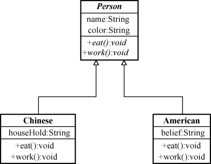</p>
<p align="center">图9.1  抽象类之间的类图关系</p>  


&emsp;&emsp;Person类的代码如下。


```
abstract class Person 

{

    String name = "人";

    String color = "肤色";

    //定义吃饭的抽象方法eat()

    public abstract void eat();

    //定义工作的抽象方法eat()

    public abstract void work();

}
```


&emsp;&emsp;Chinese类代码如下。


```
//子类Chinese继承自抽象父类Person

class Chinese extends Person

{

    String houseHold = "北京";                              //户口


    //实现父类eat()的抽象方法

    public void eat()

    {

        System.out.println("中国人用筷子吃饭！");

    }

    //实现父类work()的抽象方法

    public void work()

    {

        System.out.println("中国人勤劳工作！");

    }

}
```


&emsp;&emsp;American类代码如下。


```
//子类American继承自抽象父类Person

class American extends Person

{

    String belief = "基督教";                         //信仰


    //实现父类eat()的抽象方法

    public void eat()

    {

        System.out.println("美国人用刀叉吃饭！");

    }

    //实现父类work()的抽象方法

    public void work()

    {

        System.out.println("美国人快乐工作！");

    }

}
```


&emsp;&emsp;测试类代码如下。


```
class TestAbstract

{

    public static void main(String[] args) 

    {

        Person liuHL = new Chinese();      //创建一个中国人对象

        System.out.println("***中国人的行为***");

        liuHL.eat();                                               //调用中国人吃饭的方法

        liuHL.work();                                 //调用中国人工作的方法

        Person jacky = new American();    //创建一个美国人对象

        System.out.println("***美国人的行为***");

        jacky.eat();                                      //调用美国人吃饭的方法

        jacky.work();                                  //调用美国人工作的方法

    }

}
```


&emsp;&emsp;程序运行结果如图9.2所示。

<p align="center">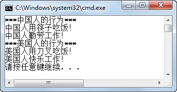</p>
<p align="center">图9.2  抽象类使用</p>  


### 9.1.3  抽象类的特征  

&emsp;&emsp;在上面例子的基础上，可以进一步了解抽象类的特征。

&emsp;&emsp;（1）抽象类不能被直接实例化。

&emsp;&emsp;例如，在测试类代码中写如下的语句。


```
Person liuHL = new Person();
```

&emsp;&emsp;编译时就会报错，提示抽象类无法被实例化，如图9.3所示。

<p align="center">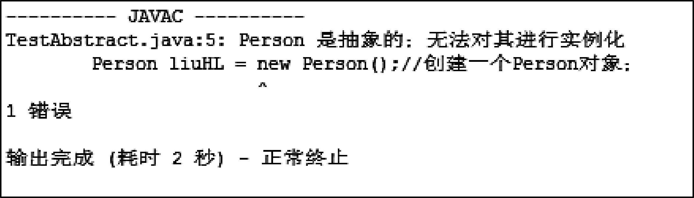</p>
<p align="center">图9.3  抽象类无法被实例化</p>  


&emsp;&emsp;（2）抽象类的子类必须实现抽象方法，除非子类也是抽象类。

&emsp;&emsp;抽象类是父类对子类的规约，要求子类必须实现抽象父类的抽象方法。例如，如果将Chinese类的work方法变为注释，使抽象类中的抽象方法没有被子类实现，编译时报错，如图9.4所示。

<p align="center">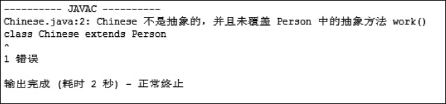</p>
<p align="center">图9.4  抽象方法必须被实现 </p>  


&emsp;&emsp;（3）抽象类里可以有普通方法，也可以有抽象方法，但是有抽象方法的类必须是抽象类。

&emsp;&emsp;去掉Person类前的abstract关键字，使Person类不再是抽象类，却含有抽象方法，编译时报错，如图9.5所示。

<p align="center">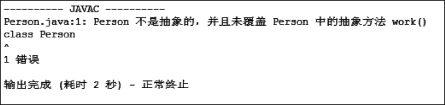</p>
<p align="center">图9.5  有抽象方法的类必须是抽象类 </p>  


&emsp;&emsp;需要注意的是，抽象类里面也可以没有抽象方法，只是把原来的类前面加上abstract关键字，使其变为抽象类。

### 9.1.4  抽象类的应用  

&emsp;&emsp;再分析《租车系统》，很自然地就会想到，之前Vehicle类中的show()方法是一个空方法，没有实际意义，所以可以把它定义为抽象方法。

&emsp;&emsp;另外，在讲解继承的时候，Truck类重写了Vehicle类的drive()方法，而且通过需求可以判断出，如果还有其他类需要继承自Vehicle类，也可能需要重写drive()方法，实现各自行驶的功能。所以，可以把Vehicle类的drive()方法定义为抽象方法，把原来Vehicle类中drive()方法的方法体实现代码移到Car类中，相当于Car类实现Vehicle类drive()抽象方法。

&emsp;&emsp;修改后Vehicle类的代码如下。


```
package com.bd.zuche;

//车类，是父类，抽象类

public abstract class Vehicle 

{

    String name = "汽车";                   //车名

    int oil = 20;                                              //油量

    int loss = 0;                                              //车损度


    //抽象方法，显示车辆信息

    public abstract void show();

    //抽象方法，行驶

    public abstract void drive();

    //加油

    public void addOil()

    {

        if(oil > 40)                   

        {

            oil = 60;

            System.out.println("邮箱已加满!");

        }else{                  

            oil = oil + 20;

        }

        System.out.println("加油完成!");

    }

    //省略了构造方法、getter方法

}
```


&emsp;&emsp;Car类的代码如下。


```
package com.bd.zuche;

//轿车类，是子类，继承Vehicle类

public class Car extends Vehicle 

{

    private String brand = "红旗";       //品牌

    //子类重写父类的show()抽象方法

    public void show()

    {

        System.out.println("显示车辆信息：\n车辆名称为：" + this.name + " 品牌是：" + this.brand + " 

        油量是：" + this.oil + " 车损度为：" + this.loss);

        //System.out.println("显示车辆信息：\n车辆名称为：" + getName() + " 品牌是：" + this.brand + "

        //油量是：" + getOil() + " 车损度为：" + getLoss());

     }       

        //子类重写父类的drive()抽象方法

     public void drive()

     {

        if(oil < 10)

        {       

            System.out.println("油量不足10升，需要加油！");

        }else{

            System.out.println("正在行驶!");

            oil = oil - 5;

            loss = loss + 10;

        }

    }

//省略了构造方法、getter方法

}
```


&emsp;&emsp;Truck类和Driver类的代码都没发生变化，运行测试类代码如下。


```
import com.bd.zuche.*;

class TestZuChe 

{

    public static void main(String[] args) 

    {

        Vehicle car = new Car("战神","长城");                 //初始化轿车对象car

        Vehicle truck = new Truck("大力士二代","10吨");          //初始化卡车对象truck

        Driver d1 = new Driver("柳海龙");                    //创建并初始化驾驶员对象

        d1.callShow(car);                       //调用驾驶员对象的相应方法

        d1.callShow(truck);                         //调用驾驶员对象的相应方法

    }

}
```

&emsp;&emsp;运行结果如图9.6所示。

<p align="center">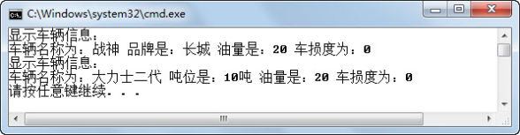</p>
<p align="center">图9.6  用抽象类完成“租车系统”</p>  


## 9.2  上机任务


#### 目标：完成本章9.1节的全部程序。

时间：30分钟。

形式：每个学员独立完成，小组组长检查。


工具：EditPlus。


## 9.3  接口

 

&emsp;&emsp;9.1节详细介绍了抽象类，提到抽象类中可以有抽象方法，也可以有普通方法，但是有抽象方法的类必须是抽象类。如果抽象类中的方法都是抽象方法，那么由这些抽象方法组成的特殊的抽象类就是所说的接口。

### 9.3.1  接口的概念  

&emsp;&emsp;接口是一系列方法的声明，是一些抽象方法的集合。一个接口只有方法的声明，没有方法的实现，因此这些方法可以在不同的地方被不同的类实现，而这些实现类可以具有不同的行为。

&emsp;&emsp;虽然我们常说，接口是一种特殊的抽象类，但是在面向对象编程的设计思想层面，两者还是有显著区别的。抽象类更侧重于对相似的类进行抽象，形成抽象的父类以供子类继承使用，而接口往往在程序设计的时候，定义模块与模块之间应满足的规约，使各模块之间能协调工作。接下来通过一个实际的例子来说明接口的作用。

&emsp;&emsp;如今，蓝牙技术已经在社会生活中广泛应用。移动电话、蓝牙耳机、蓝牙鼠标、平板电脑等IT设备都支持蓝牙实现设备间短距离通信。那为什么这些不同的设备能通过蓝牙技术进行数据交换呢？其本质在于蓝牙提供了一组规范和标准，规定了频段、速率、传输方式等要求，各设备制造商按照蓝牙规范约定制造出来的设备，就可以按照约定的模式实现短距离通信。蓝牙提供的这组规范和标准，就是所谓的接口。

&emsp;&emsp;蓝牙接口创建和使用步骤如下。

&emsp;&emsp;（1）各相关组织、厂商约定蓝牙接口标准。

&emsp;&emsp;（2）相关设备制造商按约定接口标准制作蓝牙设备。

&emsp;&emsp;（3）符合蓝牙接口标准的设备可以实现短距离通信。

&emsp;&emsp;Java接口定义的语法形式如下。


```
[修饰符]  interface 接口名 [extends] [接口列表]{

	接口体

}
```


&emsp;&emsp;interface前的修饰符是可选的，当没有修饰符的时候，表示此接口的访问只限于同包的类和接口。如果使用修饰符，则只能用public 修饰符，表示此接口是公有的，在任何地方都可以引用它，这一点和类是相同的。 

&emsp;&emsp;接口是和类同一层次的，所以接口名的命名规则参考类名命名规则即可。

&emsp;&emsp;extends关键词和类语法中的extends类似，用来定义直接的父接口。和类不同，一个接口可以继承多个父接口，当extends 后面有多个父接口时，它们之间用逗号隔开。

&emsp;&emsp;接口体就是用大括号括起来的那部分，接口体里定义接口的成员，包括常量和抽象方法。

&emsp;&emsp;类实现接口的语法形式如下：


```
[类修饰符]  class  类名  implements 接口列表{

	类体

}
```
&emsp;&emsp;类实现接口用implements关键字，Java中的类只能是单继承的，但一个Java类可以实现多个接口，这也是Java解决多继承的方法。

&emsp;&emsp;下面通过代码来模拟蓝牙接口规范的创建和使用步骤。

&emsp;&emsp;（1）定义蓝牙接口。

&emsp;&emsp;假设蓝牙接口通过input()和output()两个方法提供服务，这时就需要在蓝牙接口中定义这两个抽象方法，具体代码如下。


```
//定义蓝牙接口

public interface BlueTooth 

{

    //提供输入服务

    public void input();

    //提供输出服务

    public void output();

}
```


&emsp;&emsp;（2）定义蓝牙耳机类，实现蓝牙接口。


```
public class Earphone implements BlueTooth

{

    String name = "蓝牙耳机";

    //实现蓝牙耳机输入功能

    public void input()

    {

        System.out.println(name + "正在输入音频数据...");

    }

    //实现蓝牙耳机输出功能

    public void output()

    {

        System.out.println(name + "正在输出反馈信息...");

    }

}
```


&emsp;&emsp;（3）定义IPad类，实现蓝牙接口。


```
public class IPad implements BlueTooth

{

    String name = "iPad";

    //实现iPad输入功能

    public void input()

    {

        System.out.println(name + "正在输入数据...");

    }

    //实现iPad输出功能

    public void output()

    {

        System.out.println(name + "正在输出数据...");

    }

}
```


&emsp;&emsp;编写测试类，对蓝牙耳机类和IPad类进行测试，代码如下，运行结果如图9.7所示。


```
public class TestInterface 

{

    public static void main(String[] args) 

    {

        BlueTooth ep = new Earphone();   //创建并实例化一个实现了蓝牙接口的蓝牙耳机对象ep

        ep.input();                                       //调用ep的输入功能

        BlueTooth ip = new IPad();            //创建并实例化一个实现了蓝牙接口的iPad对象ip

        ip.input();                                        //调用ip的输入功能

        ip.output();                                      //调用ip的输出功能

    }

}
```

<p align="center">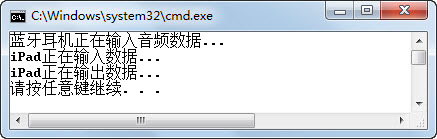</p>
<p align="center">图9.7  蓝牙接口使用</p>  


### 9.3.2  接口的使用  

&emsp;&emsp;电子邮件现在是人们广泛使用的一种信息沟通形式，要创建一封电子邮件，至少需要发信者邮箱、收信者邮箱、邮件主题和邮件内容4个部分。可以采用接口定义电子邮件的这些约定，让电子邮件类必须实现这个接口，从而达到让电子邮件必须满足这些约定的要求。

&emsp;&emsp;（1）定义电子邮件接口。


```
public interface EmailInterface 

{

    //设置发信者邮箱

    public void setSendAdd(String add);

    //设置收信者邮箱

    public void setReceiveAdd(String add);

    //设置邮件主题

    public void setEmailTitle(String title);

    //设置邮件内容

    public void writeEmail(String email);

}
```


&emsp;&emsp;（2）定义邮箱类，实现EmailInterface接口。

&emsp;&emsp;注意，在实现接口中抽象方法的同时，邮箱类本身还有一个showEmail()方法。


```
import java.util.Scanner;

//定义Email，实现Email接口

public class Email implements EmailInterface

{

    String sendAdd = "";                      //发信者邮箱

    String receiveAdd = "";                           //收信者邮箱

    String emailTitle = "";                    //邮件主题

    String email = "";                                     //邮件内容

    //实现设置发信者邮箱

    public void setSendAdd(String add)

    {

        this.sendAdd = add;

    }

    //实现设置收信者邮箱

    public void setReceiveAdd(String add)

    {

        this.receiveAdd = add;

    }

    //实现设置邮件主题

    public void setEmailTitle(String title)

    {

        this.emailTitle = title;

    }

    //实现设置邮件内容

    public void writeEmail(String email)

    {

        this.email = email;

    }

    //显示邮件全部信息

    public void showEmail()

    {

        System.out.println("***显示电子邮件内容***");

        System.out.println("发信者邮箱：" + sendAdd);

        System.out.println("收信者邮箱：" + receiveAdd);

        System.out.println("邮件主题：" + emailTitle);

        System.out.println("邮件内容：" + email);

    }

}
```


&emsp;&emsp;（3）定义一个邮件作者类。

&emsp;&emsp;邮件作者类中含静态方法writeEmail(EmailInterface email)，用于写邮件，具体代码如下。


```
class EmailWriter 

{

    //定义写邮件的静态方法，形参是EmailInterface接口

    public static void writeEmail(EmailInterface email) 

    {

        Scanner input = new Scanner(System.in);        

        System.out.print("请输入发信者邮箱：");

        email.setSendAdd(input.next());

        System.out.print("请输入收信者邮箱：");

        email.setReceiveAdd(input.next());

        System.out.print("请输入邮件主题：");

        email.setEmailTitle(input.next());

        System.out.print("请输入邮件内容：");

        email.writeEmail(input.next());

        //email.showEmail();//编译无法通过，因为形参email是EmailInterface接口，没有此方法

    }

}
```


&emsp;&emsp;（4）编写测试类。

&emsp;&emsp;测试类代码首先创建并实例化出一个实现了电子邮件接口的对象email，然后调用EmailWriter类的静态方法writeEmail写邮件，最后将email对象强制类型转换成Email对象（不提倡此做法），调用Email类的showEmail()方法。具体代码如下，程序运行结果如图9.8所示。


```
public class TestInterface2 

{

    public static void main(String[] args) 

    {

        //创建并实例化一个实现了电子邮件接口的对象email

        EmailInterface email = new Email();

        //调用EmailWriter类的静态方法writeEmail写邮件

        EmailWriter.writeEmail(email);

        //强制类型转换，调用Email类的showEmail()方法（不是接口方法）

         ((Email)email).showEmail();

    }

}
```

<p align="center">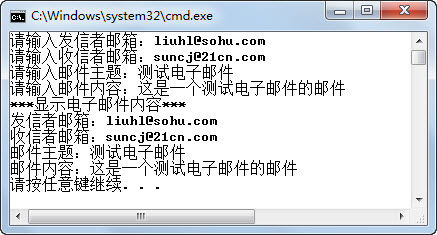</p>
<p align="center">图9.8  电子邮箱接口的使用 </p>  


### 9.3.3  接口的特征  

&emsp;&emsp;接下来，逐个了解接口有哪些特征。

&emsp;&emsp;（1）接口中不允许有实体方法。

&emsp;&emsp;例如，在EmailInterface接口中增加下面的实体方法。


```
//显示邮件全部信息

public void showEmail()

{

}
```

&emsp;&emsp;编译时就会报错，提示接口中不能有实体方法，如图9.9所示。

<p align="center">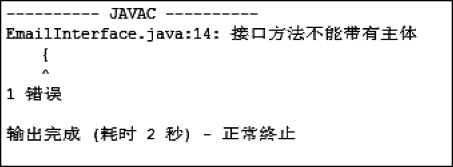</p>
<p align="center">图9.9  接口中不能有实体方法 </p>  


&emsp;&emsp;（2）接口中可以有成员变量，默认修饰符是public static final，接口中的抽象方法必须用public修辞。

&emsp;&emsp;在EmailInterface接口中，增加邮件发送端口号的成员变量sendPort，代码如下。


```
int sendPort = 25;//必须赋静态最终值
```


&emsp;&emsp;在Email类的showEmail()方法中增加语句System.out.println("发送端口号：" + sendPort);，含义为访问EmailInterface接口中的sendPort并显示出来，具体代码如下。


```
//显示邮件全部信息

public void showEmail()

{

    System.out.println("***显示电子邮件内容***");

    System.out.println("发送端口号：" + sendPort);

    System.out.println("发信者邮箱：" + sendAdd);

    System.out.println("收信者邮箱：" + receiveAdd);

    System.out.println("邮件主题：" + emailTitle);

    System.out.println("邮件内容：" + email);

}
```


&emsp;&emsp;EmailWriter类和TestInterface2类的代码不需要调整，运行TestInterface2类，程序运行结果如图9.10所示。

<p align="center">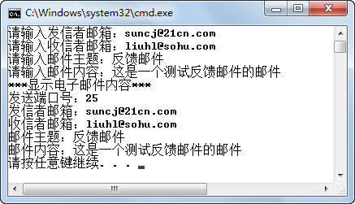</p>
<p align="center">图9.10  接口中成员变量的使用 </p>  


&emsp;&emsp;（3）一个类可以实现多个接口。

&emsp;&emsp;假设一个邮件，不仅需要符合EmailInterface接口对电子邮件规范的要求，而且需要符合对发送端和接收端端口号接口规范的要求，才允许成为一个合格的电子邮件。

&emsp;&emsp;发送端和接收端端口号接口的代码如下所示。


```
//定义发送端和接收端端口号接口

public interface PortInterface 

{

//设置发送端端口号

public void setSendPort(int port);

//设置接收端端口号

public void setReceivePort(int port);

}
```


&emsp;&emsp;则Email类不仅要实现EmailInterface接口，还要实现PortInterface接口，同时类方法中必须实现PortInterface接口的抽象方法。Email类的代码如下。


```
import java.util.Scanner;

//定义Email，实现EmailInterface和PortInterface 接口

public class Email implements EmailInterface,PortInterface

{

    int sendPort = 25;                  //发送端端口号

    int receivePort = 110;           //接收端端口号

    //实现设置发送端端口号

    public void setSendPort(int port)

    {

        this.sendPort = port;

    }

    //实现设置接收端端口号

    public void setReceivePort(int port)

    {

        this.receivePort = port;

    }

    //显示邮件全部信息

    public void showEmail()

    {

        System.out.println("***显示电子邮件内容***");

        System.out.println("发送端口号：" + sendPort);

        System.out.println("接收端口号：" + receivePort);

        System.out.println("发信者邮箱：" + sendAdd);

        System.out.println("收信者邮箱：" + receiveAdd);

        System.out.println("邮件主题：" + emailTitle);

        System.out.println("邮件内容：" + email);

    }

    //省略了其他属性和方法的代码

}
```


&emsp;&emsp;修改EmailWriter类和TestInterface2（形成TestInterface3）类时，尤其需要注意的是EmailWriter类的静态方法writeEmail(Email email)中的形参不再是EmailInterface接口，而是Email类，否则无法在writeEmail方法中调用PortInterface接口的方法，不过这样做属于非面向接口编程，不提倡。类似地，TestInterface3代码中声明email对象时，也从EmailInterface接口调整成Email类。具体代码如下。


```
import java.util.Scanner;

//定义邮件作者类

class EmailWriter 

{

    //定义写邮件的静态方法，形参是Email类（非面向接口编程）

    //形参不能是EmailInterface接口，否则无法调用PortInterface接口的方法

    public static void writeEmail(Email email) 

    {

        Scanner input = new Scanner(System.in);        

        System.out.print("请输入发送端口号：");

        email.setSendPort(input.nextInt());

        System.out.print("请输入接收端口号：");

        email.setReceivePort(input.nextInt());

        System.out.print("请输入发信者邮箱：");

        email.setSendAdd(input.next());

        System.out.print("请输入收信者邮箱：");

        email.setReceiveAdd(input.next());

        System.out.print("请输入邮件主题：");

        email.setEmailTitle(input.next());

        System.out.print("请输入邮件内容：");

        email.writeEmail(input.next());

    }

}

public class TestInterface3 

{

    public static void main(String[] args) 

	{

        //创建并实例化一个Email类的对象email

        Email email = new Email();

        //调用EmailWriter的静态方法writeEmail写邮件

        EmailWriter.writeEmail(email);

        //调用Email类的showEmail()方法（不是接口方法）

        email.showEmail();

    }

}
```

&emsp;&emsp;程序运行结果如图9.11所示。

<p align="center">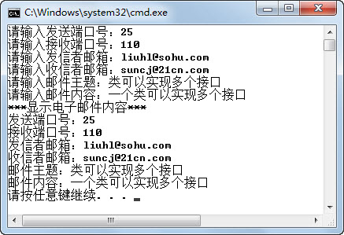</p>
<p align="center">图9.11  实现多个接口的类</p>  


&emsp;&emsp;（4）接口可以继承其他接口，实现接口合并的功能。

&emsp;&emsp;在刚才的代码中，让一个类实现了多个接口，但是再调用这个类的时候，形参就必须是这个类，而不能是该类实现的某个接口，这样做就不是面向接口编程，程序的多态性得不到充分的体现。接下来在刚才例子的基础上，用接口继承的方式解决这个问题。

&emsp;&emsp;EmailInterface类的代码如下。


```
//定义电子邮件接口，继承自PortInterface接口

public interface EmailInterface extends PortInterface 

{

    //设置发信者邮箱

    public void setSendAdd(String add);

    //设置收信者邮箱

    public void setReceiveAdd(String add);

    //设置邮件主题

    public void setEmailTitle(String title);

    //设置邮件内容

    public void writeEmail(String email);

}
```


&emsp;&emsp;PortInterface接口、Email类的代码不用调整，EmailWriter类和测试类TestInterface3中的声明为Email的类，改回为EmailInterface接口的声明，这样的程序又恢复了面向接口编程的特性，可以实现多态性。

### 9.3.4  接口的应用  

&emsp;&emsp;在接口的应用中，有一个非常典型的案例，就是实现打印机系统的功能。在打印机系统中，有打印机对象，有墨盒对象（可以是黑白墨盒，也可以是彩色墨盒），有纸张对象（可以是A4纸，也可以是B5纸）。怎么能让打印机、墨盒和纸张这些生产厂商生产的各自不同的设备，组装在一起成为打印机，却能正常打印呢？解决的办法就是接口。

&emsp;&emsp;打印机系统开发的主要步骤如下。

&emsp;&emsp;（1）打印机和墨盒之间需要接口，定义为墨盒接口PrintBox，打印机和纸张之间需要接口，定义为纸张接口PrintPaper。

&emsp;&emsp;（2）定义打印机类，引用墨盒接口PrintBox和纸张接口PrintPaper，实现打印功能。

&emsp;&emsp;（3）定义黑白墨盒和彩色墨盒实现墨盒接口PrintBox，定义A4纸和B5纸实现纸张接口PrintPaper。

&emsp;&emsp;（4）编写打印系统，调用打印机实施打印功能。

&emsp;&emsp;PrintBox和PrintPaper接口的代码如下。


```
//墨盒接口

public interface PrintBox {

    //得到墨盒颜色，返回值为墨盒颜色

    public String getColor();

    }

    //纸张接口
public interface PrintPaper {

    //得到纸张尺寸，返回值为纸张尺寸

    public String getSize();

}
```


&emsp;&emsp;打印机类Printer的代码如下。


```
//打印机类

public class Printer{     

    //使用墨盒在纸张上打印

    public void print(PrintBox box,PrintPaper paper){

        System.out.println("正在使用" + box.getColor() + "墨盒在" + paper.getSize() + "纸张上打印！");

    }

}
```


&emsp;&emsp;黑白墨盒类GrayPrintBox和彩色墨盒类ColorPrintBox的代码如下。


```
//黑白墨盒，实现了墨盒接口

public class GrayPrintBox implements PrintBox {

    //实现getColor()方法，得到“黑白”

    public String getColor() {

        return "黑白";

    }

}

//彩色墨盒，实现了墨盒接口

public class ColorPrintBox implements PrintBox {

    //实现getColor()方法，得到“彩色”

    public String getColor() {

        return "彩色";

    }

}

```

&emsp;&emsp;A4纸类A4Paper和B5纸类B5Paper的代码如下。


```
//A4纸张，实现了纸张接口

public class A4Paper implements PrintPaper {

    //实现getSize()方法，得到“A4”

    public String getSize() {

        return "A4";

    }

}

//B5纸张，实现了纸张接口

public class B5Paper implements PrintPaper {

    //实现getSize()方法，得到“B5”

    public String getSize() {

        return "B5";

    }

}
```


&emsp;&emsp;编写打印系统，代码如下，程序运行结果如图9.12所示。


```
public class TestPrinter {

    public static void main(String[] args) {

        PrintBox box = null;                       //墨盒

        PrintPaper paper = null;                  //纸张

        Printer printer = new Printer();       //打印机

        //使用彩色墨盒在B5纸上打印

        box = new ColorPrintBox();

        paper = new B5Paper();                  

        printer.print(box, paper);

        //使用黑白墨盒在A4纸上打印

        box = new GrayPrintBox();

        paper = new A4Paper();        

        printer.print(box, paper);                

    }

}
```

<p align="center">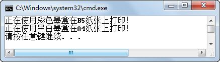</p>
<p align="center">图9.12  打印系统接口的实现 </p>  


## 9.4  上机任务


#### 目标：完成本章9.3节中的所有程序。

 


时间：60分钟。

 


形式：每个学员独立完成，小组组长检查。

 


工具：EditPlus。

 


## 9.5  上机任务


#### 目标：使用接口优化“租车系统”。

 


时间：30分钟。

 


形式：小组讨论，每个学生独立编写代码。

 


工具：EditPlus。

 

 

 


## 9.6  本章练习

 

1  下列关于抽象类和接口描述正确的是（    ）。（选择一项）

A．抽象类里必须含有抽象方法

B．接口中不可以有普通方法

C．抽象类可以继承多个类，实现多继承

D．接口中可以定义局部变量

2  接口的成员变量默认的修饰符是________、________、________。

 

 

3  请描述抽象类和接口的区别（含使用范围）。

 

 

4  使用一个类直接实现多个接口，或通过接口间继承形成一个扩展接口再让类继承，这两种方式都可以让类实现多个接口，它们在使用上的差别是什么？

 

 

5  请描述什么是多态。

 