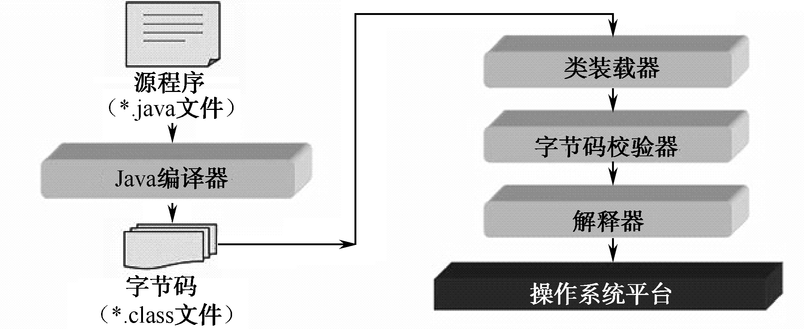
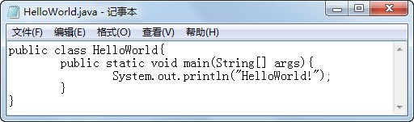
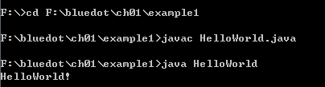
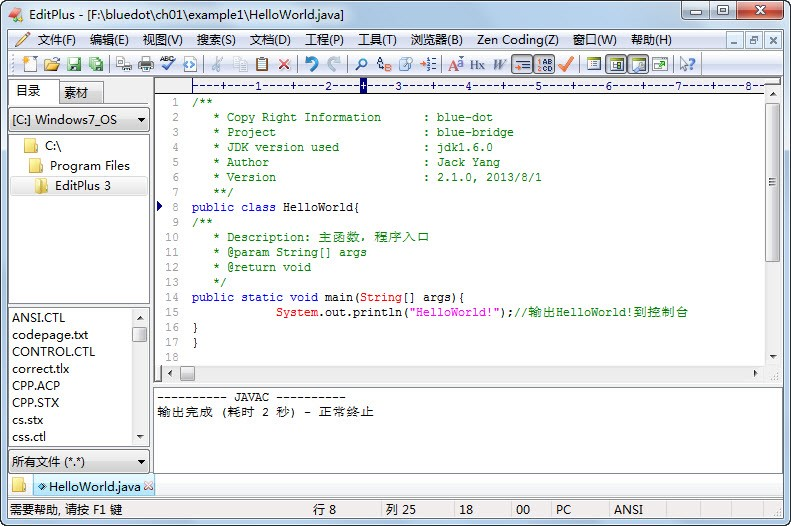

## 本章简介

&emsp;&emsp;Java是一种可以开发跨平台应用软件的面向对象程序设计语言。

&emsp;&emsp;Sun公司（已被Oracle收购）于1995年5月推出了Java程序设计语言和Java平台。在将近二十年的时间里，Java 技术因为其具有卓越的通用性、高效性、平台移植性和安全性，广泛应用于个人计算机、数据中心、游戏控制台、科学超级计算机、移动电话和互联网，它拥有全球最大的开发者群体。在全球云计算和移动互联网的产业环境下，Java更具备了显著优势和广阔前景。

## 1.1  计算机语言

&emsp;&emsp;计算机语言是指用于人与计算机之间通信的语言。为了使电子计算机完成各项工作，就需要有一套用于编写计算机程序的数字、字符和语法规则，由这些字符和语法规则组成的计算机的各种指令（或各种语句），就是计算机能接受的语言。

### 1.1.1  机器语言

&emsp;&emsp;机器语言是指一台计算机全部的指令集合。

&emsp;&emsp;机器语言是由“0”和“1”组成的二进制数，是一串串由“0”和“1”组成的指令序列，可将这些指令序列交给计算机执行，这种语言就是机器语言。

&emsp;&emsp;使用机器语言是非常痛苦的，程序员需要知道每个指令对应的“0”、“1”序列，靠记忆是一件不可能完成的工作。在程序运行过程中，如果出错需要修改，那更是难上加难。

&emsp;&emsp;另外，每种类型计算机的指令系统各不相同，针对不同类型的计算机，完成相同功能的程序需要使用不同的指令系统编写程序。其实不少高级语言仍然没有解决类似的问题，但是Java的出现，在相当大的范围内解决了此问题，这就是Java的特性之一，即“一次编译，处处运行”。

&emsp;&emsp;上面提到了机器语言的诸多问题，不过正是因为这些问题，也说明了机器语言的好处——针对特定类型计算机的机器语言运行效率最高。

&emsp;&emsp;机器语言也是通常所说的第一代计算机语言。

### 1.1.2  汇编语言

&emsp;&emsp;程序员使用机器语言编写程序是非常痛苦的，其中一个原因就是要记住每个指令对应的“0”、“1”序列，为了让程序员从大量的记忆工作中解脱出来，人们进行了一种有益的改进，用一些简洁的、有一定含义的英文字符串来替代特定指令的“0”、“1”序列。例如，用“MOV”代表数据传递、“DEC”代表数据减法运算。这种变革对程序员而言，犹如人们从在绳子上打结计数发展到使用数字符号计数，极大地提高了工作效率。这种程序设计语言就称为汇编语言，即第二代计算机语言。

&emsp;&emsp;对于计算机而言，这些冰冷的机器是不懂“MOV”这类汇编语言的，计算机只认识“0”、“1”序列。这样，在计算机上就需要有一个专门的程序，负责把汇编语言翻译成二进制的机器语言，这种翻译程序就是汇编程序。

&emsp;&emsp;汇编语言的实质和机器语言是相同的，都是直接对硬件操作，只不过汇编语言指令采用了英文缩写的标识符，更容易识别和记忆。

&emsp;&emsp;不论是机器语言还是汇编语言，其中每一个指令只能对应实际操作过程中的一个很细微的动作，例如移动、自增等，要实现一个相对复杂的功能就需要非常多的步骤。例如，假设程序要完成一个“小张去传达室取回信件”的工作，作为程序员，只能使用“向前*n*米”、“向后*n*米”、“左转”、“右转”、“上*n*个台阶”、“下*n*个台阶”、“伸手”等指令，那么完成这样的工作，可能就需要几十个步骤了，工作量仍然很大。

### 1.1.3  高级语言

&emsp;&emsp;从最初与计算机交流的痛苦经历中，人们意识到，应该设计一种这样的语言，其接近于数学语言或人的自然语言，同时又不依赖于计算机硬件，编出的程序能在所有机器上运行。

&emsp;&emsp;经过努力，1954年，第一个完全脱离机器硬件的高级语言——FORTRAN诞生。目前，影响最大、使用最广泛的高级语言有Java、C、C++、C#。另外还有一些特殊类型的语言，包括智能化语言（LISP、Prolog、CLIPS、动态语言（Python、PHP、Ruby…）等。

#### 		&emsp;&emsp;1．C语言

&emsp;&emsp;提到高级语言，必须要重点介绍一下C语言。

&emsp;&emsp;C语言是一种计算机程序设计语言，它既具有高级语言的特点，又具有汇编语言的特点。1972年由美国贝尔实验室推出C语言。1978年以后，C语言先后被移植到大、中、小及微型机上。C语言非常强悍，使用C语言既可以编写不依赖计算机硬件的应用程序，也可以编写操作系统（在操作系统及需要对硬件进行操作的场合，用C语言明显优于其他高级语言）。C语言的应用范围广泛，单片机、嵌入式系统、二维动画、三维动画、游戏开发、数据业务处理等多方面都能看到它的身影。

&emsp;&emsp;为了方便和马上要学习的Java语言进行比较，下面简要介绍C语言的一些重要特点。  
&emsp;&emsp;（1）C语言（习惯上称为中级语言）把高级语言的基本结构和语句与低级语言的实用性结合起来，它可以像汇编语言一样对位、字节和地址进行操作。  
&emsp;&emsp;（2）C语言使用指针直接进行靠近硬件的操作，对于程序员而言显得更加灵活，但同时也给程序带来了安全隐患。在构建Java语言时，就参考了C语言的诸多优势，但为了安全性考虑，取消了指针操作。

#### &emsp;&emsp;2．C++语言

&emsp;&emsp;C++语言是具有面向对象特性的C语言。

&emsp;&emsp;面向对象是一种对现实世界理解和抽象的方法，是计算机编程技术发展到一定阶段后的产物。当今，程序开发思想已经全面从面向过程（C语言）分析、设计和编程发展到面向对象的模式。

&emsp;&emsp;通过面向对象的方式，将现实世界的事务抽象成类和对象，帮助程序员实现对现实世界的抽象与建模。通过面向对象的方法，采用更利于人理解的方式对复杂系统进行分析、设计与编程。

#### &emsp;&emsp;3．C#语言

&emsp;&emsp;C#是一种面向对象的、运行于.NET Framework之上的高级程序设计语言。C#与Java惊人地相似（单一继承、接口、编译成中间代码再运行），就如同Java和C在基本语法上类似一样。在语言层面，C#语言是微软公司 .NET Windows网络框架的主角。

&emsp;&emsp;和汇编语言相比，高级语言将许多硬件相关的机器指令合并成完成具体任务的单条高级语言，与具体操作相关的细节（如寄存器、堆栈等）被透明化，不需要程序员了解。程序员只要会操作单条高级语句，不需要深入掌握操作系统级别的细节，也可以开发出程序。

&emsp;&emsp;高级语言也是通常所说的第三代计算机语言。

### 1.1.4  SQL语言

&emsp;&emsp;结构化查询语言（Structured Query Language）简称SQL，它是一种数据库查询和编程的语言，用于存取数据以及查询、更新和管理关系数据库系统，已经成为关系型数据库普遍使用的标准。

&emsp;&emsp;结构化查询语言是高级的非过程化编程语言，允许用户在高层数据结构上工作。它不要求用户指定数据的存放方法，也不需要用户了解具体的数据存放方式，所以不同底层结构的不同数据库系统可以使用相同的结构化查询语言作为数据输入与管理的接口。SQL语句可以嵌套，这使它具有极大的灵活性和强大的功能。

## 1.2  java发展史

### 1.2.1  Java的诞生

&emsp;&emsp;Java语言的产生背景，如同它的名字一样，散发着淡淡的咖啡香气，有兴趣的可以琢磨琢磨。  

&emsp;&emsp;1995年5月23日，在Sun World大会上，第一次公开发布Java和HotJava浏览器。在这个会议上，网景公司（当时该公司浏览器占据浏览器市场份额的绝对领先地位）宣布将在其浏览器中支持Java，随后一系列的公司表示了对Java的支持，使Java很快成为一个极具发展潜力的高级语言。

### 1.2.2  JDK 1.0发布 

&emsp;&emsp;1995年，Sun推出的Java只是一种语言，而要想开发复杂的应用程序，必须要有一个强大的开发库支持才行。  
&emsp;&emsp;在1996年1月，Sun发布了JDK 1.0，它包括了两部分：运行环境（即JRE）和开发环境（即JDK）。在运行环境中包括了核心API、集成API、用户界面API、发布技术、Java虚拟机（JVM）五个部分，而开发环境还包括了编译Java程序的编译器（即javac）。在JDK 1.0时代，Java库显得比较单薄，不够完善。随着JDK的逐步升级，它为开发人员提供了一个强大的开发支持库。

### 1.2.3  Java 2问世

&emsp;&emsp;1998年12月，Sun发布了Java历史上最重要的一个JDK版本：JDK1.2，并开始使用“Java 2”这一名称。从JDK 1.2发布开始，Java踏入了飞速发展的时期。  

&emsp;&emsp;在Java 2时代，Sun对Java进行了很多革命性的改变，而这些革命性的变化一直沿用到现在，对Java的发展形成了深远的影响。  

&emsp;&emsp;Java 2平台包括标准版（J2SE）、企业版（J2EE）和微缩版（J2ME）三个版本。

- J2SE：Java 2 Standard Edition（Java 2标准版），J2SE包含构成Java语言核心的类，例如数据库连接类、接口定义类、输入/输出类、网络编程类。

- J2EE：Java 2 Enterprise Edition（Java 2企业版），J2EE包含J2SE中的类，还包含用于开发企业级应用的类，例如EJB、Servlet、JSP、XML、事务控制。

- J2ME：Java 2 Micro Edition（Java 2微缩版），J2ME包含J2SE中一部分类，用于消费类电子产品的软件开发，例如寻呼机、智能卡、手机、PDA、机顶盒。  

  

  &emsp;&emsp;此后，还发布了以下主要版本的Java。  

  &emsp;&emsp;2000年5月，J2SE 1.3发布。  

  &emsp;&emsp;2002年2月，J2SE 1.4发布。

### 1.2.4  Java 5.0发布 

&emsp;&emsp;2004年9月30日，J2SE 1.5发布，成为Java语言发展史上的又一里程碑。为了表示该版本的重要性，J2SE 1.5更名为Java SE 5.0。  

&emsp;&emsp;在Java 5.0中，主要包含以下主要新特性。

- 泛型。
- 增强for循环。
- 自动拆箱和装箱。
- 类型安全的枚举。
- 静态导入。
- Annotation注解。

### 1.2.5  JDK 7.0发布  

&emsp;&emsp;2011年7月，JDK 7.0发布，带入了一些新的功能。例如，原来switch结构的条件中只能包含byte、short、int、char类型，从7.0开始，其中可以包含字符串了。

## 1.3  Java的特点

&emsp;&emsp;要想系统地说明Java语言的特点，需要大篇幅、长时间地介绍。以下是Java语言的主要特点。  

-  Java语言是简单的。
-  Java语言是面向对象的。
-  Java语言是分布式的。
-  Java语言是健壮的。
-  Java语言是安全的。
-  Java语言是平台无关的。
-  Java语言是可移植的。
-  Java语言是解释型的。
-  Java语言是高性能的。
-  Java语言是多线程的。
-  Java语言是动态的。  
   

&emsp;&emsp;随着课程的深入，会逐步学习到这些具体的内容，这里仅就以下3点做简要介绍。
### 1.3.1  Java语言是面向对象的
&emsp;&emsp;面向对象其实是现实世界模型的自然延伸，现实世界中任何实体都可以看作对象，对象之间通过消息相互作用。  
&emsp;&emsp;另外，现实世界中任何实体都可归属于某类事物，任何对象都是某一类事物的实例。  
&emsp;&emsp;传统的过程式编程语言以过程为中心，以算法为驱动（程序=算法+数据）。面向对象编程语言则以对象为中心，以消息为驱动（程序=对象+消息）。  
&emsp;&emsp;Java是典型的面向对象的语言，具体面向对象的概念和应用，会在后面的课程中详细介绍。  
### 1.3.2  Java语言是平台无关的 
&emsp;&emsp;所谓Java语言是平台无关的语言，是指用Java编写的应用程序，编译成字节码文件（.class后缀）后，不用修改就可在不同的软/硬件平台上运行。  
&emsp;&emsp;平台无关有两种：源代码级和目标代码级。C和C++具有源代码级平台无关性（没完全做到），表明用C或C++写的程序不用修改，在不同的平台上重新编译后，就可以在对应平台上运行。而Java语言是目标代码级的平台无关，使用JDK编译成的字节码文件，只要在安装有Java虚拟机的平台上就可以运行，这就是通常所说的“一次编译，处处运行”。  
### 1.3.3  Java语言是健壮的 
&emsp;&emsp;强类型机制、丢弃指针、垃圾回收机制、异常处理等是Java语言健壮性的重要保证，对指针的丢弃是Java明智的选择。  
&emsp;&emsp;Java是强类型的语言。Java要求使用显式的方法声明，这样编译器就可以发现方法调用错误，保证程序的可靠性。  
&emsp;&emsp;Java丢弃了指针。这样可以杜绝内存的非法访问，虽然牺牲了程序员操作的灵活性，但对程序的健壮性而言，不无裨益。  
&emsp;&emsp;Java的垃圾回收机制。Java的垃圾回收机制是Java虚拟机提供的管理内存的机制，用于在空闲时间以不定时的方式动态回收无任何引用的对象所占据的内存空间。  
&emsp;&emsp;Java提供了异常处理机制，程序员可以把一组可能出错的代码放在一个地方，针对可能的错误（异常）编写处理代码，简化错误处理过程，便于恢复。  
## 1.4  Java程序工作原理  
### 1.4.1  Java虚拟机  
&emsp;&emsp;Java虚拟机（Java Virtual Machine）简称JVM，它不是一台真实的机器，而是想象中的机器，通过模拟真实机器来运行Java程序。  
&emsp;&emsp;既然是模拟出来的机器，Java虚拟机看起来同样有硬件，如处理器、堆栈、寄存器等，还具有相应的指令系统。  
&emsp;&emsp;Java程序运行在这个抽象的Java虚拟机上，它是Java程序的运行环境，也是Java 最具吸引力的特性之一。  
&emsp;&emsp;前面提到过，Java语言的一个重要特点就是目标代码级的平台无关性，接下来将从原理上进一步说明为什么Java语言具有这样的平台无关性。实现Java“一次编译，处处运行”的关键就是使用了Java虚拟机。  
&emsp;&emsp;例如，使用C语言开发一个类似计算器的软件，如果想要这个软件在Windows平台运行，则需要在Windows平台下编译成目标代码，这个计算器的目标代码只能在Windows平台上运行。而如果想让这个计算器软件能在Linux平台上运行，则必须在对应的平台下编译，产生针对该平台的目标代码，才可以运行。  
&emsp;&emsp;对于Java而言，则完全不是这样。用Java编写的计算器程序（.java后缀）经过编译器编译成字节码文件，这个字节码文件不是针对具体平台的，而是针对抽象的Java虚拟机的，在Java虚拟机上运行。而在不同的平台上，会安装不同的Java虚拟机，这些不同的Java虚拟机屏蔽了各个不同平台的差异，从而使Java程序（字节码文件）具有平台无关性。也就是说，Java虚拟机在执行字节码时，把字节码解释成具体平台上的机器指令执行，具体原理如图1.1所示。  
<br/>


<p align="center">图1.1  Java虚拟机</p>    
&emsp;&emsp;在理解了Java虚拟机的基础上，接下来介绍Java程序工作原理。如图1.2所示，Java字节码文件先后经过JVM的类装载器、字节码校验器和解释器，最终在操作系统平台上运行。具体各部分的主要功能描述如下。  

- 类装载器。其主要功能是为执行程序寻找和装载所需要的类，就是把字节码文件装到Java虚拟机中。  

- 字节码校验器。其功能是对字节码文件进行校验，保证代码的安全性。字节码校验器负责测试代码段格式并进行规则检查，检查伪造指针、违反对象访问权限或试图改变对象类型的非法代码。  
- 解释器。具体的平台并不认识字节码文件，最终起作用的还是这个最重要的解释器，它将字节码文件翻译成所在平台能识别的东西。  
<br/>
<br/>

<p align="center">图1.2  Java程序工作原理</p>    
### 1.4.2  垃圾回收机制  
&emsp;&emsp;在C++中，在程序结束运行之前对象会一直占用内存，在程序员明确释放之前不能将其所占内存分配给其他对象。而Java的处理方式不同，当没有对象引用指向原先分配给某个对象的内存时，该内存便成为垃圾。  
&emsp;&emsp;Java虚拟机提供了一个系统级线程（垃圾回收器线程），它自动跟踪每一块被分配出去的内存空间，自动释放被定义成垃圾的内存。  
&emsp;&emsp;垃圾回收机制能自动释放内存空间，减轻程序员编程的负担，这是Java 虚拟机具有的一个显著优点。在没有垃圾回收机制的时候，可能要花许多时间来解决释放无用内存的问题，而用Java语言编程的时候，靠垃圾回收机制可大大缩短时间。  
&emsp;&emsp;垃圾回收机制是一个系统级的线程，它给程序员带来好处的同时，也存在着影响系统性能的问题，因为它要追踪分配的内存，释放没用的内存，这个过程需要花费系统资源。  
&emsp;&emsp;程序员可以调用System.gc()这个方法通知Java虚拟机释放无用资源，但Java虚拟机会选择在合适的时候释放无用资源，具体释放的时间，不是程序员调用System.gc()的时刻，而是Java虚拟机决定的，程序员不能精确控制和干预。  

## 1.5  Java SE的结构

&emsp;&emsp;Java SE是Java的基础，它包含Java语言基础、JDBC数据库操作、I/O（输入/输出）、网络通信、多线程等技术，Java SE（J2SE）的结构如图1.3所示。  
&emsp;&emsp;JDK是一个Java应用程序的开发环境。它由两部分组成，下层是处于操作系统层之上的运行环境，上层由编译工具、调试工具和运行Java应用程序所需的工具组成。  
&emsp;&emsp;JDK主要包含以下基本工具（仅列举部分常用的工具）。  
- javac：编译器，将源程序转成字节码文件。
-  java：执行器，运行编译后的字节码文件。
-  javadoc：文档生成器，从源码注释中自动产生Java文档。
-  jar：打包工具，将相关的类文件打包成一个文件。
<br/>
<br/>

<p align="center">图1.3  J2SE平台结构</p>    
JDK包含以下常用类库。
- java.lang：系统基础类库，其中包括字符串类String等。
- java.io：输入输出类库，例如进行文件读写需要用到。
-  java.net：网络相关类库，例如进行网络通信会用到其中的类。
-  java.util：系统辅助类库，编程中经常用到的集合属于这个类库。
-  java.sql：数据库操作类库，连接数据库、执行SQL语句、返回结果集需要用到该类库。
-  javax.servlet：JSP、Servlet等使用到的类库，是Java后台技术的核心类库。

## 1.6  Java开发环境搭建
### 1.6.1  配置JDK  
#### &emsp;&emsp;1．下载并安装JDK   
&emsp;&emsp;要想编译、运行Java程序，首先要下载JDK。在下载时需要注意，针对不同的平台有不同版本的JDK，需要选择待安装平台下的JDK下载。  
&emsp;&emsp;另外，JDK的使用也不是版本越新越好。在企业级的开发中，通常一个项目中的开发人员统一使用一个稳定版本的JDK，避免因为各版本JDK的差异带来问题。  
&emsp;&emsp;JDK的安装过程很简单，一直单击“下一步”按钮即可。  

#### &emsp;&emsp;2．Java环境变量
&emsp;&emsp;因为不同版本的JDK在安装过程中，有些会自动配置一些环境变量，有些需要用户手动配置。表1.1列举出通常需要配置的环境变量，如果JDK安装过程中没有配置，请大家手动配置。  
<p align="center">表1.1  需要配置的环境变量</p>    

| 变量名 | 说明 | 举例 |
| ----- | ---- | ---- |
| JAVA_HOME  | JDK的安装路径   | C:\jdk1.6   |
| PATH  | Windows系统执行命令时要搜索的路径    | 在最前面加上%JAVA_HOME%\bin;   |
| CLASSPATH  | 编译和运行是要找的class路径   | .;%JAVA_HOME%\lib(其中.代表当前路径)   |


#### &emsp;&emsp;3．配置环境变量
&emsp;&emsp;接下来以配置JAVA_HOME为例，具体介绍如何配置环境变量。在Windows XP系统中，右击“我的电脑”，选择“属性”→“高级”→“环境变量”命令，或者在Win 7系统中，右击“计算机”，选择“属性”→“高级系统设置”→“环境变量”命令，在“系统变量(S)”中，新建JAVA_HOME环境变量，如图1.4所示。  
<br/>

<p align="center"></p>  
<p align="center">图1.4  配置环境变量</p>    
&emsp;&emsp;其他的环境变量配置类似，不同的是PATH这个环境变量不是新建的，是选中该环境变量后进行编辑修改。  
## 1.6.2  验证JDK是否安装成功  
&emsp;&emsp;在控制台下输入java-version命令，出现如图1.5所示的结果即表明JDK安装成功。  
<br/>
<p align="center"></p>  
<p align="center">图1.5  验证JDK安装是否成功</p>    
## 1.7  第一个Java程序
### 1.7.1  编辑、编译、运行Java程序 
#### &emsp;&emsp;1．编辑Java程序
&emsp;&emsp;JDK中没有提供Java编辑器，需要使用者自己选择一个方便易用的编辑器或集成开发工具。作为初学者，可以使用记事本、UltraEdit、Editplus作为Java编辑器，编写第一个Java程序。下面以记事本为例，使用它编写HelloWorld程序。  
&emsp;&emsp;打开“记事本”，按照图1.6所示输入代码（注意大小写和程序缩进），完成后将其保存为HelloWorld.java文件（注意不要保存成HelloWorld.java.txt文件）。  
<br/>
<p align="center"></p>  
<p align="center">图1.6  HelloWorld程序代码</p>    
#### &emsp;&emsp;2．编译java源文件
&emsp;&emsp;在控制台环境下，进入到保存HelloWorld.java的目录，执行javac HelloWorld.java命令，对源文件进行编译。Java编译器会在当前目录下产生一个以.class为后缀的字节码文件。  
#### &emsp;&emsp;3．运行class文件
&emsp;&emsp;执行java HelloWorld（注意没有.class后缀）命令，会输出执行结果，如图1.7所示。
<br/>
<p align="center"></p>  
<p align="center">图1.7  编译和运行Java程序</p>    
### 1.7.2  Java程序概述  
&emsp;&emsp;Java源文件以java为扩展名。源文件的基本组成部分是类（class），如本例中的HelloWorld类。  
&emsp;&emsp;一个源文件中最多只能有一个public类，其他类的个数不限，如果源文件包含一个public类，则该源文件必须以public类名命名。  
&emsp;&emsp;Java程序的执行入口是main()方法，它有固定的书写格式。  
```
public static void main(String[] args){…}
```
&emsp;&emsp;Java语言严格区分大小写。  
&emsp;&emsp;Java程序由一条条语句构成，每个语句以分号结束。  
&emsp;&emsp;刚编写的这个程序的作用是向控制台输出“HelloWorld！”。程序虽然非常简单，但其包括了一个Java程序的基本组成部分。以后编写Java程序，都是在这个基本组成部分上增加内容。下面是编写Java程序基本步骤的介绍。  
&emsp;&emsp;（1）编写程序结构。
```
public class HelloWorld{
            
}
```
&emsp;&emsp;程序的基本组成部分是类，这里命名为HelloWorld，因为前面有public（公共的）修饰，所以程序源文件的名称必须和类名一致。类名后面有一对大括号，所有属于这个类的代码都写在这对大括号里面。  
&emsp;&emsp;（2）编写main方法。
```
public static void main(String[] args){

}
```
&emsp;&emsp;一个程序运行起来需要有个入口，main()方法就是这个程序的入口，是这个程序运行的起始点。程序没有main()方法，Java虚拟机就不知道从哪里开始执行了。需要注意的是，一个程序只能有一个main()方法，否则不知道从哪个main()方法开始运行！  
&emsp;&emsp;编写main()方法时，按照上面的格式和内容书写即可，内容不能缺少，顺序也不能调整，具体的各个修饰符的作用，后面的课程会详细介绍。main()方法后面也有一对大括号，Java代码写在这对大括号里，Java虚拟机从这对大括号里按顺序执行代码。  
&emsp;&emsp;（3）编写执行代码。
```
System.out.println("HelloWorld!");
```
&emsp;&emsp;System.out.println("*********")方法的作用很简单，就是向控制台输出*********，输出之后自动换行。前面已经说过，JDK包含了一些常用类库，提供了一些常用方法，这个方法就是java.lang.System类里提供的方法。如果程序员希望向控制台输出内容之后，不用自动换行，则使用方法System.out.print()。  
### 1.7.3  Java注释  
&emsp;&emsp;为什么要有注释呢？  
&emsp;&emsp;假设一个程序员新进入一个项目组，接手一个已离职程序员未完成的软件模块功能，当他打开原程序员编写的代码时，其中一个方法可以有上百行代码，没有任何注释。这样造成的结果是，新程序员要花费很长的时间去理解原程序员的业务逻辑和思路，可能还会出现理解错误的情况。怎么解决这个问题呢？在一个规范化的软件开发项目组里，程序的编写是必须要有注释的，Java程序编写也不例外。  
&emsp;&emsp;什么是注释？  
&emsp;&emsp;Java程序中的注释就是方便程序阅读而写的一些说明性的文字。通过注释提高Java源程序代码的可读性，使得Java程序条理清晰，易于理解。  
&emsp;&emsp;通常在程序开头加入作者、时间、版本、要实现的功能等内容作为注释，方便后来的维护以及程序员的交流。  
&emsp;&emsp;Java的注释有3种：单行注释、多行注释、文档注释。  
```
// 注释一行
/* ...... */ 注释若干行
/** ...... */ 注释若干行，并写入 javadoc 文档
```
&emsp;&emsp;下面介绍一下Java程序员编写注释的规范。  
&emsp;&emsp;（1）注释要简单明了，例如：  
```
String engName = "方鸿渐";//工程师用户名
```
&emsp;&emsp;（2）边写代码边注释，修改代码的同时修改相应的注释，以保证注释与代码的一致性。有些时候会出现修改了代码，但没有修改注释的情况，尤其是在使用javadoc产生Java文档时，程序已经进行了修改，但文档注释没修改，产生的Java文档还是原注释内容，引起错误。  
&emsp;&emsp;（3）保持注释与其对应的代码相邻，即注释的就近原则，通常是放在该段代码的上方或者放在该行代码的右边（单行注释）。  
&emsp;&emsp;（4）在必要的地方注释，注释量要适中。在实际的代码规范中，要求注释占程序代码的比例达到20%左右。  
&emsp;&emsp;（5）全局变量要有较详细的注释，包括对其功能、取值范围、哪些方法存取它以及存取时的注意事项等说明。  
&emsp;&emsp;（6）源文件头部要有必要的注释信息，包括文件名，版本号，作者，生成日期，模块功能描述（如具体功能、主要算法、内部各部分之间的关系、该文件与其他文件的关系等），主要方法清单及本文件历史修改记录等。以下是源文件头部注释示例。  
```
/**
* Copy Right Information   		: blue-dot
* Project                      	: blue-bridge
* JDK version used          	: jdk1.6.0
* Author                     	: Jack Yang
* Version                    	: 2.1.0, 2013/8/1
**/
```
&emsp;&emsp;（7）方法的前面要有必要的注释信息，包括方法名称，功能描述，输入、输出及返回值说明，抛出异常等。以下是方法注释示例。  
```
/**
* Description :checkout 
* @param Hashtable cart info
* @param OrderBean order info
* @return String
* @exception IndexOutOfBoundsException
*/
```
&emsp;&emsp;（8）文档注释标签语法。  
- @author，对类的说明，标明开发该类模块的作者。
-  @version，对类的说明，标明该类的版本。
-  @see，对类、属性、方法的说明，即相关主题。
-  @param，对方法的说明，对方法中某参数的说明。
-  @return，对方法的说明，对方法返回值的说明。
-  @exception，对方法的说明，对方法可能抛出的异常进行说明。  

&emsp;&emsp;下面是第一个Java程序增加注释后的完整程序。  

```

/ **
* Copy Right Information   	 	: blue-dot
* Project                    	: blue-bridge
* JDK version used          	: jdk1.6.0
* Author                      	: Jack Yang
* Version                     	:  2.1.0, 2013/8/1
* */
public class HelloWorld{
/**
* Description: 主函数，程序入口
* @param String[] args
* @return void
*/
public static void main(String[] args){
System.out.println("HelloWorld!");//输出HelloWorld!到控制台
}
}
```
&emsp;&emsp;本章介绍的与注释相关的内容较为详细，对于初学者来说，可能理解起来有些困难。没有关系，随着对Java学习的逐渐深入，再回过头来理解就会更加容易。  
### 1.7.4  常见Java集成开发环境  
&emsp;&emsp;以下是常见的Java集成开发环境。  
&emsp;&emsp;1．Eclipse  
&emsp;&emsp;Eclipse 是一个开放源代码的、基于Java的可扩展开发平台。就其本身而言，它只是一个框架和一组服务，用于通过插件组件构建开发环境。  
&emsp;&emsp;2．MyEclipse   
&emsp;&emsp;MyEclipse是一个十分优秀的用于开发JavaSE、JavaEE的Eclipse插件集合，MyEclipse的功能非常强大，支持也十分广泛，尤其是对各种开源产品的支持非常不错。  
&emsp;&emsp;MyEclipse企业级工作平台（MyEclipse Enterprise Workbench，简称MyEclipse）是对Eclipse IDE的扩展，利用MyEclipse可以极大地提高在连接数据库，JavaEE的开发、发布以及应用程序服务器的整合方面的工作效率。它是功能丰富的JavaEE集成开发环境，包括了完备的编码、调试、测试和发布功能，完整支持HTML、CSS、JavaScript、SQL、Struts和Hibernate等。  

## 1.8  上机任务


#### 目标：完成本章1.7节中的程序。


#### 时间：15分钟。


#### 形式：每个学员独立完成，小组组长检查。


#### 工具：记事本。

 

## 1.9  上机任务


#### 目标：编写“蓝桥计划Java工程师管理系统”（以下简称“蓝桥系统”）主界面。


#### 需求：主界面如图1.8所示。

<br/>
<p align="center"></p>  
<p align="center">图1.8  “蓝桥系统”主界面</p>  
#### 时间：20分钟。


#### 形式：每个学员独立完成，小组组长检查。


#### 工具：EditPlus。
### 使用EditPlus编辑Java程序  
&emsp;&emsp;第一个Java程序使用记事本作为编辑器，编写Java程序很不方便。在之后又介绍了两个常用的集成开发环境，用集成开发环境编写Java程序是很便利，但是对于Java初学者来说，不利于记住JDK的类和方法，所以在没有要求使用集成开发环境前，请不要使用。在记事本和集成开发环境之间，现在选择EditPlus这款功能强大的文字编辑器作为Java程序的编辑器使用。  
&emsp;&emsp;另外，通过EditPlus可以直接连接JDK，实现在EditPlus环境下调用JDK，编译、运行Java程序。  
&emsp;&emsp;首先启动EditPlus（以EditPlus 3.41版本为例），选择“工具”→“配置用户工具”命令，进入用户工具配置对话框，在类别里展开“工具”下的“用户工具”，选择“组和工具项”中的“工具组1”，单击“组名”，在弹出的对话框中将“工具组1”修改成“编译JAVA程序”（自定义名称），然后选择刚修改的组“编译JAVA程序”，选择“添加工具”→“应用程序”命令，开始添加工具。  
&emsp;&emsp;（1）添加编译功能。  
&emsp;&emsp;将“菜单文字”中的内容修改为“JAVAC”（自定义名称），在“命令”中选择JDK的javac.exe文件，例如“C:\jdk1.6\bin\javac.exe”（如果系统参数PATH已经设置，此处可以直接填写javac.exe），在“参数”中选择“文件名”，即显示为“$(FileName)”，在“初始目录”中选择“文件目录”，即显示为“$(FileDir)”，在“动作”中选择“捕获输出”，最后单击“应用”和“确定”按钮（如图1.9所示），即完成了添加编译功能。  
<br/>
<p align="center"></p>  
<p align="center">图1.9  使用EditPlus添加Java编译功能</p>    
&emsp;&emsp;（2）添加执行功能。  
&emsp;&emsp;添加执行功能和添加编译功能非常类似，不同之处在于“菜单文字”中的内容修改为“JAVA”（自定义名称），“命令”需要选择JDK中的java.exe文件，“参数”需要选择“文件名（不含扩展名）”，其他的和添加编译功能一致，如图1.10所示。  
<br/>
<p align="center"></p>  
<p align="center">图1.10  使用EditPlus添加Java运行功能</p>    
&emsp;&emsp;接下来可以把HelloWorld程序粘贴到EditPlus中，按Ctrl+1组合键会编译程序，如图1.11所示。再按Ctrl+2组合键则会运行刚才编译的程序，如图1.12所示。编译的所有信息都会显示在输出窗口中，如果出现错误，双击某一行错误信息，EditPlus会自动定位到出错行。  
<br/>
<p align="center"></p>  
<p align="center">图1.11  使用EditPlus编译HelloWorld程序</p>    
<br/>
<p align="center"> </p>  
<p align="center">图1.12  使用EditPlus运行HelloWorld程序</p>    
## 1.10  本章练习

1  Java字节码文件的后缀为（    ）。（选择一项）  
&emsp;&emsp;A．.docx  
&emsp;&emsp;B．.java  
&emsp;&emsp;C．.class  
&emsp;&emsp;D．以上答案都不对  
2  下列描述中说法正确的是（    ）。（选择一项）  
&emsp;&emsp;A．机器语言执行速度最快  
&emsp;&emsp;B．汇编语言执行速度最快  
&emsp;&emsp;C．高级语言执行速度最快  
&emsp;&emsp;D．机器语言、汇编语言和高级语言执行速度都一样  
3  JDK 5有哪些主要新特性。  
<br/>
<br/>
4  请描述什么是Java的垃圾回收机制。  
<br/>
<br/>
5  为什么Java能实现目标代码级的平台无关性。  
<br/>
<br/>