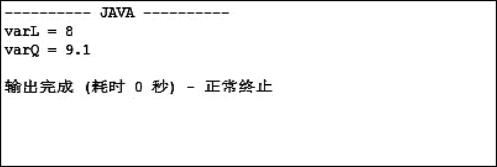
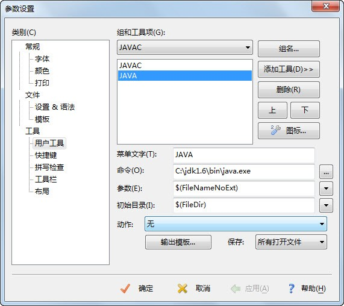

## 本章简介

&emsp;&emsp;第1章的课程中，主要学习了Java的一些常识，如何搭建Java开发环境以及Java程序的基本框架，并且学会了如何使用EditPlus编译Java程序，完成了“蓝桥系统”主界面的编写。本章要继续介绍Java的一些基础知识，包括Java的基本数据类型、常量和变量以及运算符和表达式。如果把程序比作房子，那么这些基础知识就类似于砖、瓦和水泥，对这些基础知识的深刻理解是编写高质量程序的基础。  

## 2.1  标识符和关键字

&emsp;&emsp;标识符是编程时使用的名字。要使用某个东西时，要用到它的名字来标识它，给这个东西起的名字，也需要有一定的规则，不能随便乱起名字。而关键字是事先定义好的、有特殊意义的标识符。

### 2.1.1  标识符  

&emsp;&emsp;Java对各种变量、方法和类等要素命名时使用的字符序列称为标识符。

&emsp;&emsp;给一个汉族小孩起名字，可以叫“张一二三四五六七八”吗？有的人会回答不可以。那为什么不可以呢？因为关于给小孩登记姓名，有《中华人民共和国姓名登记条例》，其中明确规定：姓名用字应当在2个汉字以上，6个汉字以下（民族自治地方的自治机关或者民族习俗对姓名的字数有规定或约定的，从其规定和约定），这个姓名超过了6个汉字，所以不可以。

&emsp;&emsp;同样的道理，Java标识符有如下命名规则。

&emsp;&emsp;（1）标识符由字母、数字、下划线“_”、美元符号“$”组成，并且首字符不能是数字。

&emsp;&emsp;（2）不能把Java关键字作为标识符。

&emsp;&emsp;（3）标识符没有长度限制。

&emsp;&emsp;（4）标识符对大小写敏感。

&emsp;&emsp;在企业的面试题里，常会出现这样的题目，下面的标识符中哪些是非法的？ 

&emsp;&emsp;stuAge、\*stuName、$count、3heartNum、public、x+y、_carSpeed、length10

&emsp;&emsp;stuName非法，原因是不能含“\*”；3heartNum非法，原因是首字符不可以是数字；public非法，原因是不可以是Java关键字；x+y非法，原因是不能含“+”，其他的标识符都是合法的。

&emsp;&emsp;作为一个程序员，写的程序中标识符不仅要合法，而且要简短且能清楚地表明含义，同时还要符合Java标识符的命名规范，这样可以让程序规范、易读。下面列举了不同类型（后面会详细介绍）的标识符的命名规则，需要遵照执行。

- 对于变量和方法名，要求第一个单词应以小写字母作为开头，后面的每个单词则都要以大写字母开头，例如stuAge、sendMessage。

- 对于类名，它和变量名、方法名的区别在于，第一个单词的首字母也需要大写，如果类名称中包含单词缩写，则这个缩写词的每个字母均应大写，例如XMLModule。另外，由于类是设计用来代表对象的，所以在命名类时应尽量选择名词。

- 常量标识符应该都使用大写字母，并且指出该常量完整的含义。如果一个常量名称由多个单词组成，则应该用下划线来分割这些单词，例如MAX_VALUE。

### 2.1.2  关键字  

&emsp;&emsp;Java关键字对Java编译器有特殊的意义，它们用来表示一种数据类型或者表示程序的结构等，关键字不能用作变量名、方法名、类名和包名。

&emsp;&emsp;大多数的编辑器（例如EditPlus和UltraEdit，不含记事本）和集成开发环境（Eclipse和MyEclipse）都会用特殊的方式（通常用蓝色）把Java关键字标识出来。

&emsp;&emsp;Java的关键字都是小写的英文字符串，goto这个标识符虽然从不使用，但也作为Java保留字进行保留，需要注意。图2.1列出了所有的Java关键字。

<p align="center"></p> 
<p align="center">图2.1  Java关键字</p>  

##  2.2  变量和常量  
###  2.2.1  变量   
&emsp;&emsp;变量是一段有名字的连续存储空间（存储在计算机内存中）。在Java代码中通过定义变量来申请并命名这样的存储空间，并通过变量的名字来使用这段存储空间。通过给变量赋值可以改变变量的值，所以称之为变量。变量是程序中数据的临时存放场所，变量中可以存放字符串、数值、日期和对象等。  

&emsp;&emsp;Java变量的核心要素是变量类型、变量名和变量值，其声明格式如下。  


```
type varName [=value];
```


&emsp;&emsp;其中type表示Java的数据类型（2.3节会详细介绍Java的基本数据类型），其含义为这个变量里存的是什么类型的数据。varName是变量名，通过这个变量名使用这个变量。value是变量值，在声明变量的时候可以不初始化变量值。通过varName = newValue，可以给这个变量赋新的变量值。

&emsp;&emsp;对于内存而言，“type varName”是声明变量，相当于根据数据类型向内存申请一块空间，而“=value”相当于把变量值放到这个内存空间中。例如int stuAge = 22（省略分号，以下同），可以拆分成int stuAge 和stuAge = 22两条语句，其中int stuAge相当于向内存申请一块可以存储int型变量的空间（实际为4个字节，32位），而stuAge = 22相当于把22这个数放到了这块内存空间中，接下来还可以通过stuAge = 27这条语句把27这个数放到刚才的内存空间中，原来22这个数就不存在了。

&emsp;&emsp;在使用变量时，要避免出现未赋值就使用的情况。虽然在后面的章节中，会看到一些变量即使不赋值也会有默认值，但作为程序员，为了避免程序出错，也要做到变量先赋值后使用。

### 2.2.2  常量  

&emsp;&emsp;在Java语言中，利用final关键字来定义Java常量，其本质为值不可变的变量。

&emsp;&emsp;因为Java常量的本质是值不可变的变量，所以在声明的时候，就必须要进行初始化。和变量不同的是，Java常量在程序中将无法再进行赋值，如果强行赋值，程序会抛出错误信息，并拒绝接受这一个新的值。例如执行下面的程序（为了节省篇幅，代码中省去了部分注释）。


```
public class FinalValue{

	public static void main(String[] args){

        final int STU_AGE = 22;              	//定义Java常量STU_AGE，其值为22

        System.out.println(STU_AGE);    		//打印出STU_AGE的值

        STU_AGE = 27;                     		//企图改变Java常量的值

	}

}
```


&emsp;&emsp;程序运行结果如图2.2所示。

<p align="center"></p> 
<p align="center">图2.2  改变常量的值</p>  

## 2.3  Java数据类型


&emsp;&emsp;变量声明包括变量的数据类型和变量名，那什么是数据类型呢？什么是Java的数据类型和Java基本数据类型呢？


### 2.3.1  Java数据类型概述  

&emsp;&emsp;假设编写程序让计算机完成这样的操作：一个学生的年龄是22岁，新年的钟声敲响之后，他的年龄就应该增加一岁，即为22+1。计算机如何执行这样的操作呢？首先，计算机要向内存申请一块空间，存放22这个数字，再申请一块空间，存放1这个数字，然后让计算机求这两个数字的和，存放到内存中。

&emsp;&emsp;现在是用整数存储学生的年龄，申请了一块内存空间，如果要存储学生的姓名，或者存储学生的成绩（例如78.5），也是申请同样大小的一块内存空间吗？这样的内存空间能存下需要存储的数据吗？答案是否定的。

&emsp;&emsp;根据能对数据进行的操作以及数据所需内存大小的不同，把数据分成不同的类型。编程的时候需要用大数据的时候才需要申请大内存，这样就可以充分利用内存。 

&emsp;&emsp;Java数据类型分为两大类，即基本数据类型和引用数据类型，如图2.3所示。其中引用数据类型又分为类、接口和数组，不是本章介绍的重点，在后面的课程中会详细介绍。

<p align="center"></p> 
<p align="center">图2.3  Java数据类型</p>  

&emsp;&emsp;Java基本数据类型分为4种，分别是整型、浮点型、字符型和布尔型。表2.1列出了不同的Java基本数据类型所占的字节数、位数和使用说明。  
<p align="center">表2.1  Java基本数据类型说明</p>  

| 数据类型 | 字节数 | 位数 | 使 用   说 明 |
| -------- | ------ | ---- | --------------------------------------------------------- |
| byte     | 1      | 8    | 取值范围：-27～27-1                                       |
| short    | 2      | 16   | 取值范围：-215～215-1                                     |
| int      | 4      | 32   | 取值范围：-231～231-1                                     |
| long     | 8      | 64   | 取值范围：-263～263-1，直接赋值时必须在数字后加上l或L     |
| float    | 4      | 32   | 取值范围：1.4E-45～3.4E38，直接赋值时必须在数字后加上f或F |
| double   | 8      | 64   | 取值范围：4.9E-324～1.8E308                               |
| char     | 2      | 16   | 使用Unicode编码（2个字节），可存汉字                      |
| boolean  | —      | —    | 只有true和false两个取值                                   |


### 2.3.2  整型  

&emsp;&emsp;Java各整数类型有固定的表示范围和字段长度，其不受具体操作系统的影响，以保证Java程序的可移植性。

&emsp;&emsp;Java语言整型常量有以下3种表示形式。

&emsp;&emsp;（1）十进制整数，例如12，-127，0。

&emsp;&emsp;（2）八进制整数，以0开头，例如014（对应于十进制的12）。

&emsp;&emsp;（3）十六进制整数，以0x或0X开头，例如0XC（对应于十进制的12）。

&emsp;&emsp;进制转换的内容不是本书涉及的范畴，如有不清楚的，请查阅相关资料。

&emsp;&emsp;Java语言的整型常量默认为int型，声明long型的整型常量需要在常量后面加上“l”或“L”，例如：


```
long maxNum = 9999999999L;
```


&emsp;&emsp;看下面的程序，其运行结果如图2.4所示。


```
class MaxNum{

    public static void main(String[] args) {

        long maxNum = 9999999999;

        System.out.println(maxNum);

    }

}
```
<p align="center"></p> 
<p align="center">图2.4  整型常量默认为int型</p>  

&emsp;&emsp;程序运行出错的原因为，Java语言的整型常量默认为int型，其最大值为2 147 483 647，而在给maxNum赋值时，等号右边的整型常数为9999999999，大于int型的最大值，所以报错。处理方法是在9999999999后面加个“L”（或“l”）。    

&emsp;&emsp;都是为了存整数，Java语言设计出4种整型类型的目的是存不同大小的数，这样可以节约存储空间，对于一些硬件内存小或者要求运行速度快的系统显得尤为重要。例如，需要存储一个两位整数，其数值范围在-99到99之间，程序员就可以使用byte类型进行存储，因为byte类型的取值范围为-128到127之间。  

### 2.3.3  浮点型  

&emsp;&emsp;在计算机系统的发展过程中，曾经提出过多种表示实数的方法，但是到目前为止使用最广泛的是浮点表示法。相对于定点数而言，浮点数利用指数使小数点的位置可以根据需要而上下浮动，从而可以灵活地表达更大范围的实数。

&emsp;&emsp;Java浮点类型常量有以下两种表示形式。

&emsp;&emsp;（1）十进制形式，例如3.14，314.0，.314。

&emsp;&emsp;（2）科学记数法形式，例如3.14e2，3.14E2，100E-2。

&emsp;&emsp;Java语言浮点型常量默认为double型，声明一个float型常量，则需要在常量后面加上“f”或“F”，例如：


```
float floatNum = 3.14F;
```


&emsp;&emsp;不同于整型，通过简单的推算，程序员就可以知道这个类型的整数的取值范围。对于float和double，要想推算出来，需要理解浮点型的存储原理，且计算起来比较复杂。接下来，通过下面的程序，可以直接在控制台输出这两种类型的最小值和最大值，程序运行结果如图2.5所示。


```
class FloatDoubleMinMax{

        public static void main(String[] args) {  

                   System.out.println("float最小值 = " + Float.MIN_VALUE);    

                   System.out.println("float最大值 = " + Float.MAX_VALUE);

                   

                   System.out.println("double最小值 = " + Double.MIN_VALUE);    

                   System.out.println("double最大值 = " + Double.MAX_VALUE);

         }

} 
```
<p align="center"></p> 
<p align="center">图2.5  浮点型数的取值范围</p>  

### 2.3.4  字符型  

&emsp;&emsp;字符型（char型）数据用来表示通常意义上的字符。

&emsp;&emsp;字符常量为用单引号括起来的单个字符，因为Java使用Unicode编码，一个Unicode编码占2个字节，一个汉字也是占2个字节，所以Java中字符型变量可以存放一个汉字，例如：


```
char eChar = 'q';

char cChar = '桥';
```


&emsp;&emsp;Java字符型常量有以下3种表示形式。

&emsp;&emsp;（1）用英文单引号括起来的单个字符，例如'a'、'汉'。

&emsp;&emsp;（2）用英文单引号括起来的十六进制字符代码值来表示单个字符，其格式为'\uXXXX'，其中u是约定的前缀（u是Unicode的第一个字母），而后面的XXXX位是4位十六进制数，是该字符在Unicode字符集中的序号，例如'\u0061'。

&emsp;&emsp;（3）某些特殊的字符可以采用转义符'\'来表示，将其后面的字符转变为其他的含义，例如'\t'代表制表符，'\n'代表换行符，'\r'代表回车符等。

&emsp;&emsp;通过下面的程序及程序的运行结果（如图2.6所示），可以进一步了解Java字符的使用方法。


```
class CharShow{

         public static void main(String[] args){

                   char eChar = 'q';

                   char cChar = '桥';

                   System.out.println("显示汉字：" + cChar);

                   char tChar = '\u0061';

                   System.out.println("Unicode代码0061代表的字符为：" + tChar);

                   char fChar = '\t';

                   System.out.println(fChar+"Unicode代码0061代表的字符为：" + tChar);

         }

}
```
<p align="center"></p> 
<p align="center">图2.6  Java字符的使用</p>  

### 2.3.5  布尔型  

&emsp;&emsp;Java中boolean类型可以表示真或假，只允许取值true或false（不可以用0或非0的整数替代true和false，这点和C语言不同），例如：


```
boolean flag = true;
```

&emsp;&emsp;boolean类型适于逻辑运算，一般用于程序流程控制，后面流程控制的课程经常会使用到布尔型。

&emsp;&emsp;在表2.1 Java基本数据类型说明中，只有boolean类型没有注明其占多少个字节，有兴趣的可以好好研究一下。

### 2.3.6  基本数据类型转换  

&emsp;&emsp;Java的数据类型转换分为以下3种：基本数据类型转换，字符串与其他数据类型转换，其他实用数据类型转换。本节介绍Java基本数据类型转换，其中boolean类型不可以和其他的数据类型互相转换。整型、字符型、浮点型的数据在混合运算中相互转换遵循以下原则。

- 容量小的类型自动转换成容量大的数据类型（如图2.7所示）。

- byte、short、char之间不会互相转换，三者在计算时首先会转换为int类型。

- 容量大的数据类型转换成容量小的数据类型时，需要加上强制转换符，但可能造成精度降低或溢出，使用时需要格外注意。

- 有多种类型的数据混合运算时，系统首先自动地转换成容量最大的数据类型，然后再进行计算。


<p align="center"></p> 
<p align="center">图2.7  Java基本数据类型转换</p>  

&emsp;&emsp;注：实箭头表示无信息丢失的转换，虚箭头表示可能有精度损失的转换。

&emsp;&emsp;通过下面的程序及程序的运行结果（如图2.8所示），可以进一步加深对Java基本数据类型转换的认识。


```
class TestConvert{

    public static void main(String[] args){

        int i1 = 222; 

        int i2 = 333;

        double d1 = (i1+i2)*2.9;         		//系统将转换为double型运算

        float f1 = (float)((i1+i2)*2.9);		//从double型转换成float型，需要进行强制类型转换

        System.out.println(d1);

        System.out.println(f1);


        byte b1 = 88; 

        byte b2 = 99;

        byte b3 = (byte)(b1+b2); 				//系统先转换为int型运算，再从int型转换成byte型

						                        //需要进行强制类型转换

        System.out.println("88 + 99 = " + b3);	//强制类型转换，数据结果溢出


        double d2 = 5.1E88;

        float f2 = (float)d2;					//从double型强制转换成float型，结果溢出

        System.out.println(f2);


        float f3 = 3.14F;

        f3 = f3 + 0.05F;//这条语句不能写成f3 = f3 + 0.05;，否则会报错，因为0.05是double型，

        //加上f3，仍然是double型，赋给float会报错

        System.out.println("3.14F + 0.05F = " + f3);

    }

}
```
<p align="center"></p> 
<p align="center">图2.8  Java基本数据类型转换</p>  

## 2.4  成员变量和局部变量

 

&emsp;&emsp;根据变量声明位置的不同，可以将变量分为成员变量和局部变量。

&emsp;&emsp;成员变量是在类的内部、方法（含语句块）外部定义的变量，其作用域从变量定义位置起到类结束。而局部变量是在方法（含语句块）内部定义的变量（包括形参），其作用域从变量定义位置起到方法（含语句块）结束。对于Java而言，类的外面不能有变量的声明。

&emsp;&emsp;下面的程序演示了成员变量和局部变量的作用域，请仔细阅读代码中的注释，运行结果如图2.9所示。

``` 

class VarScope{

    static float varQ = 9.1F;        //成员变量，其作用域从变量定义位置起至类结束

    {

        int varB = 10;               //语句块中的局部变量，其作用域从变量定义位置起至语句块结束

        System.out.println("varB = " + varB);     //可以使用本语句块中的局部变量varB

        System.out.println("varQ = " + varQ);    //可以使用成员变量varQ

    }

    public static void main(String[] args) {

        int varL = 8;                //方法中的局部变量，其作用域从变量定义位置起至方法结束 

        System.out.println("varL = " + varL);     //可以使用本方法中的局部变量varL

        System.out.println("varQ = " + varQ);    //可以使用成员变量varQ

        //System.out.println("varB = " + varB);  //不可以使用其他方法（或语句块）中的局部变量

    }

    float varT = varQ + 1.0F; 		 //可以使用成员变量varQ，varT本身也是成员变量

}
```

<p align="center"></p> 
<p align="center">图2.9  成员变量和局部变量</p>  

&emsp;&emsp;再看下面的例子，运行结果如何呢？


```
class VarScope2 {

    float varT = 9.1F;              			//成员变量，其作用域从变量定义位置起至类结束

    public void show(){

        float varT = 1.1F;        			//方法中的局部变量，其作用域从变量定义位置起至方法结束

        System.out.println("varT = " + varT);	//在控制台，输出的是9.1还是1.1呢？

        //float varT = 12.3F;					//不可以在同一个作用域内，定义两个同名变量

        }

    public static void main(String[] args) {

        VarScope2 v2 = new VarScope2();

        v2.show();                         		//调用show()方法；

        }

}
```

&emsp;&emsp;程序运行结果如图2.10所示，通过这个例子可以看出，方法中的局部变量可以和方法外的成员变量同名，如本例中的varT变量。在使用的时候，如果在局部变量所在的方法体内，局部变量覆盖成员变量，输出的结果是局部变量的值；如果在局部变量所在的方法体外，不在局部变量的作用域内，输出的是成员变量的值。


<p align="center"></p> 
<p align="center">图2.10  成员变量和局部变量同名</p>  

&emsp;&emsp;另外还需要注意的是，在Java中声明的成员变量可以不赋初始值，有默认的初始值（基本数据类型默认初始值为0、0.0、'\u0000'和false），如果声明局部变量则必须赋初始值。


## 2.5  上机任务


#### 目标：完成本章2.3节和本章2.4节的所有程序。

 


时间：20分钟。

 


形式：每个学员独立完成，小组组长检查。

 


工具：EditPlus。

 

## 2.6  Java运算符

 

&emsp;&emsp;Java语言支持如下运算符。

- 算术运算符：+、-、*、/、%、++、- -。

- 关系运算符：>、<、>=、<=、= = 、!=。

- 赋值运算符：=、+=、-=、*=、/=等。

- 逻辑运算符：！、&&、||等。

- 位运算符：~、&、|、^、>>、<<、>>>（无符号右移）。

### 2.6.1  算术运算符  

&emsp;&emsp;从参与运算的项数分，可以将算术运算符分为以下3类。

&emsp;&emsp;（1）单目运算符：+（取正）、-（取负）、++（自增1）、--（自减1）。

&emsp;&emsp;（2）双目运算符：+、-、*、/、%（取余）。

&emsp;&emsp;（3）三目运算符：(表达式1)?(表达式2):(表达式3)，当表达式1的结果为真时，整个运算的结果为表达式2，否则为表达式3，该运算符是Java语言唯一一个三目运算符，常被使用，需要掌握。

&emsp;&emsp;通过下面的例子，来重点学习++、--、%和三目运算符这四个算术运算符。


```
class ArithmeticOpr{

    public static void main(String[] args) {

        int i1 = 10, i2 = 20;

        int i = (i2++);               //++在i2后，故先运算（赋值）再自增

        System.out.print("i = " + i);

        System.out.println(" i2 = " + i2);

        i = (++i2);                    //++在i2前，故先自增再运算（赋值）

        System.out.print("i = " + i);

        System.out.println(" i2 = " + i2);

        i = (--i1);                      //--在i1前，故先自减再运算（赋值）

        System.out.print("i = " + i);

        System.out.println(" i1 = " + i1);

        i = (i1--);                      //--在i1后，故先运算（赋值）再自减

        System.out.print("i = " + i);

        System.out.println(" i1 = " + i1);


        System.out.println("10 % 3 = " + 20%3);

        System.out.println("20 % 3 = " + 10%3);


        int rst = (20 % 3)>1 ? -10 : 10;


        System.out.println("(20 % 3)>1 ? -10 : 10 = " + rst);

    }

}
```


&emsp;&emsp;程序运行结果如图2.11所示，通过这个例子可以看出，++和--这两个运算符放在操作数前或后，决定着是先自增（或自减）再运算，还是先运算再自增（或自减）。

<p align="center"></p> 
<p align="center">图2.11  算术运算符程序示例运行结果</p>  

&emsp;&emsp;第1章编写了“蓝桥系统”的主界面，其中第五项内容为“计算Java工程师月薪”，接下来单独完成这一模块的功能。

&emsp;&emsp;假设Java工程师的月薪按以下方式计算。

&emsp;&emsp;Java工程师月薪=月底薪+月实际绩效+月餐补-月保险

&emsp;&emsp;其中：

- 月底薪为固定值。

- 月实际绩效=月绩效基数（月底薪×25%）×月工作完成分数（最小值为0，最大值为150）/100。

- 月餐补=月实际工作天数×15。

- 月保险为固定值。

&emsp;&emsp;计算Java工程师月薪时，用户输入月底薪、月工作完成分数（最小值为0，最大值为150）、月实际工作天数和月保险4个值后，即可以计算出Java工程师月薪。具体代码如下。


```
import java.util.Scanner;

class CalSalary {

    public static void main(String[] args) {

        double engSalary = 0.0;                                    //Java工程师月薪

        int basSalary = 3000;                                        //底薪

        int comResult = 100;                                         //月工作完成分数（最小值为0，最大值为150）

        double workDay = 22;                                      //月实际工作天数

        double insurance = 3000 * 0.105;                     //月应扣保险数


        Scanner input = new Scanner(System.in);        //从控制台获取输入的对象

        System.out.print("请输入Java工程师底薪：" );

        basSalary = input.nextInt();   //从控制台获取输入——即底薪，赋值给basSalary

        System.out.print("请输入Java工程师月工作完成分数（最小值为0，最大值为150）：" );

        comResult = input.nextInt(); //从控制台获取输入——即月工作完成分数，赋值给comResult

        System.out.print("请输入Java工程师月实际工作天数：" );

        workDay = input.nextDouble();      //从控制台获取输入——即月实际工作天数，赋值给workDay

        System.out.print("请输入Java工程师月应扣保险数：" );

        insurance = input.nextDouble();     //从控制台获取输入——即月应扣保险数，赋值给insurance


        //Java工程师月薪= 底薪 + 底薪×25%×月工作完成分数/100 + 15×月实际工作天数 

        //- 月应扣保险数

        engSalary = basSalary + basSalary*0.25*comResult/100 + 15*workDay - insurance;

        System.out.println("Java工程师月薪为：" + engSalary );

    }

}
```


&emsp;&emsp;本程序需要从控制台获取输入，所以在程序的第一行加入了代码import java.util.Scanner;，引入Scanner工具类，通过该工具类从控制台获取输入。具体获取输入的代码，通过程序中的注释，很容易看明白。

&emsp;&emsp;另外，原来在EditPlus的“配置用户工具”中配置的“JAVA”工具，其“动作”选择的是“捕捉输出”，因本程序需要输入，故需要将动作改为“无”（见图2.12）。这样可以在需要输入的时候，启动控制台进行输入操作。  

<p align="center"></p> 
<p align="center">图2.12  设置EditPlus工具动作</p>  

&emsp;&emsp;程序的实际运行结果如图2.13所示。  

<p align="center"></p> 
<p align="center">图2.13  计算Java工程师月薪</p>  

### 2.6.2  逻辑运算符  

&emsp;&emsp;关系运算符和赋值运算符比较简单，这里不展开介绍。需要注意的是，关系运算符“==”和赋值运算符“=”看起来比较类似，但含义完全不同，“==”用于判断两边是否相等，而“=”是将右边的值赋给左边。

&emsp;&emsp;+=、-=等是扩展的赋值运算符，x += y等价于x = x + y，程序员在实际的编程过程中，为了方便阅读，尽量不要使用这种扩展的赋值运算符。

&emsp;&emsp;接下来重点介绍逻辑运算符和位运算符。在Java语言中有3种逻辑运算符，它们是逻辑非（用符号“!”表示）、逻辑与（用符号“&&”表示）和逻辑或（用符号“||”表示）。

&emsp;&emsp;逻辑非表示取反，其逻辑关系值表如表2.2所示。

<p align="center">表2.2  逻辑非关系值表</p>  

|A|	!A|
|----|----|
|true	|false|
|false|	true|


&emsp;&emsp;逻辑与的运算规则为：有一个运算数为假，其值为假，两个运算数都为真，其值为真。逻辑与的关系值表如表2.3所示。
<p align="center">表2.3  逻辑与关系值表</p>  


| A     | B     | A&&B  |
| ----- | ----- | ----- |
| false | false | false |
| true  | false | false |
| false | true  | false |
| true  | true  | true  |

 

&emsp;&emsp;逻辑或的运算规则为：有一个运算数为真，其值为真，两个运算数都为假，其值为假。逻辑或的关系值表如表2.4所示。
<p align="center">表2.4  逻辑或关系值表</p>  


| A     | B     | A&#124;&#124;B |
| ----- | ----- | ------ |
| false | false | false  |
| true  | false | true   |
| false | true  | true   |
| true  | true  | true   |

 

&emsp;&emsp;逻辑运算符在后面流程控制的课程中会经常用到，这里不再赘述。

### 2.6.3  位运算符  

&emsp;&emsp;在计算机中，所有的信息都是以二进制形式存储的，可以对整数的二进制位进行相关的操作，这就是位运算符。位运算符主要包括按位非（用符号“~”表示）、按位与（用符号“&”表示）、按位或（用符号“|”表示）、按位异或（用符号“^”表示）和移位运算符（用符号“<<”、“>>”、“>>>”表示）。

&emsp;&emsp;在企业面试Java工程师的时候，也常会问到“&&”和“&”以及“||”与“|”的区别，通过下面的学习，可以清楚地理解逻辑运算符和位运算符的区别。

&emsp;&emsp;按位非表示按位取反，其关系值表如表2.5所示。
<p align="center">表2.5  按位非的关系值表</p>  

|A	|~A|
|----|----|
|1	|0|
|0	|1|


&emsp;&emsp;按位与是逐位逻辑与。按位与的关系值表如表2.6所示。
<p align="center">表2.6  按位与的关系值表</p>  


| A    | B    | A&B  |
| ---- | ---- | ---- |
| 1    | 1    | 1    |
| 1    | 0    | 0    |
| 0    | 1    | 0    |
| 0    | 0    | 0    |

 

&emsp;&emsp;按位或是逐位逻辑或。按位或的关系值表如表2.7所示。
<p align="center">表2.7  按位或的关系值表</p>  


| A    | B    | A&#124;B |
| ---- | ---- | ---- |
| 1    | 1    | 1    |
| 0    | 1    | 1    |
| 1    | 0    | 1    |
| 0    | 0    | 0    |

 

&emsp;&emsp;按位异或是当两个运算位不同时，结果为1，否则为0。按位异或的关系值表如表2.8所示。
<p align="center">表2.8  按位异或的关系值表</p>  


| A    | B    | A^B  |
| ---- | ---- | ---- |
| 1    | 1    | 0    |
| 0    | 1    | 1    |
| 1    | 0    | 1    |
| 0    | 0    | 0    |

 

 

&emsp;&emsp;阅读下面的程序，分析程序运行结果。


```
class BitOpr {

    public static void main(String[] args){

        int a = 129;                                                                                             //二进制10000001

        int b = 128;                                                                                             //二进制10000000

        System.out.println("a和b按位与的结果是：" + (a&b));                   //按位与的结果为10000000

        System.out.println("a和b按位或的结果是：" + (a|b));          //按位或的结果为10000001

        //Integer.toBinaryString()方法是将数据按二进制格式输出

        //按位非的结果是：11111111111111111111111101111110

        System.out.println("a按位非的结果是：" + Integer.toBinaryString((~a))); 

        System.out.println("a和b按位异或的结果是：" + (a^b));      //按位与的结果为00000001


        int c = 5;

        //用性能最好的方法计算出5×8的结果

        int rst = c<<3;

        //整数每左移一位，相当于×2，左移3位相当于×8，因为仅仅是位移，所以速度快

        System.out.println("5左移三位的结果是：" + rst);

        }

}

```

&emsp;&emsp;程序运行的结果如图2.14所示，其中程序最后一段演示了“用性能最好的方法计算出5×8的结果”，这也是企业面试中常问的问题。


<p align="center"></p> 
<p align="center">图2.14  位运算符操作</p>  

##  2.7  Java表达式

###  2.7.1  Java表达式概述  

&emsp;&emsp;表达式是符合一定语法规则的运算符和操作数的组合。下面列举了一些表达式，需要注意的是，单个操作数也是表达式。


```
x

y * 5

(a-b) * c - 4

(x>y)&&(m<=n)
```
&emsp;&emsp;表达式的值：对表达式中的操作数进行运算得到的结果。

&emsp;&emsp;表达式的类型：表达式的值的数据类型即为表达式的类型。

### 2.7.2  表达式的运算顺序  

&emsp;&emsp;Java表达式按照运算符的优先级从高到低的顺序进行运算，优先级相同的运算符按照事先约定的结合方向进行运算。运算符的优先级和结合性如表2.9所示。需要注意的是，程序员在编写代码时，是不会去记运算符的优先级的，当不确定运算符的优先级时，程序员通常的做法就是对先运算的部分加上小括号，保证此运算优先执行。
<p align="center">表2.9  Java运算符优先级及结合性</p>  


| 优先级 | 运算符                                                       | 结合性   |
| ------ | ------------------------------------------------------------ | -------- |
| 1      | ()  []  .                                                    | 从左向右 |
| 2      | !  +（正） -（负）  ~  ++  --                                | 从右向左 |
| 3      | *  /  %                                                      | 从左向右 |
| 4      | +（加） -（减）                                              | 从左向右 |
| 5      | <<    >>  >>>                                                | 从左向右 |
| 6      | <  <=  >    >=  instanceof                                   | 从左向右 |
| 7      | ==  !=                                                       | 从左向右 |
| 8      | &（按位与）                                                  | 从左向右 |
| 9      | ^                                                            | 从左向右 |
| 10     | &#124;                                                           | 从左向右 |
| 11     | &&                                                           | 从左向右 |
| 12     |&#124;&#124;                                                        | 从左向右 |
| 13     | ?:                                                           | 从右向左 |
| 14     | =  +=  -=  \*=  /=  %  =  &=    &#124;=  ^=  ~=  <<=  >>=    >>>= | 从右向左 |

 


&emsp;&emsp;下面的例子看起来很简单，但作为程序员，总是在不经意间犯下这样的错误。当程序运行结果和预期结果有差异时，往往不容易找出错误所在。

``` 

import java.util.Scanner;

class ShareApple {

    public static void main(String[] args) {

        int appleNum = 0;                 //苹果数

        int stuNum = -1;                    //小朋友数

        double stuApple = -1;           //每个小朋友得到多少苹果


        Scanner input = new Scanner(System.in);

        System.out.print("请输入篮子里有几个苹果：");

        appleNum = input.nextInt();

        System.out.print("请输入屋子里有几个小朋友：");

        stuNum = input.nextInt();

        stuApple = appleNum / stuNum;

        System.out.println("每个小朋友得到：" + stuApple + "个苹果");

    }

}
```


&emsp;&emsp;输入两组不同的值（苹果数和小朋友数），如图2.15和图2.16所示，其中第二组得到的并不是预期的结果。原因在于stuApple = appleNum / stuNum这条语句，首先运算的是appleNum / stuNum，之后再进行赋值运算。appleNum / stuNum这个表达式中的两个操作数都是int型的，其运算结果也是int型，所以出现了3除以6，得到int型0的情况，再将int型的0赋给double类型的stuApple，结果显示出0.0。


<p align="center"></p> 
<p align="center">图2.15  Java表达式执行示例一  </p>  

<p align="center"></p> 
<p align="center">图2.16  Java表达式执行示例二 </p>  

## 2.8  上机任务


#### 目标：完成本章2.6节和2.7节的所有程序。

 


时间：20分钟。

 


形式：每个学员独立完成，小组组长检查。

 


工具：EditPlus。

 


## 2.9  上机任务

 


#### 目标： 

 

&emsp;&emsp;在第1章完成的“蓝桥系统”的基础上，完成获取用户输入值，并显示用户输入的值的功能。

&emsp;&emsp;运行结果如图2.17所示。

<p align="center"></p> 
<p align="center">图2.17  “蓝桥系统”获取用户输入</p>  

时间：10分钟。

 


形式：每个学员独立完成，小组组长检查。

 


工具：EditPlus。

 

 


## 2.10  本章练习

 

1  下列选项中，（    ）是Java中的关键字。（单选）

&emsp;&emsp;A．name

&emsp;&emsp;B．hello

&emsp;&emsp;C．false

&emsp;&emsp;D．good

2  Java中用于定义实数的类型有________和________，后者精度高于前者。

3  Java中有goto关键字吗？

 

 

4  请描述Java有哪些基本数据类型。

 

 

5  Java的字符型可以存一个汉字吗？

 

 

6  请说明final、finally、finalize的区别（需要结合后面的章节才能回答此问题）。

 

 

 