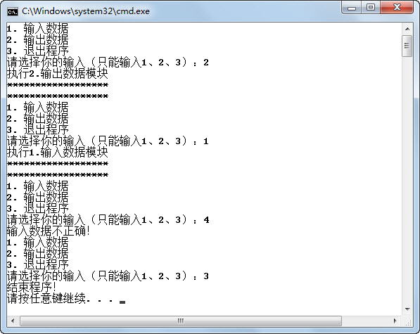
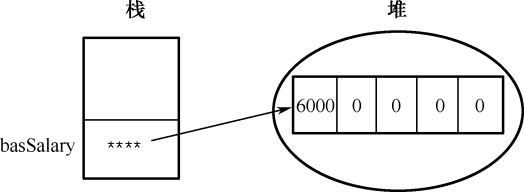
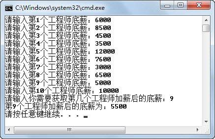
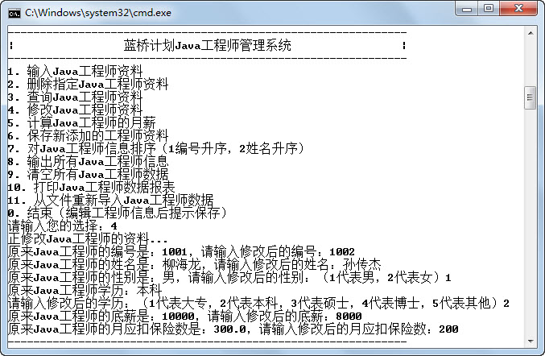

## 本章简介


&emsp;&emsp;在第3章编写《蓝桥系统》代码时，所有的代码都写在main方法里面，这个方法首先定义了一些局部变量，然后使用while循环输出《蓝桥系统》主界面，之后获取用户选择，再根据用户选择，完成相应模块的功能。

&emsp;&emsp;随着将各个模块的功能逐步完善到《蓝桥系统》中，这个main方法将会越来越庞大，代码越来越多，阅读起来会非常困难，不利于开发维护。怎么解决这个问题呢？接下来会通过在类中使用方法的形式，解决这个问题。

&emsp;&emsp;另外，现在《蓝桥系统》中存的是一个Java工程师的相关信息，例如编号、姓名、底薪……这类信息可以使用engNo、engName、basSalary…这些变量来存储具体的值。但如果《蓝桥系统》需要存100个Java工程师，难道需要定义100个编号变量、100个姓名变量和100个底薪变量吗？显然，这样的做法不现实。本章第二部分，将会系统地介绍数组，通过使用数组来解决这个问题。

 

 

 

## 4.1  方法

 

&emsp;&emsp;方法是Java中一个命名的代码块，如同在数学中用到的函数，在其他语言中常直接称为函数。

&emsp;&emsp;方法通常是为完成一定的功能，把程序中特定的代码块组合在一起而构成的，其主要的好处体现在两个方面，一个是可以重用，另一个是使程序结构更加清晰。

### 4.1.1  Java方法概述  


&emsp;&emsp;第3章通过双重for循环完成过如图4.1所示的输出。现在假设需求做了调整，需要输出3个类似这样的图形（规则一样），第一个图形是5行*，第二个图形是8行*，第三个图形是12行*，如图4.2所示，具体的代码如下。


```
class TestMethod1 

{

    public static void main(String[] args) 

    {

        //输出第一个图形，5行*

        for(int i = 1;i <= 5;i++){

            for(int j = 1;j <= i;j++){

            	System.out.print("*");

            }

            System.out.println();

        }

        //输出第二个图形，8行*

        for(int i = 1;i <= 8;i++){

            for(int j = 1;j <= i;j++){

            	System.out.print("*");

            }

            System.out.println();

        }

        //输出第三个图形，12行*

        for(int i = 1;i <= 12;i++){

            for(int j = 1;j <= i;j++){

            	System.out.print("*");

            }

            System.out.println();

        }

    }

}
```

<p align="center"></p>
<p align="center"> 图4.1  输出图形1  </p>  
<p align="center"></p>
<p align="center"> 图4.2  输出图形2 </p>  
&emsp;&emsp;虽然使用上面的代码可以实现图4.2所示图形的输出，但给程序员的感觉是编写了大量重复的代码。并且如果这个输出图形的规则发生了变化，则需要分别在输出图形的代码块中进行更改，很麻烦且容易忘记。

&emsp;&emsp;接下来用Java的方法解决这个问题，Java方法声明的语法形式如下。

```
[修饰符]  返回值类型  方法名([形参列表]){

	方法体

}
```


&emsp;&emsp;其中，大括号前面的内容称为方法头，大括号里面的称为方法体。下面具体介绍Java方法声明中的各元素。

- 修饰符：用来规定方法的一些特征，例如它的可见范围以及如何被调用。例如，我们一直在使用的main方法，其中的public static就是修饰符，public表示这个方法的可见范围，而static表示main方法是一个静态方法，这些内容后面的课程会详细介绍。

- 返回值类型：表示该方法返回什么样类型的值。方法可以没有返回值，这时需要用void表示返回值类型。不过一旦一个方法需要返回值时，那么方法体里就必须使用return语句返回此类型的值，举例如下。


```
public void drawCircular(){...}       //该方法没有返回值

public int returnInt(){                     //该方法返回值为int类型

    int x = 10;

    ...

    return x;

}
```


&emsp;&emsp;这里需要强调，return也是一种跳转语句，和前面学过的break语句和continue语句一样，不同点在于方法执行到return语句后，会返回给主调方法。

&emsp;&emsp;此外，一个方法只能有一个返回值，因此也只能有一个返回值类型。如果逻辑上确实需要返回多个值，则可以将需要返回的“多个值”先转为一个数组或一个对象，然后再返回转变后的这“一个值”。数组和对象会在后续进行学习，届时可以再深入思考。

- 方法名：必须符合标识符的命名规则，并且能够望文知义，前面在介绍标识符时详细介绍过。

- 形参列表：参数用来接收外界传来的信息，可以是一个或多个，也可以没有参数，但无论是否有参数，必须有小括号。方法中的这些参数称为形式参数，简称形参，形参必须说明数据类型，举例如下。


```
public int returnAdd(int x,int y){

	return x + y;

}
```

&emsp;&emsp;这个方法中有两个形参，都是int型的，返回值也是int型。

&emsp;&emsp;需要注意的是，如果声明了多个方法，那么多个方法之间不能相互嵌套，错误示例如下。

```
public void methodA(){

	…

    public void methodB(){

    …

    }

}
```

此外，之前学习过的选择、循环等逻辑代码，都必须写在方法的内部，如下。


```
//正确：逻辑代码写在方法内部

public void methodC(){

    if(…){

       …

    }

    for(…){

       …

    }

}

//错误：逻辑代码写在方法外部

public void methodD(){

	…

}

if(…){

   …

}
```

&emsp;&emsp;接下来，把前面输出图形的功能用一个方法来实现，这个方法没有返回值，方法名为drawStar，有1个参数：输出*的行数x，具体代码如下。


```
public static void drawStar(int x){

    for(int i = 1;i <= x;i++){

        for(int j = 1;j <= i;j++){

       		System.out.print("*");

        }

        System.out.println();

    }

}
```


&emsp;&emsp;上面的代码只声明了方法，接下来介绍如何使用方法，即方法的调用。这里只介绍类内部方法的调用，关于调用其他类的方法，在后面面向对象的课程中会学习到。在类内部调用方法很简单，只需给出方法名以及方法的实际参数列表（实参列表的数据类型必须与形参列表一致或可以自动转换成形参列表的格式）即可。如果方法有返回值，则可以赋值给相应类型的变量。例如：


```
int x = returnAdd(3 + 5);

drawStar(8);

```

&emsp;&emsp;综合以上学习的内容，采用方法调用的方式实现输出图4.2所示图形的代码如下。


```
class TestMethod2 

{

    public static void main(String[] args) 

    {

        drawStar(5);        //调用drawStar方法，实参为5，表示行数

        drawStar(8);        //调用drawStar方法，实参为8，表示行数

        drawStar(12);      //调用drawStar方法，实参为12，表示行数

        }

        //输出一个图形，共x行，每行输出的*的个数与行数相等

	public static void drawStar(int x)

    {

        for(int i = 1;i <= x;i++){

            for(int j = 1;j <= i;j++){

            	System.out.print("*");

            }

            System.out.println();

        }

    }

}
```


&emsp;&emsp;通过比较实现相同功能的两组不同的代码可以看出，使用方法调用的形式，代码结构清晰，方法声明可以被复用。

&emsp;&emsp;以上提到的方法都是用户自定义方法，JDK本身也提供了很多的方法，我们一直都在使用。例如，System.out.println()为用户向控制台输出方法，nextInt()方法（Scanner类）为从控制台获取用户输入的整数方法，Math.sqrt(i)为求i的平方根方法等。具体JDK方法的使用，请读者查阅JDK API文档。

###  4.1.2  Java方法的使用  

&emsp;&emsp;第3章在介绍while循环时，完成了如图4.3所示功能的程序，其中所有的代码都写在main方法里。接下来使用方法调用的方式组织程序结构，完成相同的功能。

&emsp;&emsp;程序包含如下的方法。

&emsp;&emsp;public static int showMenu(){…}：该方法显示程序主界面，返回用户输入的功能菜单数。

&emsp;&emsp;public static void inputData(){…}：该方法执行模块1，完成输入数据的功能。

&emsp;&emsp;public static void outputData(){…}：该方法执行模块2，完成输出数据的功能。

<p align="center"></p>
<p align="center"> 图4.3  使用方法调用组织程序结构示例功能 </p>  
&emsp;&emsp;public static void main(String[] args)：程序入口方法，使用while循环输出主界面，调用showMenu()方法获得用户输入，根据用户输入值使用switch语句，分别调用inputData()和outputData()方法。另外，原来的userSel是main方法中的局部变量，现在需要改为成员变量，由多个方法共享。具体代码如下所示。


```
import java.util.Scanner;

class TestMethod3 

{       

    //原来的userSel是main方法中的局部变量，现在需要改为成员变量，由多个方法共享

    static int userSel = -1;

    public static void main(String[] args) 

    {

        while(true){

            userSel = showMenu();                  //调用showMenu()方法获得用户输入

            switch(userSel){

                case 1:

                    inputData();        //调用inputData()方法

                    break;

                case 2:

                    outputData();      //调用outputData()方法

                    break;

                case 3:

                    System.out.println("结束程序！");

                    break;

                default:

                    System.out.println("输入数据不正确！");

                    break;

            }

            if (userSel == 3)                    //当用户输入3时，退出while循环，结束程序

            {

            	break;

            }

        }

    }


    //该方法显示程序主界面，返回用户输入的功能菜单数

    public static int showMenu() 

    {

        System.out.println("1. 输入数据");

        System.out.println("2. 输出数据");

        System.out.println("3. 退出程序");

        System.out.print("请选择你的输入（只能输入1、2、3）：");

        Scanner input = new Scanner(System.in);//从控制台获取用户输入的选择

        userSel = input.nextInt();

        return userSel;

    }

    //该方法执行模块1，完成输入数据的功能

    public static void inputData() 

    {

        System.out.println("执行1.输入数据模块");

        System.out.println("******************");

        System.out.println("******************");

    }

    //该方法执行模块2，完成输出数据的功能

    public static void outputData() 

    {

        System.out.println("执行2.输出数据模块");

        System.out.println("******************");

        System.out.println("******************");

    }

}
```
### 4.1.3  方法递归调用  

&emsp;&emsp;递归调用是指一个方法在它的方法体内调用它自身。Java语言允许方法的递归调用，在递归调用中，主调方法同时也是被调方法。执行递归方法将反复调用其自身，每调用一次就再进入一次本方法。

&emsp;&emsp;递归调用最大的问题是，如果递归调用没有退出的条件，则递归方法将无休止地调用其自身，这显然是不正确的。为了防止递归调用无休止地进行，必须在方法内有终止递归调用的手段。通常的做法就是增加条件判断，满足某条件后就不再进行递归调用，然后逐层返回。

&emsp;&emsp;接下来使用递归调用计算整数n的阶乘，具体代码如下。

 

 


```
public class TestMethod4

{

    public static void main(String[] args) {

    	System.out.println(factorial(5));

    }

//求n的阶乘的方法

    static long factorial(int n) {

        if(n == 1) {                                     //判断条件，一旦满足就不再递归，逐层返回

        	return 1;

        }

        long sum = factorial(n - 1);   //递归调用

        return  sum * n;                   //逐层返回求阶乘

    }

}

```

&emsp;&emsp;使用递归调用虽然使程序编写会简单一些，但是不易于理解，在实际编程过程中建议不要使用递归调用。


## 4.2  上机任务


#### 目标：

&emsp;&emsp;（1）规范《蓝桥系统》中一个Java工程师信息，主要包括以下内容。


```
//以下是Java工程师资料，在输入Java工程师资料时输入的内容

static int engNo = -1;                 // Java工程师编号——编号不能为负值

static String engName = "";             //Java工程师姓名——姓名不能为空

static int engSex = -1;                  //Java工程师性别（1代表男，2代表女）——性别只能输入1或2

static int engEdu = -1;           //Java工程师学历（1代表大专，2代表本科，3代表硕士，4代表

​                                //博士，5代表其他）——学历只能输入1、2、3、4、5

static int basSalary = 3000;           // Java工程师底薪——底薪不能为负值

static double insurance = 3000 * 0.105;  // Java工程师月应扣保险数——月应扣保险数不能为负值

//以下是Java工程师月工作情况资料，在计算Java工程师月薪时再输入

static int comResult = 100;      // Java工程师月工作完成分数（最小值为0，最大值为150）

​                               //——数值范围为0～150 

static double workDay = 22;                    // Java工程师月实际工作天数——数值范围为0～31

//以下是由Java工程师资料和Java工程师月工作情况资料计算出来的Java工程师的月薪

static double engSalary = 0.0;                  //Java工程师月薪
```


&emsp;&emsp;（2）重新组织《蓝桥系统》代码结构，使结构清晰，易于维护。

&emsp;&emsp;（3）完成《蓝桥系统》第一个模块“输入Java工程师资料”功能，用户按提示逐行输入Java工程师信息（月工作完成分数和月实际工作天数在“计算Java工程师的月薪”功能中输入）；如果输入错误，会要求用户从头开始重新输入Java工程师资料。

程序运行结果如图4.4所示。

<p align="center"></p>
<p align="center">图4.4  使用方法调用优化《蓝桥系统》</p>  


实现思路：

 

&emsp;&emsp;（1）将Java工程师资料设置为成员变量，能被各方法调用。

&emsp;&emsp;（2）使用方法调用重新组织《蓝桥系统》的结构，使用方法实现显示主界面以及实现各模块功能的代码。

&emsp;&emsp;（3）原先“计算Java工程师的月薪”功能中需要用户输入的部分内容，调整到“输入Java工程师资料”功能中输入。

&emsp;&emsp;（4）在“输入Java工程师资料”前需要判断是否已输入，如果已输入则输出提示信息；在“计算Java工程师的月薪”前需要判断是否已输入Java工程师资料，如果未输入则输出提示信息。可以通过status这个布尔值判断Java工程师资料是否已经输入完毕。

&emsp;&emsp;（5）在“输入Java工程师资料”时，需要根据需求对输入进行条件判断。


时间：100分钟。

 


形式：小组讨论，每个学生独立编写代码，小组组长检查。

 


工具：EditPlus。

 


参考答案： 

 

此次参考答案为完整代码，由于篇幅限制，此后的上机任务将只提供核心代码。


```
import java.util.Scanner;

class JavaEngineer 

{

    //以下是Java工程师资料，在输入Java工程师资料时输入的内容

    static int engNo = -1;             // Java工程师编号

    static String engName = "";           //Java工程师姓名

    static int engSex = -1;             //Java工程师性别（1代表男，2代表女）

    static int engEdu = -1;              //Java工程师学历（1代表大专，2代表本科，3代表硕士，

    ​                                     //4代表博士，5代表其他）

    static int basSalary = 3000;                      // Java工程师底薪

    static double insurance = 3000 * 0.105;  // Java工程师月应扣保险金额

    //以下是Java工程师月工作情况资料，在计算Java工程师月薪时再输入

    static int comResult = 100;      // Java工程师月工作完成分数（最小值为0，最大值为150）

    static double workDay = 22;       // Java工程师月实际工作天数

    //以下是由Java工程师资料和Java工程师月工作情况资料计算出来的Java工程师的月薪

    static double engSalary = 0.0;     //Java工程师月薪


    static int userSel;         //用户在主界面上选择的输入

    static boolean status = false;     //status表示Java工程师资料是否输入完毕

    ​                         //注意，不包括Java工程师月工作情况资料

    static Scanner input = new Scanner(System.in);

 

    public static void main(String[] args) 

    {

        while(true){

            userSel = showMenu();           //调用showMenu()方法获得用户输入

            switch(userSel)

            {

                case 1:

                    System.out.println("请现在输入Java工程师资料");

                    inputEngInf();              //调用方法输入Java工程师资料

                    break;

                case 2:

                    System.out.println("正删除Java工程师资料...");   

                    deleteEngInf();             //调用方法删除Java工程师资料

                    break;

                case 3:

                    System.out.println("正查询Java工程师的资料...");         

                    searchEngInf();            //调用方法查询Java工程师资料

                    break;

                case 4:

                    System.out.println("正修改Java工程师的资料...");         

                    modifyEngInf();           //调用方法修改Java工程师资料

                    break;                           

                case 5:

                    //调用方法计算Java工程师薪水，计算前需要获取月工作完成分数

                    //和月实际工作天数两个数值

                    calEngSalary();

                    break;

                case 6:

                    System.out.println("本模块功能未实现");               

                    break;

                case 7:

                    System.out.println("本模块功能未实现");

                    break;

                case 8:

                    System.out.println("本模块功能未实现");

                    break;

                case 9:

                    System.out.println("本模块功能未实现");               

                    break;

                case 10:

                    System.out.println("本模块功能未实现");

                    break;

                case 11:

                    System.out.println("本模块功能未实现");

                    break;

                case 0:

                    System.out.println("程序结束！");

                    break;

                default:

                    System.out.println("数据输入错误！");

                    break;

            }

            if (userSel == 0)                    //当用户输入0时，退出while循环，结束程序

            {

                break;

            }

        }

    }

    //该方法显示程序主界面，返回用户选择的功能菜单数

    public static int showMenu() 

    {

        System.out.println("--------------------------------------------------------------");

        System.out.println("|      蓝桥计划Java工程师管理系统        |");

        System.out.println("--------------------------------------------------------------");

        System.out.println("1. 输入Java工程师资料");

        System.out.println("2. 删除指定Java工程师资料");

        System.out.println("3. 查询Java工程师资料");

        System.out.println("4. 修改Java工程师资料");

        System.out.println("5. 计算Java工程师的月薪");

        System.out.println("6. 保存新添加的工程师资料");

        System.out.println("7. 对Java工程师信息排序（1编号升序，2姓名升序）");

        System.out.println("8. 输出所有Java工程师信息");

        System.out.println("9. 清空所有Java工程师数据");

        System.out.println("10. 打印Java工程师数据报表");

        System.out.println("11. 从文件重新导入Java工程师数据");

        System.out.println("0. 结束（编辑工程师信息后提示保存）");

        System.out.print("请输入您的选择：");

        userSel = input.nextInt();

        return userSel;

    }


    //1. 输入Java工程师资料，月工作完成分数和月实际工作天数不在此处输入

    public static void inputEngInf() 

    {

        if(status == true)             //表示Java工程师资料已经输入完毕

        {

        	System.out.println("Java工程师资料已输入完毕，可以选择4进行修改！");

        }else{

        	while( !status )            //如果Java工程师信息输入不完整，则全部重新输入

        	{

                System.out.print("请输入Java工程师的编号：");

                engNo = input.nextInt();                           

                if(engNo <= 0)            //Java工程师编号不能为负值

                {

                    status = false;             //Java工程师信息输入不正确

                    System.out.print("Java工程师编号不能为负值！");

                    continue;           //跳出本次循环，执行下一次输入Java工程师资料循环

                }

                else

                {

                	status = true;    //表示到目前为止，Java工程师信息输入正确

                }


                System.out.print("请输入Java工程师的姓名：");

                engName = input.next();                           

                if(engName.length() == 0)             //没有输入姓名，姓名的长度为0

                {

                    status = false;              //Java工程师信息输入不正确

                    System.out.print("Java工程师姓名不能为空！");

                    continue;              //跳出本次循环，执行下一次输入Java工程师资料循环

   

                }

                else

                {

                	status = true;          //表示到目前为止，Java工程师信息输入正确

                }


                System.out.print("请输入Java工程师的性别：（1代表男，2代表女）");

                engSex = input.nextInt();                                   

                if(engSex != 1 && engSex != 2)   //Java工程师性别既不是1，也不是2

                {

                    status = false;               //Java工程师信息输入不正确

                    System.out.print("性别只能输入1或2！");

                    continue;                  //跳出本次循环，执行下一次输入工程师资料循环

                }

                else

                {

                	status = true;              //表示到目前为止，Java工程师信息输入正确

        		}


                System.out.print("请输入Java工程师的学历：（1代表大专，2代表本科，

                3代表硕士，4代表博士，5代表其他）");

                engEdu = input.nextInt();                                   

                if(engEdu != 1 && engEdu != 2 && engEdu != 3 && engEdu != 4 && engEdu != 5)							 //工程师学历不是1、2、3、4、5

                {

                    status = false;                        //Java工程师信息输入不正确

                    System.out.print("学历只能输入1、2、3、4、5——（1代表大专，2代表本科，3代表硕士，4代表博士，5代表其他）！");

                    continue;                      //跳出本次循环，执行下一次输入Java工程师资料循环

                }

                else

                {

                	status = true;                //表示到目前为止，Java工程师信息输入正确

                }


                System.out.print("请输入Java工程师的底薪：");

                basSalary = input.nextInt();                      

                if(basSalary <= 0)                 //Java工程师底薪不能为负值

                {

                    status = false;               //Java工程师信息输入不正确

                    System.out.print("Java工程师底薪不能为负值！");

                    continue;                      //跳出本次循环，执行下一次输入Java工程师资料循环

                }

                else

                {

                	status = true;                //表示到目前为止，Java工程师信息输入正确

                }


                System.out.print("请输入Java工程师月应扣保险金额：");

                insurance = input.nextDouble();                        

                if(insurance <= 0)                 //Java工程师月应扣保险金额不能为负值

                {

                    status = false;               //Java工程师信息输入不正确

                    System.out.print("Java工程师月应扣保险金额不能为负值！");

                    continue;           //跳出本次循环，执行下一次输入Java工程师资料循环

                }

                else

                {

                	status = true;                //表示到目前为止，Java工程师信息输入正确

                }

            }

        }

    }


    //2. 删除Java工程师资料，实际是把Java工程师相关信息置为初始值

    public static void deleteEngInf(){}


    //3. 查询Java工程师资料，实际是把Java工程师信息资料逐行输出

    public static void searchEngInf(){}


    //4. 修改Java工程师资料，和输入Java工程师资料功能类似，区别在于需要先输出原信息

    //再让用户输入新修改的信息；

    public static void modifyEngInf(){}


    //5. 计算Java工程师的月薪，返回月薪值

    //计算之前需要获取月工作完成分数和月实际工作天数两个数值

    public static void calEngSalary() 

    {                

    if(status == false)                                                                 //表示Java工程师资料未输入或已删除

    {

    System.out.println("Java工程师资料未输入或已删除，不能计算！");

    }else{

    while(true)

    {

    System.out.print("请输入Java工程师月工作完成分数（最小值为0，最大值为150）：" );

    comResult = input.nextInt();                    //从控制台获取月工作完成分数，赋值给

    ​                                                                 //comResult

    if(comResult < 0 || comResult > 150)     //月工作完成分数（最小值为0，最大值为150）

    {

    System.out.println("输入错误，请重新输入！");

    continue;                                         //跳出本次循环，执行下一次循环

    }else{

    break;

    }

    }

    while(true)

    {

    System.out.print("请输入Java工程师月实际工作天数（最小值为0，最大值为31）：" );

    workDay = input.nextDouble();               //从控制台获取月实际工作天数，赋值给

    ​                                                                 //workDay

    if(workDay < 0 || workDay > 31)            //月实际工作天数（最小值为0，最大值为31）

    {

    System.out.println("输入错误，请重新输入！");

    continue;                                         //跳出本次循环，执行下一次循环

    }else{

    break;

    }

    }

    //调用CalEngSalaryValue计算Java工程师月薪

    //输入底薪、月工作完成分数、月实际工作天数、月应扣保险数

    engSalary = calEngSalaryValue(basSalary,comResult,workDay,insurance) ;

    System.out.println("Java工程师" + engName + "月薪为：" + engSalary );

    }

    }


    public static double calEngSalaryValue(int basSalary,int comResult,double workDay,double insurance) 

    {

    //Java工程师月薪 = 底薪 + 底薪×25%×月工作完成分数/100 + 15×

    //月实际工作天数 - 月应扣保险金额

    return basSalary + basSalary*0.25*comResult/100 + 15*workDay - insurance;

    }

}

```


## 4.3  数组

&emsp;&emsp;在本章简介中提到现在《蓝桥系统》中存的是一个Java工程师，如果《蓝桥系统》需要存100个Java工程师，难道需要定义100个编号变量、100个姓名变量和100个底薪变量吗？显然，编程语言不会这么傻。Java提供了一种称为数组的数据类型，数组不是基本数据类型，而是引用数据类型。

&emsp;&emsp;数组是把相同类型的若干变量按一定顺序组织起来，这些按序排列的同类型数据元素的集合称为数组。数组有两个核心要素：相同类型的变量和按一定的顺序排列。数组中的元素在内存中是连续存储的。数组中的数据元素可以是基本类型，也可以是引用类型。

### 4.3.1  一维数组  

&emsp;&emsp;使用数组时，需要声明、创建、赋值和使用这几个步骤。

#### 1．数组的声明

&emsp;&emsp;声明数组的语法形式如下，推荐使用前一种。

```
数据类型[]  数组名;或  数据类型 数组名[];
```

&emsp;&emsp;声明数组就是告诉计算机，该数组中元素是什么类型的，例如：


```
int engNo[];

double[] engSalary;

String[] engName;//String字符串是引用类型，engName数组里存放的是引用类型元素
```

&emsp;&emsp;必须注意的是，Java语言中声明数组的时候不可以指定数组长度，例如int engNo[100]是非法的。

#### 2．创建数组

&emsp;&emsp;所谓创建数组，就是要为数组分配内存空间，不分配内存是不能存放数组元素的，创建数组就是在内存中划分出几个连续的空间用于依次存储数组中的数据元素，其语法形式如下。


```
数组名 = new 数据类型[数组长度];
```


&emsp;&emsp;可以把数组声明和数组创建合并，其语法形式为：


```
数据类型[]  数组名 = new 数据类型[数组长度];
```


&emsp;&emsp;其中数组长度就是数组中存放的元素个数，必须是整数。例如：


```
int[] engNo = new int[5];

String[] engName = new String[5];
```


#### 3．数组元素赋值和使用

&emsp;&emsp;创建完数组之后，就可以给数组赋值并使用数组了。在使用数组时，主要通过下标来访问数组元素。给数组赋值的语法形式如下。


```
数组名[数组下标] = 数值;
```


&emsp;&emsp;尤其需要注意的是，数组下标从0开始编号，数组名[0]代表数组中第1个元素，数组名[1]代表数组中第2个元素……数组下标的最大值为数组长度减1，如果下标值超过最大值会出现数组下标越界问题。例如：


```
engNo[0] = 1001;

engNo[1] = 1002;

engName[4] = "孙传杰";
```


&emsp;&emsp;第3章有这样一个例子：假设“蓝桥系统”中可以存放10个Java工程师信息，现在需要分别输入这10个Java工程师的底薪，计算出底薪大于等于6000的高薪人员比例以及这些高薪人员的底薪平均值，程序运行结果如图3.12所示。

&emsp;&emsp;之前的做法是：使用for循环，在用户输入的时候，立刻进行判断，统计出高薪人员的人数和高薪人员底薪总和，然后计算得出结果。但如果需要保留这10个Java工程师底薪的信息，并需要根据用户选择输出这个工程师的底薪（如图4.5所示），这样的做法就完成不了任务了。接下来采用数组来完成这个案例，具体代码如下。

<p align="center"></p>
<p align="center"> 图4.5  用数组存放Java工程师底薪 </p>  
```
import java.util.Scanner;

class TestArray1 

{

    public static void main(String[] args) 

    {

        int highNum = 0;       //底薪大于等于6000的Java工程师人数

        int sumBasSalary = 0;       //高薪人员底薪总和

        int[] basSalary = new int[10];    //创建一个长度为10的整型数组


        Scanner input = new Scanner(System.in);

        for(int i = 1;i <= 10 ; i++ )

        {

            System.out.print("请输入第" + i +"个工程师底薪：");  //依次让用户输入的第i个工程师的底薪，注意下标是i-1

            basSalary[i-1] = input.nextInt();

            if(basSalary[i-1] >= 6000)

            {

                highNum = highNum + 1;                        //高薪人员计数

                sumBasSalary = sumBasSalary + basSalary[i-1];     //高薪人员底薪求和

            }

        }

        System.out.println("10个Java工程师中，高薪人员比例为：" + highNum/10.0*100 + "%");

        System.out.println("高薪人员平均底薪为：" + sumBasSalary/highNum);


        System.out.print("请输入你需要获取第几个工程师的底薪：");

        int index = input.nextInt();

        System.out.println("第" + index + "个工程师的底薪为：" + basSalary[index-1]);

    }

}
```
### 4.3.2  引用数据类型  

&emsp;&emsp;前面学习Java基本数据类型的时候提到，Java数据类型分为两大类，分别是基本数据类型和引用数据类型，接下来会从存储空间的角度讲解引用数据类型。

&emsp;&emsp;假设声明Java工程师的底薪变量basSalary并对其赋值，其语句为：

```
int basSalary = 6000;
```

&emsp;&emsp;其内存操作为：首先系统给变量basSalary分配了4个字节的内存空间，然后把6000这个int型的数值赋给变量basSalary。

&emsp;&emsp;如果用数组（引用数据类型）存放5个Java工程师的底薪，其中第1个工程师的底薪为6000，其语句为：


```
int[] basSalary; 

basSalary = new int[5];

basSalary[0] = 6000;
```


&emsp;&emsp;其内存操作为：

&emsp;&emsp;首先声明了一个basSalary变量，这个变量是在栈中存放的一个地址，用于指向实际int型数组存放的位置。

&emsp;&emsp;在堆内存中创建5个连续的、存放int型元素的空间，并把存储空间的首地址赋给变量basSalary，使变量basSalary指向数组存放的位置。

&emsp;&emsp;在堆内存创建5个连续的、存放int型元素的空间时，会默认进行初始化，如图4.6所示。如果数组元素的类型为基本数据类型，其默认初始化的值为0、0.0、'\u0000'或false；如果是引用数据类型，默认初始化的值为null。

<p align="center"></p>
<p align="center"> 图4.6  引用数据类型初始化 </p>  
&emsp;&emsp;把6000这个int型的数值放入通过basSalary指向的数组存储空间的第1个位置，如图4.7所示。

<p align="center"></p>
<p align="center"> 图4.7  引用数据类型赋值 </p>  
&emsp;&emsp;内存存储形式的不同是基本数据类型和引用数据类型本质的区别，引用数据类型的名称实际代表的是存放引用数据类型的地址，不是引用数据类型本身。Java语言中，数组是引用数据类型，类以及后面要学到的接口也是引用数据类型，前面用到的存放字符串的String类型就是引用数据类型。

###  4.3.3  值传递与引用传递  

&emsp;&emsp;值传递和引用传递是调用方法时必须注意的问题。接下来看这样一段代码。


```
class TestArray2 

{

    public static void main(String[] args) 

    {

        int engNo1 = 1001;

        int engNo2 = 1002;

        System.out.println("值传递交换数值：");

        System.out.println("调用前工程师1、工程师2编号为：" + engNo1 + "\t" + engNo2);//调用前

        exchange1(engNo1, engNo2); //值传递，传递的实质是数值的副本，所以没有交换原值

        System.out.println("调用后工程师1、工程师2编号为：" + engNo1 + "\t" + engNo2);//调用后


        int[] engNo = new int[2];

        engNo[0] = 1001;

        engNo[1] = 1002;

        System.out.println("引用传递交换数值：");

        System.out.println("调用前工程师1、工程师2编号为：" + engNo[0] + "\t" + engNo[1]);//调用前

        exchange2(engNo);//引用传递，传递的实质是指向数组的地址，所以交换了数组里的值

        System.out.println("调用后工程师1、工程师2编号为：" + engNo[0] + "\t" + engNo[1]);//调用后

	 }

        //值传递，交换int型a和b的值

	public static void exchange1(int a,int b)

  	{

        int temp = a;

        a = b;

        b = temp;

   }

	//引用传递，交换数组x第1个元素和第2个元素的值

  	public static void exchange2(int[] x)

  	{

        int temp = x[0];

        x[0] = x[1];

        x[1] = temp;

    }

}
```


&emsp;&emsp;采用值传递时，其传递的实质是数值的副本，所以在调用使用值传递交换数据的方法时，只是在方法内将值的副本的数据内容进行了交换，其原数据本身并没有发生变化。

&emsp;&emsp;而采用引用传递时，其传递的实质为引用的地址，本例中传递的是数组的地址，在调用使用引用传递交换数据的方法时，是对这个地址指向的数据进行了交换，即对原数组的值进行了交换。

&emsp;&emsp;程序运行结果如图4.8所示。

<p align="center"></p>
<p align="center"> 图4.8  值传递和引用传递 </p>  
&emsp;&emsp;在图4.5所示的案例中，系统中可以存放10个Java工程师信息，容许用户输入这10个Java工程师的底薪，当时的需求如下。

&emsp;&emsp;（1）计算出底薪大于等于6000的高薪人员比例以及这些高薪人员的底薪平均值。

&emsp;&emsp;（2）输出用户选择的某个工程师的底薪。

&emsp;&emsp;现在调整需求，在用户输入这10个Java工程师的底薪后，对他们的底薪进行加薪，加薪标准如下。

&emsp;&emsp;（1）底薪大于等于6000元的高薪人员，加薪5%。

&emsp;&emsp;（2）非高薪人员，加薪10%。

&emsp;&emsp;最后输出用户选择的某个工程师加薪后的底薪，程序代码如下所示。


```
import java.util.Scanner;

class TestArray3 

{

    static int[] basSalary = new int[10];                  //创建一个长度为10的整型数组，存放工程师底薪

    static Scanner input = new Scanner(System.in);

    public static void main(String[] args) 

    {

        //调用inputEngSalary方法输入工程师底薪并执行加薪操作

        inputEngSalary(basSalary);            //采用引用传递

        System.out.print("请输入你需要获取第几个工程师加薪后的底薪：");

        int index = input.nextInt();

        System.out.println("第" + index + "个工程师加薪后的底薪为：" + basSalary[index-1]);

    }

    public static void inputEngSalary(int[] salary)

    {

        for(int i = 1;i <= 10 ; i++ )

        {

            System.out.print("请输入第" + i +"工程师底薪：");

            salary[i-1] = input.nextInt();

            if(salary[i-1] >= 6000)

            {

           		salary[i-1] = salary[i-1] + (int)(salary[i-1] * 0.05);   //高薪人员加薪5%

            }else{

            	salary[i-1] = salary[i-1] + (int)(salary[i-1] * 0.1);     //非高薪人员计数10%

            }

        }

    }

}

```

&emsp;&emsp;程序运行结果如图4.9所示。

<p align="center"></p>
<p align="center"> 图4.9  使用引用传递给工程师加薪 </p>  
### 4.3.4  一维数组初始化  

&emsp;&emsp;在前面的案例中，一般采用for循环的方式给数组赋值，接下来介绍一维数组初始化的方法。

&emsp;&emsp;在声明、创建的时候同时初始化，例如：


```
int[] engNo = new int[]{1001,1002,1003,1004,1005};

String[] engName = new String[]{"柳海龙","孙传杰","孙悦"};
```


&emsp;&emsp;甚至可以直接写成：


```
int[] engNo = {1001,1002,1003,1004,1005};

String[] engName = {"柳海龙","孙传杰","孙悦"};
```


&emsp;&emsp;int型、String型数组初始化时，内存中的结构如图4.10和图4.11所示。

<p align="center"></p>
<p align="center"> 图4.10  int型数组初始化</p>  
<p align="center"></p>
<p align="center"> 图4.11  String型数组初始化 </p>  
&emsp;&emsp;语句String[] engName = {"柳海龙","孙传杰","孙悦"};对数组声明、创建并初始化的过程可以细分为如下几步。

&emsp;&emsp;（1）String[] engName ——在栈内存中分配1个空间，用于存放字符串数组的地址。

&emsp;&emsp;（2）engName = new String[3]; ——在堆内存中分配3个连续空间，并把地址赋给engName，使栈内存中的地址指向这3个连续的内存空间，这3个空间里存放的默认初始值为null。

&emsp;&emsp;（3）engName[0] = "柳海龙";——在堆内存中创建字符串“柳海龙”，并把该引用类型的地址存放到engName数组的第1个元素空间里，使这个地址指向“柳海龙”这个引用类型。

&emsp;&emsp;（4）engName[1] = "孙传杰";——在堆内存中创建字符串“孙传杰”，并把该引用类型的地址存放到engName数组的第2个元素空间里，使这个地址指向“孙传杰”这个引用类型。

&emsp;&emsp;（5）engName[2] = "孙悦";——在堆内存中创建字符串“孙悦”，并把该引用类型的地址存放到engName数组的第3个元素空间里，使这个地址指向“孙悦”这个引用类型。

 

 

## 4.4  上机任务

目标：有一分数序列：2/1，3/2，5/3，8/5，13/8，21/13，求出这个数列的前20项之和。

时间：15分钟。

形式：每个学员独立完成，小组组长检查。

工具：EditPlus。

实现思路：

&emsp;&emsp;（1）从序列中可以看出规律，后一个分数的分子是前一个分数分子与分母之和，后一个分数的分母是前一个分数的分子。

&emsp;&emsp;（2）声明一个长度为21的整型数组a，前20个整数用于存放这个序列前20项的分母，第21个整数用于存放这个序列第20项的分子，a[0] = 1; a[1] = 2; a[2] = a[0] + a[1]。

&emsp;&emsp;（3）第i项的分数为a[i]/a[i-1]（需要强制转换成double类型）。

## 4.5  二维数组

&emsp;&emsp;前面介绍的数组只有一个维度，称为一维数组，其数组元素也只有一个下标变量。在实际问题中有很多情况是二维或多维的，Java语言允许构造多维数组存储多维数据。多维数组的数组元素有多个下标，以标识它在数组中的位置。编程中，经常会用到二维数组，更高维度的数组在实际编程中很少使用，所以这里仅介绍二维数组。

### 4.5.1  二维数组简介  

&emsp;&emsp;声明并创建二维数组的语法形式如下。
```
数据类型[][]  数组名;或  数据类型 数组名[][];

数组名 = new 数据类型[第一维长度] [第二维长度];
```


&emsp;&emsp;在创建的时候，可以同时设置第一维长度和第二维长度，也可以只设置第一维长度，但不可以只设置第二维长度。例如：
```
int[][] arr = new int[3][4];
```
&emsp;&emsp;在直观上看，上面的例子就是定义了一个3行4列的二维数组，数组名为arr。该数组的下标变量共有12（3×4）个，即：


```
arr [0][0], arr [0][1], arr [0][2], arr [0][3]

arr [1][0], arr [1][1], arr [1][2], arr [1][3]

arr [2][0], arr [2][1], arr [2][2], arr [2][3]
```

&emsp;&emsp;二维数组本质是一维数组，其中这个一维数组的每个元素都是引用类型，分别指向不同的一维数组，其内存结构和之前介绍的String型一维数组类似。

&emsp;&emsp;二维数组的赋值和使用与一维数组类似，都是通过下标访问数组元素，不同的是一维数组只有一个下标，而二维数组有两个下标，分别表示该元素所在数组的行数和列数。例如arr[0][3]，其表示的是数组arr中第1行第4列的元素。

&emsp;&emsp;在声明并创建数组（int[][] arr = new int[3][4];）之后，可使用的数组下标范围为：arr[0][0]~arr[2][3]，这一点和一维数组类似，需要注意数组下标越界的问题。

&emsp;&emsp;同一维数组一样，二维数组在创建的时候也可以初始化，例如：


```
int[][] arr1= \{\{2,3},{1,5},{3,9\}\};//初始化一个3行2列的整型二维数组

int[][] arr2= \{\{1,2,3},{1,5},{3,9\}\};//初始化一个3行的整型二维数组
```


&emsp;&emsp;其中数组arr2第一行有3个元素，第二和第三行有2个元素，对于这类每行元素数不同的二维数组，在使用时尤其需要注意数组下标越界的问题。

### 4.5.2  二维数组的使用  

&emsp;&emsp;接下来完成一个案例：某学习小组有4个学生，每个学生有3门课的考试成绩，如表4.1所示。求各科目的平均成绩和总平均成绩。


<p align="center">表4.1  学生成绩表</p>  


| 科目\姓名 | 王云 | 刘静涛 | 南天华 | 雷静 |
| --------- | ---- | ------ | ------ | ---- |
| Java基础  | 77   | 65     | 91     | 84   |
| 前端技术  | 56   | 71     | 88     | 79   |
| 后端技术  | 80   | 81     | 85     | 66   |

 

&emsp;&emsp;程序运行结果如图4.12所示，具体代码如下。

<p align="center"></p>
<p align="center"> 图4.12  二维数组的应用 </p>  
```
import java.util.Scanner;

class Test2Array 

{

    public static void main(String[] args) 

    {

        int i = 0;

        int j = 0;

        String[] course = {"Java基础","前端技术","后端技术"};

        String[] name = {"王云","刘静涛","南天华","雷静"};

        int[][] stuScore = new int[3][4];                                          //存放所有学生各科成绩

        int[] singleSum = new int[]{0,0,0};                                              //存放各科成绩的和

        int allScore = 0;                                                                   //存放总成绩

        Scanner input = new Scanner(System.in);


        //输入成绩，对单科成绩累加，对总成绩累加

        for(i = 0;i < 3; i++)

        {

            for(j = 0;j < 4;j++){ 

                System.out.print("请输入科目：" + course[i] + " 学生：" + name[j] + " 的成绩：");

                stuScore[i][j] = input.nextInt();                         //读取学生成绩

                singleSum[i] = singleSum[i] + stuScore[i][j];  //单科成绩累加

            }                          

            allScore = allScore + singleSum[i];                                     //总成绩累加

        }


        for(i = 0;i < 3; i++)

        {

            System.out.println("科目：" + course[i] + "的平均成绩：" + singleSum[i] / 4.0);

        }

        System.out.println("总平均成绩:" + allScore / 12.0);

    }

}

```


## 4.6  上机任务

#### 目标：使用二维数组打印出杨辉三角，程序运行结果如图4.13所示。

<p align="center"></p>
<p align="center"> 图4.13  使用二维数组打印杨辉三角 </p>  
时间：20分钟。


形式：小组讨论，每个学生独立编写代码，小组组长检查。


工具：EditPlus。


参考答案：


```
class Test2Array2 

{

    public static void main(String[] args) 

    { 

        int i,j; 

        int[][] a = new int[10][10];

        a[0][0] = 1;                                                    //给第一行数组元素赋值 

        for(i = 1;i < 10;i++)                                        //给二维数组元素赋值 

        {

            a[i][0] = 1;                                            //给第一列元素赋值  

            a[i][i] = 1;                                             //给对角线元素赋值  

            for(j = 1;j < i;j++)

            {

           		a[i][j] = a[i-1][j] + a[i-1][j-1];       //按杨辉三角规则赋值

            }

        } 

        for(i = 0;i < 10;i++)                                         //打印杨辉三角 

        {

        for(j = 0;j <= i;j++)   {                               //控制每行打印的个数

            System.out.print(" " + a[i][j] + " "); 

            System.out.println(); 

        }

    }

}

```


## 4.7  上机任务

#### 目标：

 

&emsp;&emsp;（1）完成《蓝桥系统》第二个模块“删除Java工程师资料”功能，实际是把Java工程师相关信息置为初始值，也需要将月工作完成分数、月实际工作天数和月薪置为初始值。

&emsp;&emsp;（2）完成《蓝桥系统》第三个模块“查询Java工程师资料”功能，实际是把Java工程师信息资料逐行输出，性别和学历不能输出数字，要输出真实文字，不显示月工作完成分数、月实际工作天数和月薪，程序运行结果如图4.14所示。

<p align="center"></p>
<p align="center"> 图4.14  查询Java工程师资料 </p>  
&emsp;&emsp;（3）完成《蓝桥系统》第四个模块“修改Java工程师资料”功能，和输入Java工程师资料功能类似，区别在于需要先输出原信息后再让用户输入新修改的信息，性别和学历不能输出数字，要输出真实文字，不修改月工作完成分数、月实际工作天数和月薪。

&emsp;&emsp;程序运行结果如图4.15所示。

<p align="center"></p>
<p align="center">图4.15  修改Java工程师资料</p>  
时间：100分钟。

形式：小组讨论，每个学生独立编写代码，小组组长检查。

工具：EditPlus。

参考答案：


```
//2. 删除Java工程师资料，实际是把Java工程师相关信息置为初始值

public static void deleteEngInf(){   

    if(status == false)                                     //表示Java工程师资料未输入或已删除

    {

        System.out.println("Java工程师资料未输入或已删除！");

        }else{

        engNo = -1;

        engName = "";

        engSex = -1;

        engEdu = -1;

        basSalary = 3000;

        comResult = 100;

        workDay = 22;

        insurance = 3000 * 0.105;

        engSalary = 0.0;

        status = false;                         //表示Java工程师资料未输入或已删除

    }

}

//3. 查询Java工程师资料，实际是把Java工程师信息资料逐行输出

public static void searchEngInf(){

    if(status == false)                                     //表示Java工程师资料未输入或已删除

    {

        System.out.println("Java工程师资料未输入或已删除！");

    }else{

        System.out.println("Java工程师编号：" + engNo);

        System.out.println("Java工程师姓名：" + engName);

        System.out.println("Java工程师性别：" + (engSex == 1 ?"男":"女"));

    switch (engEdu)                    //1代表大专，2代表本科，3代表硕士，4代表博士，5代表其他

    {

        case 1: 

            System.out.println("Java工程师学历：大专");

            break;

        case 2: 

            System.out.println("Java工程师学历：本科");

            break;        

        case 3: 

            System.out.println("Java工程师学历：硕士");

            break;

        case 4: 

            System.out.println("Java工程师学历：博士");

            break;        

        case 5: 

            System.out.println("Java工程师学历：其他");

            break;

        default: 

            System.out.println("Java工程师学历输入不正确");

            break;

    }

    System.out.println("Java工程师底薪：" + basSalary);

    System.out.println("Java工程师月应扣保险数：" + insurance);

    }

}

 

//4. 修改Java工程师资料，和输入Java工程师资料功能类似，区别在于需要先输出原信息再让用户

//输入新修改的信息

public static void modifyEngInf() 

{       

    if(status == false)                                              //表示Java工程师资料未输入或已删除

    {

    	System.out.println("Java工程师资料未输入或已删除，不能修改！");

    }else{

    	status = false;                                  //将Java工程师资料是否输入完毕置为否，需要修改

        while( !status )                                //如果Java工程师信息修改不完整，则全部重新修改

        {

            System.out.print("原来Java工程师的编号是：" + engNo + "，请输入修改后的编号：");

            engNo = input.nextInt();                           

            if(engNo <= 0)                      //Java工程师编号不能为负值

            {

                status = false;               //Java工程师信息输入不正确

                System.out.print("Java工程师编号不能为负值！");

                continue;                      //跳出本次循环，执行下一次输入Java工程师资料循环

            }

            else

            {

            	status = true;                //表示到目前为止，Java工程师信息输入正确

            }

            System.out.print("原来Java工程师的姓名是：" + engName + "，

            请输入修改后的姓名：");

            engName = input.next();                           

            if(engName.length() == 0)    //没有输入姓名，姓名的长度为0

            {

            status = false;               //Java工程师信息输入不正确

            System.out.print("Java工程师姓名不能为空！");

            continue;                      //跳出本次循环，执行下一次输入Java工程师资料循环

            }

            else

            {

                status = true;                          //表示到目前为止，Java工程师信息输入正确

            }

            System.out.print("原来Java工程师的性别是：" + (engSex == 1 ?"男":"女") + "，

            请输入修改后的性别：（1代表男，2代表女）");                

            engSex = input.nextInt();                                    

            if(engSex != 1 && engSex != 2)    //Java工程师性别既不是1，也不是2

            {

                status = false;                        //Java工程师信息输入不正确

                System.out.print("Java工程师性别只能输入1或2！");

                continue;                                //跳出本次循环，执行下一次输入Java工程师资料循环

            }

            else

            {

            	status = true;                          //表示到目前为止，Java工程师信息输入正确

            }

            switch (engEdu)                    //1代表大专，2代表本科，3代表硕士，4代表博士，

            ​                                              //5代表其他

            {

                case 1: 

                    System.out.println("原来Java工程师学历：大专");

                    break;

                case 2: 

                    System.out.println("原来Java工程师学历：本科");

                    break;        

                case 3: 

                    System.out.println("原来Java工程师学历：硕士");

                    break;

                case 4: 

                    System.out.println("原来Java工程师学历：博士");

                    break;        

                case 5: 

                    System.out.println("原来Java工程师学历：其他");

                    break;

                default: 

                    System.out.println("原来Java工程师学历不正确！");

                    break;

            }       

            System.out.print("请输入修改后的学历：（1代表大专，2代表本科，3代表硕士，

            4代表博士，5代表其他）");

            engEdu = input.nextInt();                                   

            if(engEdu != 1 && engEdu != 2 && engEdu != 3 && engEdu != 4 && engEdu != 5)

            //工程师学历不是1、2、3、4、5

            {

                status = false;               //Java工程师信息输入不正确

                System.out.print("学历只能输入1、2、3、4、5——（1代表大专，2代表本科，

                3代表硕士，4代表博士，5代表其他）！");

                continue;                      //跳出本次循环，执行下一次输入Java工程师资料循环

            }

            else

            {

                status = true;                //表示到目前为止，Java工程师信息输入正确

            }

            System.out.print("原来Java工程师的底薪是：" + basSalary + "，

            请输入修改后的底薪：");

            basSalary = input.nextInt();                       

            if(basSalary <= 0)                 //Java工程师底薪不能为负值

            {

                status = false;               //Java工程师信息输入不正确

                System.out.print("Java工程师底薪不能为负值！");

                continue;                      //跳出本次循环，执行下一次输入Java工程师资料循环

            }

            else

            {

                status = true;                //表示到目前为止，工程师信息输入正确

            }

            System.out.print("原来Java工程师的月应扣保险金额是：" + insurance + "，

            请输入修改后的月应扣保险数：");

            insurance = input.nextDouble();                         

            if(insurance <= 0)                 //Java工程师月应扣保险数不能为负值

            {

                status = false;               //Java工程师信息输入不正确

                System.out.print("Java工程师月应扣保险数不能为负值！");

                continue;                      //跳出本次循环，执行下一次输入Java工程师资料循环

            }

            else

            {

                status = true;                //表示到目前为止，Java工程师信息输入正确

            }

        }

    }

}

```


## 4.8  本章练习

1  假设有数组名为arr的数组，获取其长度的形式为（    ）。（选择一项）

&emsp;&emsp;A．arr.size

&emsp;&emsp;B．arr.size()

&emsp;&emsp;C．arr.length

&emsp;&emsp;D．arr.length()

2  请描述以下程序编译、运行的结果，并说明原因。


```
class TestA

{

    public static void main(String[] args) 

    { 

        int[][] arr = \{\{1,2,3},{1,5},{3,9\}\};

        for(int i = 0;i < 3;i++) {

            for(int j = 0;j <= i;j++){

            	System.out.println(" " + arr [i][j] + " "); 

            }

        }

    }

}
```


3  编写一个方法static void bubbleSort(int[] a)，使用冒泡排序算法对数组a进行排序。

4  请描述基本数据类型和引用数据类型在内存使用上的区别。

5  请描述值传递和引用传递的区别。
