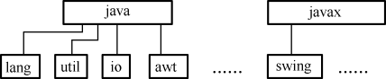
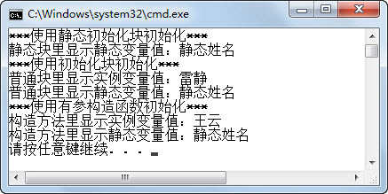

## 本章简介 

&emsp;&emsp;在前面的编程过程中，编写的程序规模小，只用到了为数不多的类，将这些类文件放在一个文件夹下即可。如果要编写规模大、功能多的程序，就需要编写为数众多的若干个类，要是还在一个文件夹中存放这么多类，类的管理将会相当混乱。本章将介绍使用包的形式组织程序中各种类型的类，使类组织结构清晰，易于管理。

&emsp;&emsp;关于访问权限，在第6章介绍封装的过程中，已经提到了private（私有的）和public（公有的）之间的区别。本章将全面系统地介绍不同的访问权限修饰符的区别，读者务必要认真掌握，在今后的课程中会经常用到。

&emsp;&emsp;本章最后，会介绍static关键字。这个关键字在前面的章节中一直在用，main方法前面就使用了static关键字进行了修饰，其含义和作用也将会在本章系统地介绍。

 

 

 

## 7.1  Java包

 

&emsp;&emsp;在计算机中存放了若干类型的文档，为了管理方便，操作系统采用了树形结构的文件夹形式存放这些文档，并对文档进行管理。

&emsp;&emsp;例如，在Windows操作系统中，可以将硬盘划分为C、D、E、F四个分区（简称C、D、E、F盘）。为了达到分类管理的目的，可以将程序安装在C盘，把工作用到的文档放在D盘，把生活中产生的文档放在E盘，最后用F盘作为备份盘，用于备份文件。

&emsp;&emsp;这样做的好处是不仅可以将文档分门别类地存储，易于查找，同时还可以在不同的盘符下存放同名的文件，解决了文件名冲突的问题。

&emsp;&emsp;为了更好地组织类，Java提供了包机制。包是类的容器，用于分隔类名空间。如果没有指定包名，所有的类都属于一个默认的无名包。

&emsp;&emsp;Java中的包一般都包含功能相关的类。例如，Java中通用的工具类，一般都放在java.util包中。

&emsp;&emsp;总地来说，包有以下3个方面的作用。

&emsp;&emsp;（1）提供了类似于操作系统树形文件夹的组织形式，能分门别类地存储、管理类，易于查找并使用类。

&emsp;&emsp;（2）解决了同名类的命名冲突问题。学生王云定义了一个类，类名叫TestStudent，学生刘静涛也定义了一个叫TestStudent的类。如果在同一个文件夹下，就会产生命名冲突的问题。使用了包的机制，就可以把王云定义的类放在wangyun包下，把刘静涛定义的类放在liujingtao包下，那么就可以通过wangyun. TestStudent和liujingtao. TestStudent访问不同的类，解决了命名冲突的问题。

&emsp;&emsp;（3）包允许在更广的范围内保护类、属性和方法。关于这方面的作用，在本章后面介绍访问权限的时候，大家就能体会到。

 

### 7.1.1  包的使用  


&emsp;&emsp;程序员可以使用package关键字指明源文件中的类属于哪个具体的包，包的语法形式如下。


```
package pkg1[．pkg2[．pkg3…]];
```


&emsp;&emsp;程序中如果有package语句，该语句一定是源文件中的第一条可执行语句，它的前面只能有注释或空行。另外，一个文件中最多只能有一条package语句。

&emsp;&emsp;包的名字有层次关系，各层之间以点分隔，包层次必须与Java开发环境文件系统的层次结构相同。通常包名全部用小写字母，这与类名以大写字母开头且各单词的首字母亦大写的命名约定有所不同。关于包的命名，现在使用得最多的规则是使用internet域名，并将其中的元素颠倒过来。例如abc公司的域名为www.abc.com，该公司开发部门正开发了一个叫fly的项目，在这个项目中有一个工具类的包，则这个工具包的包名可以为：com.abc.fly.tools。

来看下面的例子。


```
package com.bd.test;              //声明包

public class TestPackage

{

    public static void main(String[] args) 

    {

        System.out.println("package com.bd.test");

    }

}
```


&emsp;&emsp;注意，要编译运行这个程序，首先需要在当前目录下依次建立com、bd和test子目录，如图7.1所示，在com\bd\test子目录下创建TestPackage.java文件。

&emsp;&emsp;要编译运行这个程序，推荐的做法是首先退到当前目录（如图7.1所示的example1目录），再执行javac com\bd\test\TestPackage.java命令编译这个java源文件。运行时，也是在当前目录下执行java com.bd.test.TestPackage，可以看到运行结果，如图7.2所示。

<p align="center"></p>
<p align="center">图7.1  包目录结构 </p>  
<p align="center"></p>
<p align="center">图7.2  编译运行包下的程序</p>  


​                          

### 7.1.2  调整EditPlus  

&emsp;&emsp;为了让大家熟悉Java基础语法和类库，从第1章开始，我们一直使用EditPlus连接JDK编辑、编译和运行Java程序。如今引入了包的概念，编译和运行的目录不再是Java源文件所在的目录。按照之前配置的用户工具进行运行（Ctrl+2），会出现找不到类的错误，如图7.3所示。

<p align="center"></p>
<p align="center">图7.3  EditPlus运行包下的程序结果</p>  


&emsp;&emsp;从图7.3所示的结果中可以看到，在Java源文件所在的目录下直接执行java TestPackage命令，找不到类的错误。如何调整EditPlus解决这个问题呢？其实只要调整运行路径和运行文件名，就可以解决这个问题。

&emsp;&emsp;打开EditPlus配置用户工具对话框，选择“JAVA”工具，将参数从“$(FileNameNoExt)”修改为“com.bd.test.$(FileNameNoExt)”（带上包名的Java文件名），将初始目录从“$(FileDir)”修改为“F:\bluedot\ch07\example1”（执行java命令的真实路径），如图7.4所示。

<p align="center"></p>
<p align="center">图7.4  调整EditPlus中的Java运行环境   </p>  


&emsp;&emsp;在EditPlus中再次运行程序（Ctrl+2），程序能正常运行。

### 7.1.3  JDK中的包  

&emsp;&emsp;JDK的类库被分成许多包，这些包是分层次组织的，就像在硬盘上嵌套有各级子目录一样。最高一级的包名是java和javax，其下一级的包名有lang、util、net、io等，如图7.5所示。

 <p align="center"></p>
<p align="center">图7.5  JDK包结构</p>  


&emsp;&emsp;下面简要介绍JDK类库中不同包的主要功能。

- java.lang：提供利用Java编程语言进行程序开发的基础类，例如String、Math、Integer、System和Thread等。

- java.util：Java工具类，包含对集合的操作、事件模型、日期和时间设置、国际化和各种实用工具类。

- java.io：通过数据流、序列化和文件系统提供系统输入和输出。

- java.net：为实现网络应用程序而提供的类。

- java.awt：包含用于创建用户界面和绘制图形图像的类。

 

## 7.2  引用包

 

&emsp;&emsp;接着上面的例子，将TestPackage.java调整为如下内容。


```
package com.bd.test;

public class TestPackage

{

    public show() 

    {

        System.out.println("package com.bd.test");

    }

}
```


&emsp;&emsp;假设在当前目录（如图7.1所示的example1目录）下新建了一个Java程序TestImport1.java，在程序中需要新建一个TestPackage类的对象，并调用该对象的show()方法，代码如下。


```
class TestImport1 

{

    public static void main(String[] args) 

    {

        TestPackage tp = new TestPackage();

        tp.show();

    }

}
```


&emsp;&emsp;编译时会提示错误，找不到TestPackage类。其原因在于，TestPackage这个类已经被打包到com\bd\test目录下，如果在TestImport1代码中不做任何操作，是找不到TestPackage类的。

 

### 7.2.1  完整类名引用类  

&emsp;&emsp;引用不同包中的类有两种方法，其中一种非常直观的方法就是使用完整类名引用类。例如，将上面TestImport1类修改为如下的内容。


```
class TestImport2 

{

    public static void main(String[] args) 

    {

        //使用完整包名引用包

        com.bd.test.TestPackage tp = new com.bd.test.TestPackage();

        tp.show();

    }

}
```


&emsp;&emsp;编译并运行（运行前要将EditPlus的运行环境调整回本章之前的状态）程序，会正常地在控制台输出“package com.bd.test”。

### 7.2.2  导入包  

&emsp;&emsp;使用完整类名引用类的方法虽然直观，但书写的内容多，且当使用的类比较多时，编辑和阅读都非常困难。接下来学习的是采用导入包的形式引用类，导入包的语法形式如下。


```
import 包名.类名;
```


&emsp;&emsp;这里的包名、类名既可以是JDK提供的包和类的名称，也可以是用户自定义的包名和类名。

&emsp;&emsp;如果要使用一个包中的某些类，可以使用import 包名.*;的形式导入这个包中所有的类。不过，包的导入不是迭代的，就是说当导入java.util.*时，只会导入java.util包中所有的公共类，不会导入这个包下其他文件夹中的类。

&emsp;&emsp;另外，import语句需要放在package语句后，在类定义之前。

&emsp;&emsp;例如，现在需要通过Java程序求出64的平方根。通过查询JDK API，找到java.lang.Math类有一个sqrt(double a)方法，返回a的平方根，则具体实现代码如下。


```
import java.lang.Math;                                                                            //导入java.lang.Math类，可以省略

class TestImport3

{

    public static void main(String[] args) 

    {

        System.out.println("64的平方根为：" + Math.sqrt(64)); //使用Math类的sqrt方法

    }

}

```

&emsp;&emsp;编译、运行程序，输出正确结果：8.0。

&emsp;&emsp;如果删除import java.lang.Math;这条语句后重新编译、运行，发现程序仍然可以正确输出8.0的结果。为什么呢？其因为在于，对于java.lang包中的所有公共类，系统都默认导入到程序中，不需要程序员显式地导入。

&emsp;&emsp;假设现在需要输出当前的日期和时间。通过查询JDK API，找到java.util.Date类有一个toString()方法，按一定的格式输出日期和时间，则具体实现代码如下。


```
import java.util.*;                                                                          //导入java.util包中的所有公共类，不可以省略

class TestImport4

{

    public static void main(String[] args) 

    {

        Date now = new Date();

        System.out.println("现在的日期为：" + now.toString());        //使用Date类的toString方法

    }

}
```


&emsp;&emsp;程序运行结果如图7.6所示。

<p align="center"></p>
<p align="center">图7.6  导入包输出日期</p>  
&emsp;&emsp;本小节的两个例子都是导入了JDK类库中的包，接下来修改7.2.1节中使用“完整类名引用类”的例子，采用导入包的形式引用类，具体代码如下。


```
import com.bd.test.*;                                                  //导入com.bd.test中所有的公共类

class TestImport5 

{

    public static void main(String[] args) 

    {

        TestPackage tp = new TestPackage();     //直接使用导入的类

        tp.show();

}

}
```


## 7.3  上机任务

目标：完成本章7.1、7.2节中的所有程序。


时间：20分钟。


形式：每个学员独立完成，小组组长检查。

 

工具：EditPlus。

## 7.4  上机任务

目标：用户随机输入一个整数，返回一个从1到这个整数之间的随机数。例如，用户输入200，程序返回一个大于等于1且小于等于200的随机数。

实现思路：

&emsp;&emsp;（1）使用java.lang.Math类的random()方法，返回double值，该值大于等于0.0且小于1.0。

&emsp;&emsp;（2）注意需要返回的值是大于等于1且小于等于200的一个随机数。

 

时间：10分钟。


形式：每个学员独立完成，小组组长检查。


工具：EditPlus。


## 7.5  访问权限


&emsp;&emsp;一个商业的Java应用系统有很多类，其中有些类并不希望被其他类使用。每个类中都有属性和方法，但是并不是所有的属性和方法都允许被其他类调用。如何能做到这样的访问控制呢？这就需要使用访问权限修饰符。

&emsp;&emsp;Java语言中的访问权限修饰符有4种，但却只有3个关键字。因为不写访问权限修饰符时，在Java中被称为默认权限（包权限），本教材中以default代替。其他3个访问权限修饰符分别为private、protected和public。

### 7.5.1  对类的访问控制  

&emsp;&emsp;对于类而言，能使用的访问权限修饰符只有public和default。如果使用public修饰，则表示该类在任何地方都能被访问，如果不写访问权限修饰符，则该类只能在本包中使用。

&emsp;&emsp;继续上面的例子，将TestPackage.java文件中定义类的语句“public class TestPackage”中的public去掉，使该类的访问权限变为只能在本包中使用，再次编译TestPackage.java和TestImport5.java，在编译TestImport5.java时，编译器会报出如图7.7所示的错误。

<p align="center"></p>
<p align="center">图7.7  在不同的包中使用默认类</p>  

### 7.5.2  对类成员的访问控制  

&emsp;&emsp;对于类的成员（属性和方法）而言，4种访问权限修饰符都可以使用。下面按照权限从小到大的顺序对四种访问权限修饰符分别进行介绍。

#### 1．私有权限private

&emsp;&emsp;Private可以修饰属性、构造方法、普通方法。被private修饰的类成员只能在定义它们的类中使用，在其他类中不能访问。

&emsp;&emsp;在第6章介绍封装的时候，已经使用了private这个私有的访问权限修饰符。对于封装良好的程序而言，一般将属性私有化，提供公有的getter和setter方法，供其他类调用。

&emsp;&emsp;下面构造方法私有化的问题。所谓构造方法私有化，就是说使用private修饰这个类的构造方法，如下所示。


```
package com.bd.test;

public class Student 

{

    String stuName;         //学生姓名

    //构造方法私有化

    private Student(String name)

    {

        this.stuName = name;

        System.out.println("学生姓名为：" + this.stuName);

    }

}

```

&emsp;&emsp;使用下面的代码测试Student类，编译时报错，如图7.8所示。


```
import com.bd.test.*;

public class TestStudent

{

    public static void main(String[] args) 

    {

        Student wangYun = new Student("王云");       //使用构造方法创建学生对象

    }

}
```

<p align="center"></p>
<p align="center">图7.8  对构造方法私有化的类进行实例化</p>  
&emsp;&emsp;如果想在外部使用这个Student类，则只能在这个类内部实例化一个静态的Student类对象，并提供一个静态的、公有的方法获取这个类对象，具体代码如下。


```
package com.bd.test;

public class Student 

{

    String stuName;         //学生姓名

    static Student stu = new Student("王云");

    //构造方法私有化

    private Student(String name)

    {

        this.stuName = name;

        System.out.println("学生姓名为：" + this.stuName);

    }

    //静态公有方法返回类对象

    public static Student getStudent(){

        return stu;

    }

}
```

&emsp;&emsp;使用下面的代码获取Student类对象，程序可以正确运行。


```
import com.bd.test.*;

public class TestStudent2

{

    public static void main(String[] args) 

    {

        Student stu = Student.getStudent();

    }

}
```


&emsp;&emsp;注意，此处Student类是一个单例模式的类。通过将构造方法私有化，使这个类的创建只能在类的内部完成，并且用一个公有的方法返回了这个类的实例。这样做可以保证这个类只有一个实例，不会出现其他类中为这个类创建多个实例的情况，这就是单例模式。

#### 2．默认权限default

&emsp;&emsp;属性、构造方法、普通方法都能使用默认权限，即不写任何关键字。默认权限也称为同包权限。同包权限的元素只能在定义它们的类中以及同包的类中被调用。下面以普通方法为例介绍同包权限。修改Student类，代码如下。


```
package com.bd.test;                                                             //Student类在com.bd.test包中

public class Student 

{

    String stuName;

    public Student(String name)

    {

        this.stuName = name;

    }

    //访问权限为default

    void showName()

    {

        System.out.println("学生姓名为：" + this.stuName);

    }

}

```

&emsp;&emsp;使用下面的代码测试调用Student类的默认访问权限的showName()方法。注意，两个类不在同一个包中，编译时报错，如图7.9所示。


```
//TestStudent3类在当前目录，不在com.bd.test目录中

import com.bd.test.*;

public class TestStudent3

{

    public static void main(String[] args) 

    {

        Student wangYun = new Student("王云");       //使用构造方法创建学生对象

        wangYun.showName();

    }

}
```

<p align="center"></p>
<p align="center">图7.9  默认权限包访问</p>  
&emsp;&emsp;在void showName()方法前添加public关键字，编译并运行程序，可正常运行。

#### 3．受保护权限protected

&emsp;&emsp;protected可修饰属性、构造方法、普通方法，能在定义它们的类中以及同包的类中调用被protected修饰的成员。如果有不同包中的类想调用它们，那么这个类必须是这些成员所属类的子类。关于子类及相关概念，将会在讲解继承的时候详细介绍。

#### 4．公共权限public

&emsp;&emsp;Public可以修饰属性、构造方法和普通方法。被public修饰的成员，可以在任何一个类中被调用，是权限最大的访问权限修饰符。

### 7.5.3  访问权限修饰符总结  

&emsp;&emsp;访问权限修饰符使用范围总结如表7.1所示。

<p align="center">表7.1  访问权限修饰符总结</p>    


| 修饰符    | 类内部 | 同一个包中 | 子类 | 任何地方 |
| --------- | ------ | ---------- | ---- | -------- |
| private   | Yes    |            |      |          |
| default   | Yes    | Yes        |      |          |
| protected | Yes    | Yes        | Yes  |          |
| public    | Yes    | Yes        | Yes  | Yes      |

 

## 7.6  static关键字

 

&emsp;&emsp;在通常情况下，要使用一个类对象（实例）的公有成员变量，需要通过这个类实例化出对象，再通过“对象名.变量名”的形式访问。作为程序员，有时需要定义一个类级别的变量，它的使用完全独立于该类的任何对象，可以直接通过“类名.变量名”的形式进行访问。

&emsp;&emsp;在类成员的声明前，加上static（静态的）关键字，就能创建出这样的静态类成员。static成员最常见的例子是main方法。因为在程序开始执行时必须调用main方法，所以将它声明为static。

&emsp;&emsp;声明为static的变量称为静态变量或类变量。可以直接通过类名引用静态变量，也可以通过实例名来引用静态变量，但最好采用前者，因为采用后者容易混淆静态变量和实例变量。静态变量是跟类相关联的，类的所有实例共同拥有一个静态变量。

&emsp;&emsp;声明为static的方法称为静态方法或类方法。静态方法可以直接调用静态方法，访问静态变量，但是不能直接访问实例变量和实例方法。静态方法中不能使用this关键字，因为静态方法不属于任何一个实例。

 

 

 

 

### 7.6.1  static关键字的使用  

#### 1．用static修饰类的成员变量

&emsp;&emsp;用static修饰的类的成员变量是静态变量，对该类的所有实例来说，只有一个静态值存在，所有实例共用一个变量。静态变量是指不管类实例化出多少个对象，系统仅在第一次调用类的时候为静态变量分配内存。先来看下面的例子。


```
public class TestStatic

{

    public static void main(String[] args) 

    {

        Student wangYun = new Student();

        wangYun.avgAge = 22;                           //将Student类变量的值设置为22        

        System.out.println("王云所在班平均年龄为：" + wangYun.avgAge);

        Student liuJT = new Student();

        liuJT.avgAge = 21;                                  //将Student类变量的值设置为21        

        System.out.println("王云所在班平均年龄为：" + wangYun.avgAge);

        System.out.println("刘静涛所在班平均年龄为：" + liuJT.avgAge);

    }

}

class Student 

{ 

    public static int avgAge;                                   //类变量，存放平均年龄

}
```

&emsp;&emsp;程序运行结果如图7.10所示。

<p align="center"></p>
<p align="center">图7.10  类变量使用</p>  

&emsp;&emsp;通过程序运行结果可以看出，所有Sutdent类的实例wangYun和liuJT都共用了静态变量avgAge，当给其中任何一个实例的静态变量赋值，都是对这一个静态变量进行操作。

#### 2．用static修饰类的成员方法

&emsp;&emsp;用static修饰类的成员方法表示，该方法被绑定于类本身，而不是类的实例。看下面的例子。


```
public class TestStatic2

{

    public static void main(String[] args) 

    {

        Student.showAvgAge();       //调用静态方法           

        System.out.println("静态变量输出所在班平均年龄为：" + Student.avgAge);

    }

}

class Student 

{

    public static int avgAge = 22;                  //类变量，存放平均年龄

    public static void showAvgAge()  //静态方法输出班平均年龄

    {

        System.out.println("静态方法输出所在班平均年龄为：22");

    }

}
```

&emsp;&emsp;程序运行结果如图7.11所示。

<p align="center"></p>
<p align="center">图7.11  静态方法使用</p>  


&emsp;&emsp;注意，在TestStatic2程序的main方法中，都是通过“类名.静态变量名”和“类名.静态方法名”的形式访问静态变量和调用静态方法的。通过“类实例.静态变量”和“类实例.静态方法”也可以访问静态变量和调用静态方法，但不推荐使用。

#### 3．静态方法不能操作实例变量

&emsp;&emsp;静态方法可以操作静态变量，不能操作实例变量，可以通过下面的例子看出。

```
public class Student 

{

    public int avgAge = 22;                           //实例变量，存放平均年龄

    public static void showAvgAge()  //静态方法调用实例变量——编译出错

    {

        System.out.println("静态方法输出所在班平均年龄为：" + avgAge);

    }

}
```

&emsp;&emsp;编译时报错，如图7.12所示。

<p align="center"></p>
<p align="center">图7.12  静态方法调用实例变量 </p>  


### 7.6.2  Java静态块  

&emsp;&emsp;第6章学习了对象的初始化过程，在使用new关键字创建并初始化对象的过程中，具体的初始化分为以下4步。

&emsp;&emsp;（1）给对象的实例变量分配空间，默认初始化成员变量。

&emsp;&emsp;（2）成员变量声明时的初始化。

&emsp;&emsp;（3）初始化块初始化。

&emsp;&emsp;（4）构造方法初始化。

&emsp;&emsp;接下来将会先介绍什么是Java静态块，并结合对象的初始化过程，介绍静态变量、静态块的执行顺序。

&emsp;&emsp;静态块的语法形式如下。


```
static

{

	语句块

}
```


&emsp;&emsp;Java类首次装入JVM时，会对静态变量（含静态块）或方法进行一次初始化，方法不被调用是不会执行的，就是说静态变量和静态块是在类首次装载进JVM时被执行的。

&emsp;&emsp;运行如下的程序，运行结果如图7.13所示。


```
public class Student 

{

    private static String staticName = "静态姓名";       //静态变量

    private String stuName = "";                                    //学生姓名——私有变量

    //使用静态初始化块初始化

    static

    {       

        System.out.println("***使用静态初始化块初始化***");

        System.out.println("静态块里显示静态变量值：" + staticName);

    }

    //使用初始化块初始化

    {       

        this.stuName = "雷静";

        System.out.println("***使用初始化块初始化***");

        System.out.println("普通块里显示实例变量值：" + stuName);

        System.out.println("普通块里显示静态变量值：" + staticName);

    }

    //构造方法，用户初始化对象的成员变量

    public Student(String name){         

        this.stuName = name;

        System.out.println("***使用有参构造函数初始化***");

        System.out.println("构造方法里显示实例变量值：" + stuName);

        System.out.println("构造方法里显示静态变量值：" + staticName);

    }

    public static void main(String[] args) 

    {

        Student stu = new Student("王云");

    }

}
```

<p align="center"></p>
<p align="center">图7.13  使用静态块初始化变量</p>  

&emsp;&emsp;通过上面的例子可以看出，静态变量和静态块都是在类实例化对象前被执行的。


## 7.7  上机任务


目标：完成本章7.5、7.6节的所有程序。


时间：30分钟。

形式：每个学员独立完成，小组组长检查。

工具：EditPlus。


## 7.8  本章练习

1  静态块在&emsp;&emsp;&emsp;&emsp;时被执行，普通块在 &emsp;&emsp;&emsp;&emsp;时被执行。 

 

 

2  请描述Java包机制的主要作用。

 

 

3  结合自己的理解，请描述为什么静态方法不能调用实例变量。

 

 

4  请介绍4种访问权限修饰符的区别。

 

 

5  请描述类变量和实例变量的区别。

 

 

 